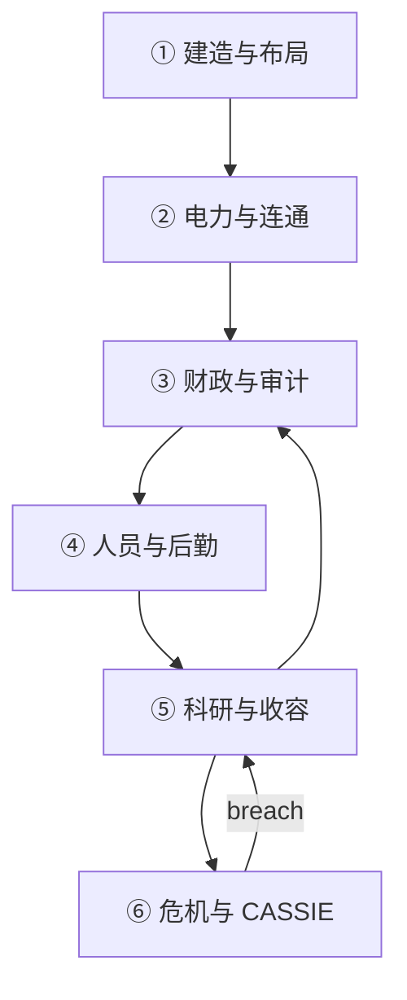
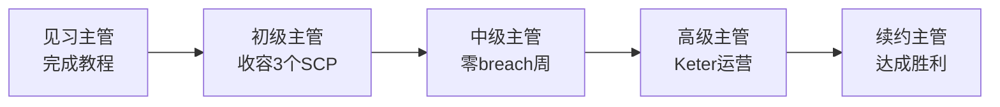

# 🔄 核心玩法循环

## 一句话定义

**在电力、财政、审计三重约束下，建造一座能持续收容异常的地下站点，并最终赢得基金会续约。**

这不是即时战略，也不是纯建造游戏 — 你需要在 **时间流逝** 中做序列决策：今天研究的节点，决定了十天后能否安全捕获下一个 SCP。

---

## 六大核心系统



### ① 建造与布局

| 要点 | 详情 |
|------|------|
| 网格放置 | 走廊、房间、检查点、输电竖井 |
| 施工机制 | 工程师到场后 **消耗工时**，非即时完成 |
| 连通要求 | 房间须与已通电走廊 **寻路可达** |
| 区域规划 | LCZ / HCZ / 行政 / 后勤 / 入口 |
| 扩建 | 中层地图 60×40 → 72×48 → 84×56（科研解锁） |

### ② 电力与连通

| 要点 | 详情 |
|------|------|
| 发电方式 | 柴油 → 水力 → 地热 → 核电（v1.6.0 移除太阳能/风力） |
| 负载管理 | 消耗 > 发电 → 负载削减 → 收容单元断电 → breach |
| 跨层传输 | 输电竖井 + 电力中继 |
| 开局参考 | 约 160 发电 / 153 用电，余量极小 |

### ③ 财政与审计

| 要点 | 详情 |
|------|------|
| 周补给 | 每周入账，占月拨款池 18% |
| 月绩效 | 每月结算，含运营评分加成 |
| 拨款上限 | 约 **¥100 万/月**（封顶） |
| 审计乘数 | ≥80: +8% · 50–79: 标准 · <50: −15% |
| 破产线 | 余额 **< −¥100,000** → Game Over |

### ④ 人员与后勤

| 类型 | 职责 |
|------|------|
| 科研 | 研究点、观测、观察岗 |
| 安保 | 巡逻、押送、拦截 |
| 工程师 | 施工、巡检 |
| 医护 | 治疗、士气 |
| D 级 | 高风险实验（伦理代价） |

三类物资：**清洁水 · 口粮 · 补给** — 不足则士气与运营评分下降。

### ⑤ 科研与收容

完整管线见 [异常上报 → MTF 捕获](../09-containment/pipeline.md)：

```
外勤上报 → 研究(特性→材料→规程) → 建造专属单元 → MTF捕获 → 分配 → 启用措施
```

### ⑥ 危机与 C.A.S.S.I.E

收容失效后进入危机循环：隔离 → 调度安保 → 手动/MTF 重收容。同时 loose ≥3 → 立即失败。

---

## 时间尺度

理解时间单位是规划的基础：

| 单位 | 换算 | 用途 |
|------|------|------|
| **模拟 tick** | 3 游戏分钟 | 所有系统更新一次 |
| **游戏日** | 顶栏天数 | 合同期限、超期计算 |
| **游戏分钟** | tick 累积 | 建造工时、临时收容 20 分钟 |
| **自动存档** | 每 2 游戏日 | 后台写入 |
| **月度结算** | 每月初 | 工资 + 维护 + 绩效拨款 |


**暂停是你的朋友**。按 `空格` 暂停后仍可建造与查阅面板 — 复杂布局务必在暂停下完成。


---

## 收入从何而来？

拨款不是固定的。核心公式（简化）：

| 组成部分 | 计算方式 | 上限 |
|----------|----------|------|
| 基础池 | ¥50,000 + 运营评分 × ¥70,000 | — |
| 收容加成 | 每间已收容 × ¥1,500 | ¥25,000 |
| 观察加成 | 每间活跃观察室 × ¥2,000 | ¥20,000 |
| 研究加成 | 预估月产出 / 100 × ¥80 | ¥15,000 |
| 物资加成 | 月结时按库存 | ¥5,000 |
| 审计乘数 | 见上表 | ±15% |
| 审查制裁 | 基金会审查期间 | −8% |

详见 [财政与审计](../06-economy/budget-audit.md)。

---

## 胜利之路

三条硬条件 **同时满足**：

| # | 条件 | 技巧 |
|---|------|------|
| 1 | ≥3 SCP 已收容 | SCP-999 算 1 个，再捕 2 个即可 |
| 2 | 全部非 SCP 科技解锁 | 别忘了基础设施与核弹链 |
| 3 | 连续 30 天无 breach | 从最后一次失效次日开始计数 |

详见 [胜利与失败条件](../12-progression/win-lose.md)。

---

## 新手优先级（前 10 游戏日）

| 天数 | 优先做 | 不要做 |
|------|--------|--------|
| 1–2 | 读邮件、熟悉地图、完成教程 | 大规模扩建 |
| 3–5 | 第一条 SCP 科研链、稳电力 | 捕获未研究的 SCP |
| 5–7 | 首个 MTF 捕获（Safe 优先） | 招聘超出宿舍容量 |
| 7–10 | 观察室（若报告 173）、接 O5 合同 | 同时开工 3+ 高耗电设施 |

完整首日指南：[第一天生存指南](../03-tutorial/first-day.md)

---

## 主管进阶路径



下一章：[术语表](glossary.md) — 30+ 专有名词速查。

---

## 本章导航

- 上一篇：[世界观](worldview.md)
- 下一篇：[术语表](glossary.md)
