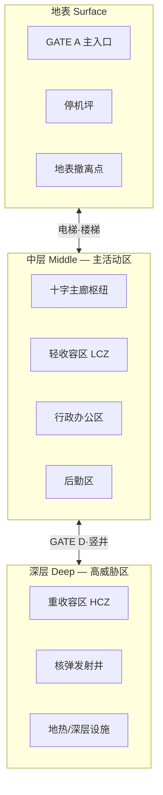
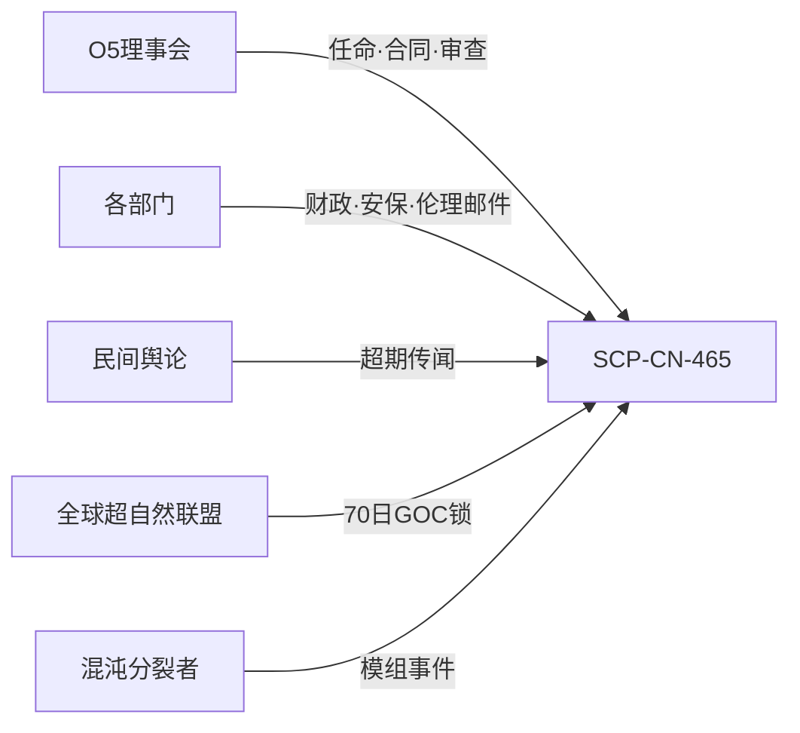

# 🌐 世界观与站点代号

> **[待补图 IMG-004]** 站点地图（三层切换可见）

## 基金会与你的使命

**SCP 基金会**（Secure, Contain, Protect）是一个秘密跨国组织，致力于收容超出常人理解的异常个体、物体与现象，将其与人类社会隔离，并尽可能研究其性质。

你收到的任命状来自 **O5 理事会** — 基金会最高权力机构，由 13 名匿名理事组成。他们极少露面，但每一封红头文件的重量，都足以改变一座站点的命运。

> **Secure. Contain. Protect.**  
> 控制异常，阻止其扩散；收容异常，使其无法造成伤害；保护人类，使其永远不必知道真相。

---

## SCP-CN-465

| 属性 | 说明 |
|------|------|
| **正式代号** | SCP-CN-465 |
| **类型** | 大型地下多层收容站点 |
| **你的职位** | 站点主管（Site Director） |
| **权限** | 建造、招聘、财政、科研、C.A.S.S.I.E 协议 |
| **责任** | 每一次 breach、每一笔赤字、每一次审计降级 |


早期版本日志中偶见 **SITE-CN-422** 等旧代号。v1.6.1 统一为 **SCP-CN-465**，以当前版本为准。


---

## 三层地下结构

站点垂直分为三层，通过电梯井、楼梯间与 **GATE D 竖井闸口** 连通：

### 各层职能

| 楼层 | 日常活动 | 风险等级 |
|------|----------|----------|
| **地表** | 人员进出、物资运输、紧急撤离 | 突破此层 = 异常泄露至外界 |
| **中层** | 行政指挥、LCZ 收容、主要科研 | 站点运营核心 |
| **深层** | HCZ 高威胁收容、战略级设施 | 一旦失控，后果灾难性 |

---

## 功能区域详解

开局地图以颜色区分区域。规划建造时 **必须尊重区域规划**，否则 SCP 突破概率大幅上升。

| 区域 | 地图色 | 收容对象 | 典型设施 |
|------|--------|----------|----------|
| **行政办公区** | 蓝色 | — | 控制室、C.A.S.S.I.E 中枢、避难所 |
| **轻收容区 LCZ** | 绿色 | Safe、低威胁 Euclid | SCP-999 单元、观察室、临时收容间 |
| **重收容区 HCZ** | 红色 | Keter、高威胁 Euclid | SCP-682/106 单元、检查点 |
| **后勤支援区** | 灰色 | — | 柴油/水力/地热/核电、水厂、仓储、食堂 |
| **入口区** | 黄色 | — | GATE A/B/C/D、停机坪 |

### 区域密度规则

同一 zone 内收容过多 SCP 会导致 **区域过密**，突破 RNG 上升。此外：

* Keter 放在 LCZ → 极高 breach 风险
* Safe 放在 HCZ → 浪费高等级单元但不致命
* 每个 SCP 有 `PreferredZone`，应尽量遵守

---

## C.A.S.S.I.E — 你的 AI 副官

**C.A.S.S.I.E**（Central Autonomous Site Security Intelligence Engine）是站点内置的自主安全 AI。它不是工具，而是与你共享指挥权的 **第二主管**。

### 能力矩阵

| 能力 | 自动 | 手动 | 说明 |
|------|------|------|------|
| 全站封锁 | ✅ | ✅ | 检查点关闭、人员进避难所 |
| 区域隔离 | ✅ | ✅ | 仅隔离事故扇区 |
| 电力削减 | ✅ | — | 过载时按优先级断电 |
| 人员调度 | ✅ | — | 引导避险、分配拦截 |
| MTF 派遣 | — | ✅ | 捕获 / 紧急召回 |
| 核弹选弹 | ✅ | ✅ | 9 种弹头自动或手动选择 |
| O5 齐射 | — | ✅ | 多弹头联合（如 SCP-682） |
| 毁灭协议 | ✅ | — | 30 分钟倒计时 |

### v1.6.0 离线解封

关闭 C.A.S.S.I.E 后（核武/毁灭协议执行中除外）：

* 自动解除全站封锁与事故区隔离
* 非战斗人员恢复施工与日常勤务
* 适合你需要精细手动管理的时期

---

## 外部压力源

站点不是封闭沙盒。以下力量会持续施压：

| 压力源 | 触发条件 | 后果 |
|--------|----------|------|
| **O5 催办** | SCP 超期 28 日未收容 | 审计 −3、行政压力 |
| **基金会审查** | 超期 42 日 | 拨款 −8% 持续数天 |
| **民间传闻** | 超期 14 日 | 威胁 +1、邮件通报 |
| **GOC 介入** | 超期 70 日 | **永久失去该 SCP 收容权** |
| **伦理委员会** | D 级实验、049 产物等 | 审计事件、叙事邮件 |

---

## 开局状态

新游戏时 O5 已为你准备好基础设施：

| 项目 | 初始值 |
|------|--------|
| 账户余额 | ¥500,000 |
| 审计评级 | 70 |
| 站点威胁 | 较低 |
| 已收容 SCP | SCP-999 ×1 |
| 预置设施 | 十字主廊、GATE、检查点、柴油发电、科研中心、宿舍、食堂 |
| 教程 | 自动启动 12 步引导 |

---

## 视觉气质

游戏 UI 采用 **冷峻监控中心** 美学 — 荧光灯下的生死决策，而非 jump scare 恐怖：

* 主背景深蓝黑，面板半透明描边
* 顶栏 44px 紧凑状态条：日期 · ¥ · 电力 · 威胁 · 审计
* CASSIE 播报条左侧严重度色条 + 扫描线
* 封锁时地图外圈红色渐晕（v1.4.5+ 柔光样式）

下一章：[核心玩法循环](gameplay-loop.md) → 理解六大系统如何运转。

---

## 本章导航

- 上一篇：[章节说明](README.md)
- 下一篇：[核心玩法循环](gameplay-loop.md)
