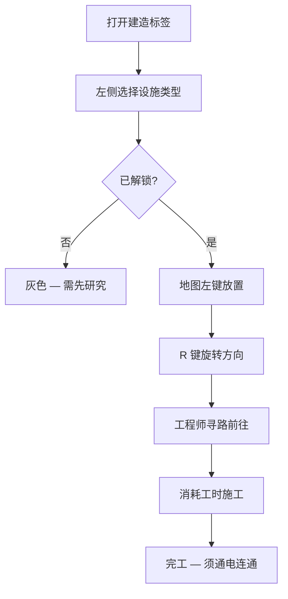

# ⌨️ 操作与快捷键


---

## 地图与相机

| 操作 | 按键 / 手势 | 技巧 |
|------|-------------|------|
| **缩放** | 鼠标滚轮 | 缩到合适比例后建造更精准 |
| **平移** | 中键拖动 | 比 WASD 更直觉 |
| **平移** | W A S D 或方向键 | 暂停时也能平移 |
| **选中** | 左键点击 | 房间 / 人员 / SCP → 左下详情 |
| **楼层切换** | 地图底部按钮 | 地表 / 中层 / 深层 |
| **右键指令** | 右键点击 | 人员 → 移动 / 解雇 |


部门面板打开时，滚轮可能作用于面板而非地图 — 先点击地图区域再缩放。


---

## 游戏控制

| 操作 | 按键 | 备注 |
|------|------|------|
| **暂停 / 继续** | `空格` | 暂停后仍可建造与查阅 |
| **快速存档** | `Ctrl+S` | 教程第 11 步强制练习 |
| **返回主菜单** | `Esc` | 需二次确认 |
| **时间倍速** | 设置面板 | 1x / 2x / 3x |
| **旋转建造** | `R` | 仅建造模式生效 |
| **Shift 修饰** | `Shift` | 部分建造/拆除操作 |

---

## 建造模式完整流程



| 步骤 | 要点 |
|------|------|
| 选择 | 分类：走廊 / 基础设施 / 收容 / 后勤 / 生产 / 科研 / 管理 |
| 放置 | 绿色 = 可放，红色 = 不可（重叠/未连通/超限） |
| 旋转 | `R` 切换朝向，走廊方向影响连通 |
| 等待 | 工程师 **到场后** 才开始计时，不是放置即开工 |
| 验收 | 完工后检查：通电？连通？区域正确？ |

---

## 人员调度

### 右键移动

1. 左键选中人员 → 左下出现详情面板
2. 右键点击地图目标格
3. 人员沿走廊寻路（跨层走电梯/楼梯）

### 指派岗位（v1.6.0+）

1. 选中人员 → 详情面板 → **指派岗位**
2. 点击目标房间
3. 人员设为该房间 **常驻岗位**
4. 房间详情显示在岗人员列表

### 解雇

右键人员 → **解雇**，或通过人事面板操作。

---

## 界面布局

```
┌──────────────────────────────────────────────────────────────────┐
│  第 N 天  │  ¥ 余额  │  ⚡ 发电/用电  │  ⚠ 威胁  │  ★ 审计      │
├────────────┬─────────────────────────────────────┬───────────────┤
│ 【左上】   │                                     │ 【右上】      │
│ 部门导航   │         【中央】站点地图             │ 简报/邮件     │
│ 9 个 Tab   │    滚轮缩放 · 中键平移              │ O5 合同       │
│            │    底部切楼层                       │ 设施协议      │
├────────────┤                                     ├───────────────┤
│ 【左下】   │                                     │ 【右下】      │
│ 选中详情   │                                     │ 事件日志      │
│ 房间/人员  │                                     │ 时间线        │
│ SCP 信息   │                                     │               │
└────────────┴─────────────────────────────────────┴───────────────┘
```

详见 [四侧栏布局与顶栏](../04-interface/layout.md)。

---

## Android 触控对照

| PC 操作 | Android 手势 |
|---------|-------------|
| 左键 | 单指轻触 |
| 右键 | 长按 0.5 秒 |
| 平移 | 单指拖动（面板收起时） |
| 缩放 | 双指捏合 |
| 暂停 | 地图右下角 II |
| 快速存档 | 顶栏右上角 |

完整列表：[Android 移动端](mobile.md)

---

## 完整快捷键表

见 [附录 · 快捷键一览](../appendix/shortcuts.md)

---

## 本章导航

- 上一篇：[主菜单](main-menu.md)
- 下一篇：[Android](mobile.md)
