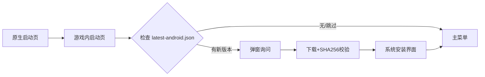

# 📱 Android 移动端

> APK 直接分发 · 强制横屏 · v1.6.8

---

## 概述

Android 版与 PC 版共享 `SiteDirector.Game` 核心逻辑，但 UI 改为 **底部 Tab + 可调整高度面板** 的触控布局。

| 对比项 | PC | Android |
|--------|-----|---------|
| 版本号 | `GameVersion`（当前 v1.6.8） | **同 PC**（自 v1.6.8 起共用） |
| 操作 | 键鼠 | 触控手势 |
| 面板 | 四侧栏 | 底部 Tab + 上拉面板 |
| 模组 | 可导入 `Mods/` | 仅内置官方模组 |
| 更新 | ZIP 自动覆盖 | APK 应用内更新 |
| 方向 | 窗口任意 | **强制横屏** |

---

## 安装

1. 获取 `站点主管-收容协议-v1.6.8.apk`
2. 传到手机
3. 设置 → 安全 → 允许「安装未知来源应用」
4. 点击 APK 安装
5. **旋转至横屏**启动


**签名不一致**：早期 debug 包与正式包签名不同。需 **卸载旧版后重装**。存档会丢失，请先 PC 端备份或手动导出。


---

## 应用内更新

Release 版启动流程：

| 环境 | 行为 |
|------|------|
| Release | 完整更新检查 |
| Debug | 跳过更新 |
| 临时关闭 | 环境变量 `SITE_DIRECTOR_SKIP_UPDATE=1` |

---

## 触控操作大全

### 地图操作

| 操作 | 手势 | 条件 |
|------|------|------|
| 点击选中 | 单指轻触 | 始终 |
| 右键/上下文 | **长按约 0.5 秒** | 人员指令 |
| 平移地图 | 单指拖动 | **部门面板收起时** |
| 缩放 | 双指捏合 | **部门面板收起时** |

### 面板操作

| 操作 | 手势 |
|------|------|
| 打开部门 | 底部 Tab：简报 / 建造 / 人事 / 科研 |
| 更多部门 | 底部 **更多▼** → 财政 / 收容 / CASSIE / 设置 / 模组 |
| 关闭面板 | 点 ✕ · 再点同一 Tab · 点地图空白 · 返回键 |
| 面板滚动 | 面板内容区单指上下拖动 |
| 调整高度 | 拖动面板顶部横条 |

### 顶栏与地图角

| 按钮 | 位置 | 功能 |
|------|------|------|
| 暂停 II | 地图右下角 | 暂停/继续 |
| 倍速 1x/2x/3x | 地图右下角 | 时间加速 |
| 旋转 R | 建造模式右下角 | 旋转设施 |
| 存档 | 顶栏右上角 | 快速存档 |
| 退出 | 顶栏右上角 | 返回主菜单（确认） |

---

## 模组限制

| 项目 | Android |
|------|---------|
| 内置模组 | ExampleMod、173 规程包、混沌分裂者 |
| 自定义导入 | **不支持** |
| 首启 | 复制模组到应用私有目录 |

---

## 常见问题

| 问题 | 解决 |
|------|------|
| 竖屏能用吗？ | 不能，请旋转设备 |
| 字体加载失败 | 确认 `simhei.ttf` 存在后重新打包 |
| 签名不一致 | 卸载旧版 → 重装正式 APK |
| 面板挡地图 | 收起面板或下拉至最低 |

开发者构建见 [Android 构建](../14-developer/mobile-build.md)。

---

## 本章导航

- 上一篇：[快捷键](controls.md)
- 下一篇：[新手教程](../03-tutorial/README.md)
