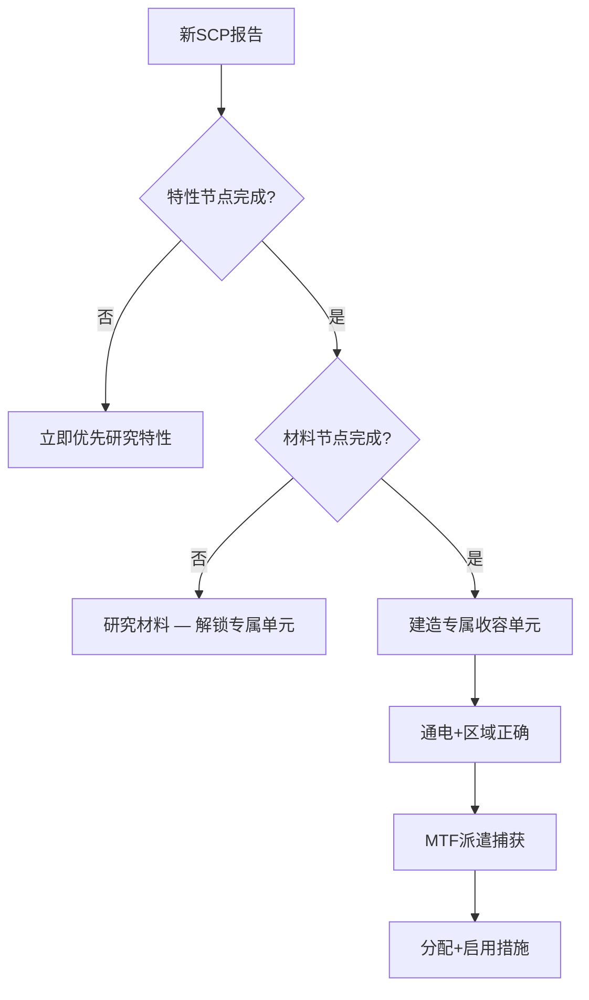

# 🌅 第一天生存指南

> 教程结束后 → 第一个游戏日结束前的 **实战 checklist**

---

## 时间轴

```mermaid
gantt
  title 首日优先级时间轴
  dateFormat X
  axisFormat %s

  section 第0小时
  读邮件与财政        :0, 1
  检查电力与999       :1, 2

  section 第1小时
  规划科研方向        :2, 4
  确认工程师施工      :4, 6

  section 第1天
  启动首条科研链      :6, 10
  暂停规划扩建        :10, 14

  section 首周
  首个MTF捕获         :14, 20
  接O5合同            :20, 24
```

---

## 第 0 小时：态势评估

### ✅ Checklist

- [ ] 打开 **简报** → 阅读 O5 任命函
- [ ] 扫一眼 **财政** → 确认 ¥500,000
- [ ] 查看 **收容** → SCP-999 状态正常
- [ ] 看顶栏 **电力** → 发电 ≥ 用电？
- [ ] `Ctrl+S` 快速存档

### 电力第一印象

开局约 **160 发电 / 153 用电** — 余量极小。


**断电 = breach 温床。** 任何新房间上线前，先算 PowerDraw 增量。


---

## 第 1 小时：科研与施工

| 优先级 | 行动 | 原因 |
|--------|------|------|
| 🥇 | 确认科研中心通电 | 无科研 = 无法解锁收容材料 |
| 🥈 | 开始基础设施或首个 SCP **特性** 节点 | 外勤上报随时可能出现 |
| 🥉 | 确认教程放置的走廊已连通 | 工程师可能仍在施工 |
| 4 | 招聘 1 工程师（若施工队列满） | 加速后续建造 |

**不要做**

* ❌ 大规模扩建未规划区域
* ❌ 同时开工核电 + HCZ 单元
* ❌ 捕获第二个 SCP（科研未就绪）

---

## 第 1 天：财政纪律

### 支出预警

| 支出类型 | 触发 | 量级感 |
|----------|------|--------|
| 房间维护 | 每月 | 每房间 ¥200–¥8,000 |
| 人员工资 | 每月 | 按编制 |
| 电力维护 | 每月 | 发电站越高越贵 |
| breach 罚款 | 事件 | 可能极大 |

### 财政红线

| 余额 | 状态 | 行动 |
|------|------|------|
| > ¥300,000 | 🟢 安全 | 正常扩张 |
| ¥100,000–300,000 | 🟡 谨慎 | 暂停非必要建造 |
| ¥0–100,000 | 🟠 危险 | 只接有奖励的 O5 合同 |
| < ¥0 | 🔴 危急 | 拆除换退款、完成合同 |
| < −¥100,000 | ☠️ **Game Over** | — |

---

## 首周目标

| 目标 | 指标 | 检验方式 |
|------|------|----------|
| 电力稳定 | 负载 < 90% | 顶栏电力余量为正 |
| 科研启动 | ≥1 节点进行中 | 科研面板有活动项目 |
| 审计维持 | ≥ 65 | 顶栏审计不持续下降 |
| 零 breach | 0 次失效 | 事件日志无突破记录 |
| 第二个 SCP | 材料节点完成 | 可建专属单元 |

---

## 第一份 O5 合同（游戏日 ≥3）

| 合同类型 | 新手友好度 | 建议 |
|----------|------------|------|
| MaintainBalance | ⭐⭐⭐ | 优先接 |
| ResearchTech | ⭐⭐⭐ | 顺势接 |
| NoBreachDays | ⭐⭐ | 稳定期再接 |
| ContainScp（Keter） | ⭐ | 后期再接 |


合同 **失败罚金** 可能触发财政危机。余额紧张时拒绝合同不是懦弱，是专业判断。


---

## 首个外勤上报：标准应对

当收容面板出现新报告：

### 超期倒计时

从报告日起：

| 天数 | 后果 |
|------|------|
| 14 | 民间传闻 |
| 28 | O5 催办，审计 −3 |
| 42 | 审查，拨款 −8% |
| 56 | 可能游荡失控 |
| 70 | **GOC 锁 — 永久失去** |

---

## 常见第一天翻车

| 症状 | 根因 | 急救 |
|------|------|------|
| 全局断电 | 负载过高 | 拆非必要房间 / 增建发电 |
| 999 breach | LCZ 断电 | 优先恢复 LCZ 供电 |
| 工程师不动 | 路径不通 | 检查走廊连通 |
| 研究 0% | 无科研槽位 | 建实验室、招科研 |
| 173 杀人 | 无观察岗 | 建观察室 + 派研究员 |

---

## 培训后阅读路线

1. [电力网格](../05-site/power.md)
2. [财政与审计](../06-economy/budget-audit.md)
3. [异常上报管线](../09-containment/pipeline.md)
4. [SCP 图鉴](../10-scp/index.md)
5. [胜利条件](../12-progression/win-lose.md)

---

## 本章导航

- 上一篇：[Walkthrough](walkthrough.md)
- 下一篇：[指挥界面](../04-interface/README.md)
