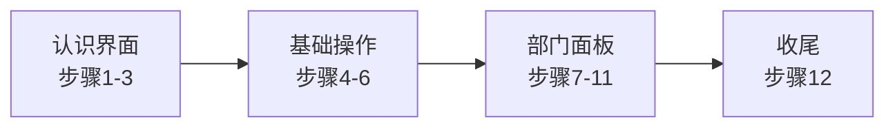

# 📋 教程概览

> **[待补图 IMG-013]** 教程 overlay 面板

游戏内建 **12 步新手教程**，约 3 分钟走完流程，本手册将其扩展为 **15 分钟精读版**。

---

## 四阶段结构

| 阶段 | 步骤 | 主题 | 你将掌握 |
|------|------|------|----------|
| **认识界面** | 1–3 | 简报、地图、暂停 | 在哪看邮件、怎么浏览三层站点 |
| **基础操作** | 4–6 | 财政、建造 | 钱从哪来、怎么放走廊 |
| **部门面板** | 7–11 | 人事~CASSIE、存档 | 9 个 Tab 各自干什么 |
| **收尾** | 12 | 完成培训 | 长期目标认知 |

---

## 强制步骤 vs 可跳过

v1.6.1 采用 **混合强制** 设计 — 关键肌肉记忆必须练到，其余可快进：

| 步骤 | 标题 | 强制？ | 原因 |
|------|------|--------|------|
| 4 | 时间与暂停 | ⚠️ **是** | 规划与危机都依赖暂停 |
| 6 | 网格建造 | ⚠️ **是** | 核心玩法，须实际放置 |
| 11 | 存档与设置 | ⚠️ **是** | 养成 Ctrl+S 习惯 |
| 其余 | — | 可点「下一步」跳过 | 降低教程摩擦 |

---

## 重看教程

设置面板 → **重新开始教程** → `TutorialFinished` 重置为 `false`。

适合：

* 久未游玩后回归
* 换了新存档想复习
* 向朋友演示基本操作

---

## 教程与手册对照

| 教程步骤 | 扩展阅读 |
|----------|----------|
| 步骤 1–3 界面 | [四侧栏布局](../04-interface/layout.md) |
| 步骤 4–6 基础 | [财政](../06-economy/budget-audit.md) · [建造](../05-site/construction.md) |
| 步骤 7–11 部门 | [04-interface 全部章节](../04-interface/layout.md) |
| 步骤 12 完成 | [第一天生存指南](first-day.md) |

---

下一章：[12 步完整 Walkthrough](walkthrough.md) — 逐步详解。

---

## 本章导航

- 上一篇：[章节说明](README.md)
- 下一篇：[Walkthrough](walkthrough.md)
