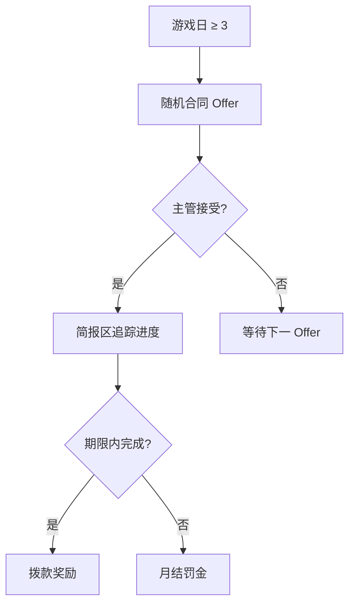
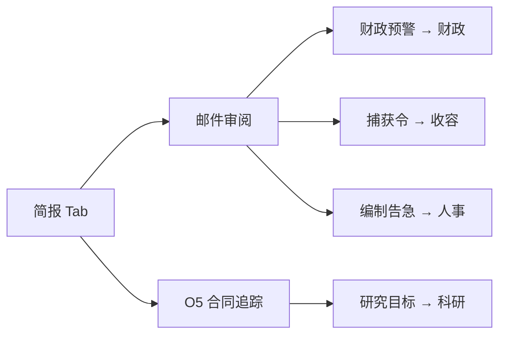

# 📋 简报

> **文档版本**：v1.6.1 · 站点态势与叙事信息中心  
> **系统代号**：BRIEFING TERMINAL — SCP-CN-465 主管专用

> **[待补图 IMG-005]** 简报面板 + 邮件列表

---

## 面板定位

**简报** Tab 是主管每日工作的 **第一站**。O5 批示、部门通报、伦理审查、设备告警与民间传闻均在此汇总。右下 **事件日志** 同步滚动重大事件，形成「面板 + 日志」双通道态势感知。


建议养成习惯：**每天第一件事**扫一眼未读邮件，再切换其他部门 Tab。


---

## 面板结构

| 区域 | 位置 | 内容 | 交互 |
|------|------|------|------|
| 站点概况 | 上部 | 威胁等级、活跃合同摘要、关键计数 | 只读态势 |
| 通讯区 | 中部 | 邮件列表（新邮件置顶） | 点击进入全屏阅读器 |
| 合同追踪 | 概况旁 | 已接受 O5 合同进度 | 链接合同详情 |
| 设施协议 | 危机时 | 毁灭协议等倒计时状态 | 只读，不可取消 |
| 事件同步 | 右下日志 | 邮件对应事件高亮 | 时间线滚动 |

---

## 邮件系统

点击邮件标题 → **全屏邮件阅读器**，模拟基金会内部通讯终端排版。

### 邮件来源与优先级

| 来源 | 典型主题 | 紧急度 | 建议响应 |
|------|----------|--------|----------|
| O5 理事会 | 任命函、合同通知、审查令 | 高 | 记录 deadline，切换 [财政](finance.md) / [收容](containment.md) |
| 财政部门 | 余额预警、月结通报 | 高 | 检查 [财政](finance.md) 收支明细 |
| 安保部门 | 编制不足、巡逻缺口 | 中 | 打开 [人事](personnel.md) 增编安保 |
| 伦理委员会 | D 级实验授权、SCP-049 产物 | 中 | 参阅 [D 级人员](../07-personnel/d-class.md) |
| 设备维护 | 发电机故障、门禁异常 | 中–高 | 地图定位故障房间 |
| 民间渠道 | 超期 SCP 传闻泄露 | 高 | 加速 [收容](containment.md) 捕获管线 |

### 邮件管理操作

| 操作 | 说明 |
|------|------|
| 新邮件标识 | 列表顶部，未读高亮 |
| 清已读 | 批量标记已读，不删除内容 |
| 全删 | **二次确认**后清空列表（谨慎使用） |


O5 **红头文件** 通常附带硬性期限。忽略合同邮件可能导致罚金与审计下跌。


---

## O5 合同

游戏日 **≥ 3** 后，O5 随机提供可接受合同。

| 字段 | 说明 |
|------|------|
| 目标 | 收容特定 SCP、维持审计、完成研究等 |
| 期限 | 游戏日内完成，逾期视为失败 |
| 奖励 | 一次性拨款，补预算利器 |
| 失败罚金 | 月结时扣除，v1.4.8+ 不永久叠加 |

合同机制、威胁等级联动详见 [O5 合同与威胁等级](../12-progression/missions-threat.md)。

---

## 设施协议

重大危机时（如 **毁灭协议**、多弹头齐射），简报区显示 **设施协议** 状态：

| 状态 | 显示内容 | 主管权限 |
|------|----------|----------|
| 倒计时中 | 剩余游戏分钟 / 秒 | 只读，须优先重收容 |
| 执行中 | 弹头类型、目标区域 | 核武流程见 [毁灭协议](../11-cassie/warhead-protocol.md) |
| 已解除 | 协议归档通知 | 恢复正常运营 |


毁灭协议倒计时期间，勿手动将人员调出避难所。C.A.S.S.I.E 会强制引导非战斗人员避险。


---

## 与其他面板的协作

| 邮件类型 | 下一步面板 | 关联章节 |
|----------|------------|----------|
| 财政预警 | [财政](finance.md) | [预算审计](../06-economy/budget-audit.md) |
| 捕获授权 | [收容](containment.md) | [收容管线](../09-containment/pipeline.md) |
| 研究许可 | [科研](research.md) | [科技树](../08-research/tech-tree.md) |
| 封锁通告 | [CASSIE](cassie.md) | [封锁与 MTF](../11-cassie/lockdown-mtf.md) |

---

## 操作建议（主管 Checklist）

1. **开局**：阅读 O5 任命函，确认初始 SCP-999 状态
2. **每日**：未读邮件 → 合同进度 → 威胁 / 审计顶栏交叉验证
3. **月结前**：留意财政月结预告邮件，预留工资与维护费
4. **危机后**：检查伦理委员会跟进邮件与设备维护通报
5. **超期 SCP**：民间传闻邮件出现时，优先加速 MTF 捕获（见 [超期升级](../09-containment/overdue.md)）

---

## 相关章节

* [核心玩法循环](../01-introduction/gameplay-loop.md) — 简报在六大系统中的位置
* [教程概览](../03-tutorial/overview.md) — 教程第 1 步简报引导
* [胜利与失败条件](../12-progression/win-lose.md) — 合同失败与破产判定

---

## 本章导航

- 上一篇：[布局](layout.md)
- 下一篇：[财政](finance.md)
