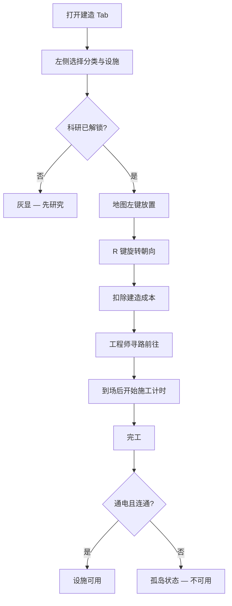

# 🏗️ 建造

> **文档版本**：v1.6.1 · 站点设施放置与工程管理终端  
> **工程权限**：主管授权 — 工程师执行

> **[待补图 IMG-007]** 建造面板 + 地图放置

---

## 面板定位

**建造** Tab 用于在网格地图上 **放置、拆除、升级与扩建** 设施。所有建造操作可在 **暂停模式**（`空格`）下完成——时间冻结，工程师寻路冻结，但放置指令立即生效。


绿色高亮 = 可放置；红色 = 不可（重叠、未连通、区域违规、未解锁、全站限 1 已满）。详见 [操作与快捷键](../02-getting-started/controls.md)。


---

## 基本建造流程

| 步骤 | 要点 | 常见错误 |
|------|------|----------|
| 选择 | 左侧分类树浏览 | 未注意全站限 1 设施 |
| 放置 | 左键地图格 | 走廊未连通导致孤岛 |
| 旋转 | `R` 切换四向 | 走廊方向错误阻断寻路 |
| 等待 | 工程师 **到场后** 才计时 | 误以为放置即开工 |
| 验收 | 通电 + 连通 + 区域正确 | 收容单元放错 zone |

---

## 建造分类

| 分类 | 代表设施 | 前置条件 | 关联章节 |
|------|----------|----------|----------|
| 走廊 | 标准走廊、复合通道 | 开局可用 / 科研解锁 | [建造指南](../05-site/construction.md) |
| 基础设施 | 电力中继、输电竖井 | 部分需科研 | [电力网格](../05-site/power.md) |
| 后勤 | 柴油/水力/地热/核电、水处理、仓储 | 发电链科研 | 太阳能/风力 **已移除**（v1.6.0） |
| 办公 | 控制室、C.A.S.S.I.E 中枢、避难所 | 控制室限 1 | [GATE 闸口](../05-site/gates.md) |
| 科研 | 科研中心、科研实验室 | 科研中心限 1 | [科技树](../08-research/tech-tree.md) |
| 收容 | 各 SCP 专属单元、临时收容间 | SCP 材料节点 | [收容措施](../09-containment/measures-transfer.md) |
| 人员 | 宿舍、食堂、医务室、安保站 | 宿舍容量限制招聘 | [人员需求](../07-personnel/types-needs.md) |
| 核弹 | 弹头发射井 | 核弹科研链 | [弹头科研](../08-research/warhead-research.md) |


v1.6.0 核电站加强为 **4×4 占地，出力 1200**。规划 HCZ 扩建时预留地块。


---

## 限制规则

| 规则类型 | 说明 | 违反后果 |
|----------|------|----------|
| 全站限 1 | 科研中心、C.A.S.S.I.E 中枢、控制室 | 无法重复放置 |
| 科研锁定 | 未解锁节点对应房间灰显 | 须先完成 [科研](research.md) |
| 区域规划 | LCZ / HCZ / 行政 / 后勤 / 入口 | 错区提高 breach RNG |
| 收容等级 | 单元 `ContainmentLevel` ≥ SCP 需求 | 极高 breach 风险 |
| 区域密度 | 同 zone SCP 过密 | 突破概率上升 |

区域色与楼层说明见 [三层站点与区域](../05-site/floors-zones.md)。

---

## 升级与扩建

### 单房间扩建

| 可扩建设施 | 效果 | 操作位置 |
|------------|------|----------|
| 水处理厂 | 提高产水 | 选中房间 → 左下详情 |
| 仓储 | 提高容量上限 | 同上 |
| 医务室 | 提高治疗能力 | 同上 |
| 更多设施 | v1.6.0+ 扩展列表 | [建造指南](../05-site/construction.md) |

### 中层站点扩建

| 阶段 | 地图尺寸 | 解锁条件 |
|------|----------|----------|
| 初始 | 60 × 40 | 开局 |
| 第一次扩建 | 72 × 48 | 研究「中层扩建协议」 |
| 第二次扩建 | 84 × 56 | 后续扩建科研 |

扩建须在 **控制室** 发起，非建造 Tab 直接操作。

---

## 拆除规则

| 条件 | 是否可拆 | 返还 |
|------|----------|------|
| 空房间 | 是 | 10%–30% 建造成本 |
| 有 SCP 在内 | **否** | — |
| 有人员在内 | **否** | — |
| 施工中 | 是（中断工程） | 部分返还 |


拆除 **C.A.S.S.I.E 中枢** 或 **控制室** 将导致站点指挥能力瘫痪。仅破产应急时考虑。


---

## 与工程师 / 电力的协作

| 场景 | 建造面板操作 | 后续检查 |
|------|--------------|----------|
| 新发电站 | 放置于后勤灰区 | [财政](finance.md) 维护费增量 |
| 收容单元 | 匹配 SCP 分级与 zone | [收容](containment.md) 分配 |
| 观察室 | 邻接收容单元 | [观察岗](../07-personnel/orders-observation.md) |
| 输电竖井 | 跨层电力连通 | 地图检查通电状态 |

工程师可被 **手动指派岗位**（v1.6.0+）锁定至工地直至完工。

---

## 相关章节

* [建造、升级与扩建](../05-site/construction.md) — 完整设施目录
* [电力网格](../05-site/power.md) — 发电类型与负载
* [设施与房间目录](../appendix/room-catalog.md) — 全房间参数速查
* [快捷键一览](../appendix/shortcuts.md) — `R` / `Shift` 修饰键

---

## 本章导航

- 上一篇：[财政](finance.md)
- 下一篇：[人事](personnel.md)
