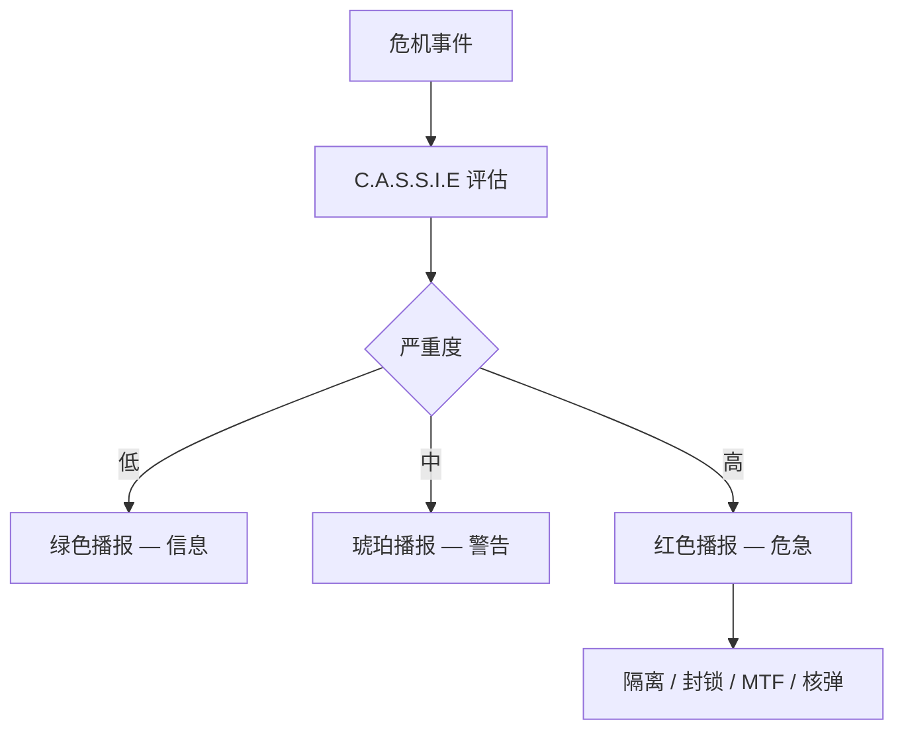

# 🤖 C.A.S.S.I.E

> **文档版本**：v1.6.1 · 中央自主站点安全情报引擎控制终端  
> **系统全称**：Central Autonomous Site Security Intelligence Engine

> **[待补图 IMG-011]** CASSIE 面板 + 播报条

---

## 面板定位

**C.A.S.S.I.E** Tab 用于查看与控制站内 **自主安全响应系统**。C.A.S.S.I.E 在秒级响应 breach、调度人员、隔离区域、削减电力负载，并在极端态势下启动毁灭协议。地图顶部 **播报条** 与面板状态实时同步。


建议 **早期开启** C.A.S.S.I.E 熟悉危机响应逻辑；熟练后可关闭尝试手动管理。关闭后 v1.6.0+ 自动解除封锁（核武/毁灭协议执行中除外）。


---

## 子系统架构

| 模块 | 职能 | 玩家可见表现 |
|------|------|--------------|
| CassieDirector | 播报队列、优先级排序 | 地图顶栏 CASSIE 条 |
| CassieResponseSystem | breach 自动响应 | 安保调度、隔离 |
| CassieIsolationResponse | 区域隔离 | 事故区门禁锁定 |
| CassieDispatchResponse | 人员 / MTF 调度 | 拦截 loose SCP |
| CassiePowerResponse | 电力削减 | 负载优先级断电 |
| CassieWarheadResponse | 核弹选弹 | 弹头建议与齐射 |

技术细节见 [C.A.S.S.I.E 自主响应](../11-cassie/auto-response.md)。

---

## 自动响应矩阵

| 触发态势 | C.A.S.S.I.E 响应 | 主管可覆盖? |
|----------|------------------|-------------|
| 单个 SCP breach | 隔离事故区、调安保 | 可手动增援 |
| 多 loose SCP | 全站封锁、避难所引导 | 封锁中勿调出人员 |
| SCP-096 脸泄露 | 紧急封锁 + MTF | 优先召回 |
| SCP-079 渗透 | 切断网络链路 | 检查行政区 |
| 电力过载 / 不足 | 负载削减、优先级断电 | 增发电或减消耗 |
| 审计极低 + 多 breach | 毁灭协议倒计时 | **不可取消** |
| 特定 SCP 行为 | 按异常机制响应 | 参阅 SCP 图鉴 |

---

## 手动指令

| 指令 | 用途 | 冷却 / 费用 | 关联 |
|------|------|-------------|------|
| 全站封锁 | 手动 lockdown | — | [封锁与 MTF](../11-cassie/lockdown-mtf.md) |
| 区域隔离 | 隔离指定事故区 | — | 地图红晕标识 |
| MTF 派遣 | 捕获或补给任务 | 审计相关费用 | [收容](containment.md) |
| 紧急召回 | 重收容最高威胁 loose SCP | 冷却 + 费用 | 失控列表 |
| 核弹选弹 | 手动选择弹头类型 | 须科研解锁 | [弹头科研](../08-research/warhead-research.md) |
| O5 齐射 | 多弹头联合打击 | 如 SCP-682 | [毁灭协议](../11-cassie/warhead-protocol.md) |


O5 齐射为 **最终手段**。误射行政区将导致编内人员伤亡与审计崩盘。


---

## 播报系统

地图顶部 **C.A.S.S.I.E 播报条** 要素：

| 元素 | 说明 |
|------|------|
| 左侧严重度色条 | 绿（信息）→ 琥珀（警告）→ 红（危急） |
| 扫描线动画 | 基金会终端视觉 |
| 标题 / 正文 | 当前最高优先级播报 |
| 音效 | 突破 / 封锁 / 核弹各自音效 |
| 地图外圈渐晕 | 全站封锁时红色晕影 |

突破重大事件时可能出现 **地图横幅倒计时**（如毁灭协议剩余时间）。

---

## 开关 C.A.S.S.I.E（v1.6.0+）

### 关闭时

| 解除项 | 说明 |
|--------|------|
| 全站封锁 | 自动解除（核武/毁灭协议中 **除外**） |
| 避难所强制指令 | 人员可离开避难所 |
| 事故区隔离 | 门禁恢复 |
| 非战斗人员 | 恢复施工、日常勤务、非封锁区移动 |

### 开启时

恢复 **全自动危机管理**：秒级 breach 响应、人员避险、安保 intercept。

| 场景 | 建议状态 |
|------|----------|
| 新手 / 多 SCP 运营 | **开启** |
| 学习手动危机管理 | 关闭（接受更高风险） |
| 核弹倒计时 / 毁灭协议 | 开启或只读等待 |
| 观察岗轮班 | 开启不影响研究员值守（v1.4.8+） |

---

## 与玩家主管的分工

| 职能 | C.A.S.S.I.E | 玩家主管 |
|------|-------------|----------|
| 时间尺度 | 秒级响应 | 日 / 周级规划 |
| breach 处置 | 自动隔离、调度 | 手动 MTF、选弹批准 |
| 人员安全 | 避难所引导 | 招聘、岗位、扩建 |
| 电力危机 | 负载削减 | 建造发电、扩建电网 |
| 核弹 | 选弹建议 | O5 齐射最终批准 |
| 长期经济 | — | [财政](finance.md)、合同 |

---

## 离线解封后的运营恢复

关闭 C.A.S.S.I.E 后，以下活动 **自动恢复**：

* 工程师施工（非手动岗位锁定者由主管调度）
* 科研人员日常研究产出
* 走廊寻路与非封锁区移动
* 后勤设施正常运行

**不恢复**：已 loose 的 SCP 仍须主管通过 [收容](containment.md) 或紧急召回处置。

---

## 相关章节

* [C.A.S.S.I.E 自主响应](../11-cassie/auto-response.md) — 触发逻辑与模块
* [封锁与 MTF 调度](../11-cassie/lockdown-mtf.md) — lockdown 细则
* [毁灭协议与弹头](../11-cassie/warhead-protocol.md) — 9 弹头与齐射
* [布局](layout.md) — 播报条与地图渐晕

---

## 本章导航

- 上一篇：[收容](containment.md)
- 下一篇：[设置](settings.md)
