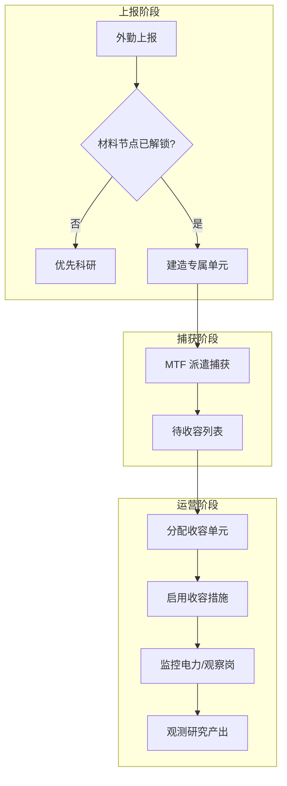
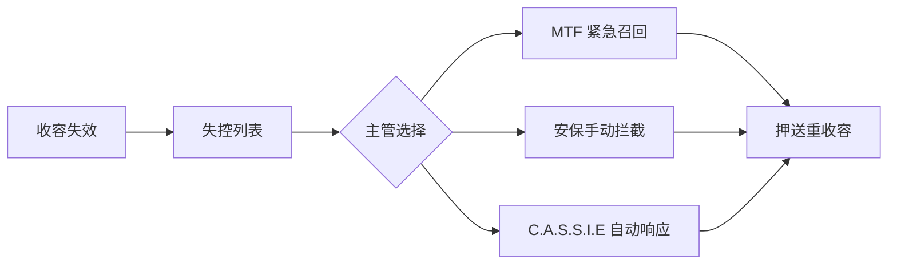

# 🔒 收容

> **文档版本**：v1.6.1 · 异常对象管理与收容规程终端  
> **管理权限**：主管全权 — MTF 行动须主管授权

> **[待补图 IMG-010]** 收容面板上报/待收容

---

## 面板定位

**收容** Tab 是异常管理的 **核心枢纽**。外勤上报、MTF 捕获、单元分配、措施启用、转移押送与重收容操作均在此完成。右下事件日志同步 breach 与捕获事件。


电力中断、区域不合规、收容等级不足任一条件满足，breach 风险将显著上升。主管须每日巡检已收容列表。


---

## 面板分区

| 分区 | 内容 | 典型操作 |
|------|------|----------|
| 外勤上报 | 新发现的 SCP 报告 | 审阅分级与威胁预估 |
| 待收容 | MTF 捕获后待分配单元 | 拖入 / 选入专属收容室 |
| 已收容 | 各收容室实时状态 | 检查电力、措施、观察岗 |
| 失控 | Loose SCP 列表 | 重收容、MTF 紧急召回 |

---

## 典型工作流

完整管线见 [异常上报 → MTF 捕获](../09-containment/pipeline.md)。以下为面板内逐步操作：

| 步骤 | 面板位置 | 前提 | 结果 |
|------|----------|------|------|
| 1. 审阅上报 | 外勤上报 | 游戏日推进周期性产生 | 确认目标 SCP |
| 2. 研究材料 | [科研](research.md) | — | MTF 派遣解锁 |
| 3. 建造单元 | [建造](build.md) | 专属单元科研完成 | 空位收容室就绪 |
| 4. MTF 派遣 | 收容面板 / [CASSIE](cassie.md) | 冷却结束、费用足够 | 捕获成功 → 待收容 |
| 5. 分配单元 | 待收容 | 单元空位、等级合规 | SCP 进入已收容 |
| 6. 启用措施 | 已收容详情 | 规程节点完成 | breach RNG 下降 |

开局已有 **SCP-999**，无需捕获，可作为运营基准对照。

---

## 关键操作详解

| 操作 | 入口 | 费用 / 冷却 | 说明 |
|------|------|-------------|------|
| MTF 派遣 | 收容面板按钮 | 费用随审计变化 | 捕获已上报 SCP |
| 分配单元 | 待收容 → 选房间 | — | 须匹配分级与 zone |
| 执行收容规程 | breach 后 | 需安保押送 | 将 loose SCP 重收容 |
| 转移 | 已收容详情 | — | 同层 LCZ/HCZ 间移动 |
| 临时收容间 | 转移流程 | ~20 分钟倒计时 | 押送中转 |
| 紧急召回 | 收容 / CASSIE | 冷却 + 费用 | 优先最高威胁 loose SCP |


**收容等级**：房间 `ContainmentLevel` 须 **≥** SCP `RequiredContainmentLevel`。Keter 放低级单元 = 极高 breach 风险。


---

## 状态指示与风险因子

| 指示 | 含义 | 主管响应 |
|------|------|----------|
| 电力中断图标 | 单元断电 | 修复输电 / 发电，优先 HCZ |
| 区域不合规标记 | SCP 不在 PreferredZone | 计划转移或接受风险 |
| 措施未启用 | 规程研究完成但未应用 | 立即启用措施 |
| 观察岗空缺 | 173 等需视线 | [人事](personnel.md) 派研究员 |
| 超期未捕获 | 14/28/42/56/70 日升级 | 见 [超期升级](../09-containment/overdue.md) |

### 超期时间线（未捕获 SCP）

| 游戏日 | 事件级别 |
|--------|----------|
| 14 | 民间传闻 |
| 28 | O5 施压 |
| 42 | 伦理审查 |
| 56 | 拨款削减 |
| 70 | GOC 锁 — 冻结捕获权 |

---

## 区域合规速查

| SCP 分级 | 推荐 zone | 错区后果 |
|----------|-----------|----------|
| Safe | LCZ（绿） | 密度上升 |
| 低威胁 Euclid | LCZ | breach RNG 上升 |
| Keter | HCZ（红） | 极高 breach 概率 |
| 区域密度 | 同 zone 不宜过密 | 突破 RNG 叠加 |

区域色说明见 [布局](layout.md#地图图例与区域色) 与 [三层站点](../05-site/floors-zones.md)。

---

## 失控与重收容

breach 罚款计入 [财政](finance.md) 支出。多 loose SCP 可能触发全站封锁与毁灭协议。详见 [收容失效与重收容](../09-containment/breach-recontain.md)。

---

## 相关章节

* [收容全流程](../09-containment/pipeline.md) — MTF 费用与冷却
* [收容措施与转移](../09-containment/measures-transfer.md) — 临时收容间规程
* [SCP 图鉴](../10-scp/index.md) — 26 个内置异常参数
* [观察岗](../07-personnel/orders-observation.md) — SCP-173 关键配置

---

## 本章导航

- 上一篇：[科研](research.md)
- 下一篇：[CASSIE](cassie.md)
