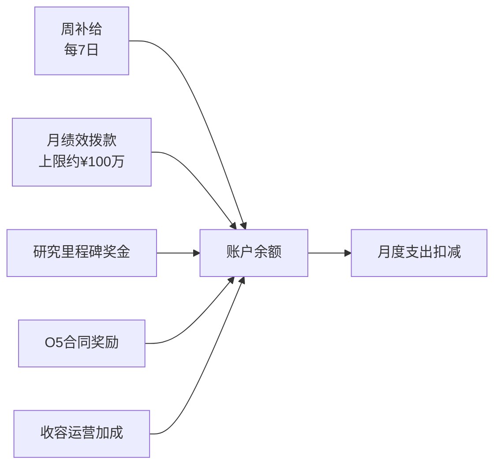
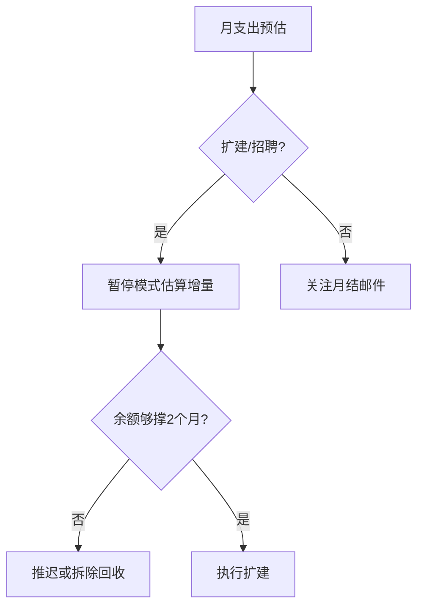

# 💰 财政

> **文档版本**：v1.6.1 · 站点经济状况与物资后勤终端  
> **审计主体**：基金会财政部门 — SCP-CN-465 月度审查

> **[待补图 IMG-006]** 财政面板收支明细

---

## 面板定位

**财政** Tab 展示站点 **账户余额、周期性拨款、收支明细与物资库存**。扩建、招聘、MTF 派遣前均应在此估算月支出增量。顶栏 **余额 ¥** 与面板数据实时同步。


余额低于 **−¥100,000** 将触发 **站点破产** → 游戏失败。建议维持正余额并预留至少一周工资。


---

## 主要信息区

| 项目 | 显示位置 | 说明 | 更新频率 |
|------|----------|------|----------|
| 账户余额 | 顶栏 + 面板首行 | 当前可用资金 | 实时 |
| 周补给 | 收入区 | 基金会定期基础拨款 | 每 7 游戏日 |
| 月绩效 | 收入区 | 运营评分结算拨款 | 每月初 |
| 收入明细 | 可展开列表 | 收容加成、研究里程碑、合同奖励 | 事件触发 |
| 支出明细 | 可展开列表 | 维护、工资、电力、罚款 | 每月 / 事件 |
| 物资库存 | 后勤区 | 清洁水、口粮、补给 | 实时 |

---

## 收入结构

### 月绩效影响因素

月绩效受 **运营评分** 加权计算，核心因子包括：

| 因子 | 高评分条件 | 低评分后果 |
|------|------------|------------|
| 审计评级 | ≥ 80 最优 | < 50 拨款削减 |
| 电力稳定 | 发电 ≥ 消耗 | 负载削减期间下降 |
| 收容状况 | 无 loose SCP | breach 罚款叠加 |
| 站点连通性 | 走廊通电连通 | 孤岛房间拖累评分 |
| 后勤物资 | 水/粮充足 | 短缺降低效率 |
| 威胁等级 | 维持低位 | 高威胁压缩拨款 |

拨款公式与审计乘数详见 [财政与审计](../06-economy/budget-audit.md)。

---

## 支出项详解

| 类型 | 触发时机 | 估算方式 | 备注 |
|------|----------|----------|------|
| 房间维护 | 每月初 | 按房间类型固定费率 | 扩建直接增加 |
| 人员工资 | 每月初 | 按各类型编制 | 招聘前查人事面板 |
| 电力成本 | 每月初 | 发电维护 + 消耗 | 核电维护费较高 |
| Breach 罚款 | 收容失效时 | 按 SCP 分级 | 可能极重 |
| 合同失败罚金 | 月结时 | 按合同条款 | v1.4.8+ 不永久叠加 |
| MTF 派遣 | 派遣时 | 随审计评级变化 | 低审计 = 高费用 |


月结事件中区分 **「月结净额」** 与 **「本月合计净增」**——前者为当月收支轧差，后者含周补给等跨项汇总。


---

## 物资与后勤

| 物资 | 用途 | 短缺影响 |
|------|------|----------|
| 清洁水 | 水厂产出，人员需求 | 士气下降、运营评分降低 |
| 口粮 | 食堂消耗，日常补给 | 同上 |
| 通用补给 | 部分设施运行、事件消耗 | 后勤事件触发 |

物资生产与仓储扩建见 [物资与后勤](../06-economy/logistics.md)。

---

## 财政管理策略

### 安全线参考

| 阶段 | 建议最低余额 | 审计目标 | 说明 |
|------|--------------|----------|------|
| 开局（日 1–7） | ¥50,000+ | ≥ 60 | 首 capture 前勿过度扩建 |
| 中期（首 Keter 前） | ¥100,000+ | ≥ 70 | 预留 MTF 与 breach 罚金 |
| 后期（多 SCP 运营） | ¥200,000+ | ≥ 80 | 支撑核弹科研与扩建 |

### 应急手段

| 手段 | 回收比例 | 风险 |
|------|----------|------|
| 拆除房间 | 10%–30% 建造成本 | 内有人员/SCP 不可拆 |
| 解雇人员 | 停止工资增量 | 编制不足影响运营 |
| 完成 O5 合同 | 一次性奖励 | 有失败罚金风险 |
| 暂停扩建 | — | 最安全手段 |

---

## 与顶栏 / 简报的联动

| 信号 | 来源 | 财政面板动作 |
|------|------|--------------|
| 余额变黄 / 红 | 顶栏 ¥ | 展开支出明细，定位最大项 |
| 财政预警邮件 | [简报](briefing.md) | 检查月绩效与罚款记录 |
| 审计下跌 | 顶栏 ★ | 优先重收容，恢复拨款乘数 |
| 月结事件 | 右下日志 | 核对净额与净增差异 |

---

## 相关章节

* [财政与审计](../06-economy/budget-audit.md) — 拨款公式、审计评级表
* [建造](build.md) — 维护费与建造成本
* [人事](personnel.md) — 工资与编制
* [第一天生存指南](../03-tutorial/first-day.md) — 首小时财政红线

---

## 本章导航

- 上一篇：[简报](briefing.md)
- 下一篇：[建造](build.md)
