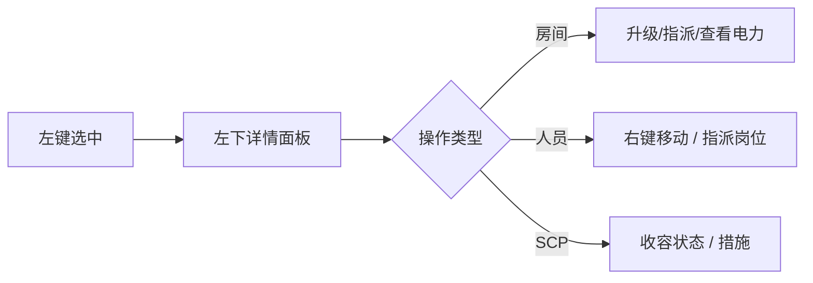

# 🖥️ 四侧栏布局与顶栏

> **文档版本**：v1.6.1 · 对应游戏内 HUD 与四象限侧栏布局  
> **适用平台**：Windows 桌面版（Android 见 [移动端差异](#移动端差异)）

> **[待补图 IMG-003]** 四侧栏 HUD 总览


---

## 设计理念

站点主管的指挥界面遵循基金会 **监控终端** 范式：顶栏为实时态势摘要，中央为 **可交互站点地图**，四侧栏分别承担 **导航、详情、简报、日志** 职能。所有操作均在暂停状态下可用——时间冻结不代表指挥权冻结。


新手教程第 1 步会引导你熟悉本布局；完整键位见 [操作与快捷键](../02-getting-started/controls.md)。


---

## 顶栏状态条（44px）

顶栏固定在窗口最上方，五项指标从左至右排列，字体与色条均遵循基金会终端规范。

| 指标 | 显示内容 | 主管解读 | 关联面板 |
|------|----------|----------|----------|
| **日期** | 游戏运行天数 | 合同期限、超期 SCP 计时基准 | [简报](briefing.md) |
| **余额 ¥** | 当前账户资金 | 低于红线即破产 | [财政](finance.md) |
| **电力** | 发电 vs 消耗 | 不足时 C.A.S.S.I.E 执行负载削减 | [电力网格](../05-site/power.md) |
| **威胁** | 站点威胁等级 1–10 | 影响事件频率与 SCP 猎杀性 | [O5 合同](../12-progression/missions-threat.md) |
| **审计** | 审计评级 0–100 | 拨款、MTF 费用、breach RNG | [财政与审计](../06-economy/budget-audit.md) |


审计评级 **< 50** 时，收容失效随机概率上升，O5 审查邮件频率增加。建议将 **70** 作为日常安全线。


部分版本支持点击顶栏指标跳转相关部门面板（视当前 UI 绑定而定）。

---

## 四侧栏空间分配

```
┌──────────────────────────────────────────────────────────────────┐
│  日期 │ ¥余额 │ ⚡电力 │ ⚠威胁 │ ★审计                              │
├──────────────┬───────────────────────────────┬───────────────────┤
│ 【左上】     │                               │ 【右上】          │
│ 部门 Tab     │        【中央】站点地图         │ 简报内容区        │
│ 9 个标签页   │        缩放 / 平移 / 选中     │ 邮件 / 合同 / 协议│
├──────────────┤                               ├───────────────────┤
│ 【左下】     │                               │ 【右下】          │
│ 选中详情     │                               │ 事件日志          │
│ 房间/人员/SCP│                               │ 时间线滚动        │
└──────────────┴───────────────────────────────┴───────────────────┘
```

| 象限 | 职能 | 典型内容 |
|------|------|----------|
| 左上 | **部门导航** | 9 个 Tab + 模组入口 |
| 中央 | **态势地图** | 三层楼层、实时实体位置 |
| 右上 | **简报主区** | 当前 Tab 的详细面板 |
| 左下 | **实体详情** | 选中对象的属性与操作 |
| 右下 | **事件日志** | 全站时间线，重大事件同步高亮 |

---

## 部门 Tab 一览

| Tab | 图标色 | 核心职能 | 详解 |
|-----|--------|----------|------|
| [简报](briefing.md) | 蓝 | 态势、邮件、O5 合同 | 每日首要审阅 |
| [财政](finance.md) | 绿 | 收支、物资、月结 | 扩建前必查 |
| [建造](build.md) | 灰 | 放置、拆除、升级 | 暂停模式操作 |
| [人事](personnel.md) | 橙 | 招聘、编制、列表 | 观察岗配置 |
| [科研](research.md) | 紫 | 横向科技树 | 解锁设施与规程 |
| [收容](containment.md) | 红 | 上报、待收容、失控 | 异常管理枢纽 |
| [CASSIE](cassie.md) | 青 | 封锁、MTF、核弹 | 危机响应 |
| [设置](settings.md) | 白 | 存读档、显示、教程 | 含模组管理 |
| 模组 | — | 启用/禁用模组 | 需重进对局生效 |


v1.6.1 教程第 9 步要求打开 **科研** 标签；第 1 步桌面版会自动切入简报。


---

## 中央地图交互

| 操作 | 输入 | 效果 |
|------|------|------|
| 选中 | 左键点击 | 房间 / 人员 / SCP → 左下详情 |
| 人员指令 | 右键点击 | 移动目标格 / 解雇 |
| 缩放 | 滚轮 | 建议缩至能看清单格走廊 |
| 平移 | 中键拖动 / WASD / 方向键 | 暂停时亦可平移 |
| 楼层 | 地图底部按钮 | 地表 / 中层 / 深层 |
| 旋转建造 | `R` | 仅建造模式生效 |



部门面板打开时，滚轮可能作用于面板滚动而非地图——**先点击地图区域**再缩放。

---

## C.A.S.S.I.E 广播条

突破或重大事件时，地图上方浮现 **C.A.S.S.I.E 播报条**：

| 元素 | 说明 |
|------|------|
| 左侧色条 | 严重度：绿（信息）→ 琥珀（警告）→ 红（危急） |
| 扫描线动画 | 基金会终端视觉标识 |
| 标题 / 正文 | 播报队列当前最高优先级消息 |
| 地图外圈渐晕 | 全站封锁时红色晕影包围地图 |

播报逻辑、自动响应与手动指令详见 [C.A.S.S.I.E](cassie.md) 与 [自主响应](../11-cassie/auto-response.md)。

---

## 地图图例与区域色

可通过地图图例面板查看区域颜色含义：

| 颜色 | 区域 | 典型设施 |
|------|------|----------|
| 绿 | LCZ 轻收容 | Safe、低威胁 Euclid 单元 |
| 红 | HCZ 重收容 | Keter 单元、深层设施 |
| 蓝 | 行政办公 | 控制室、C.A.S.S.I.E 中枢、避难所 |
| 黄 | 入口区 | GATE 闸口、检查点 |
| 灰 | 后勤支援 | 发电、水厂、仓储 |

区域规划错误（如 Keter 放 LCZ）会提高 breach 概率。详见 [三层站点与区域](../05-site/floors-zones.md)。

---

## 移动端差异

Android 版使用 **底部 Tab** + **可拖拽高度面板**，逻辑与 PC 四侧栏相同：

* 顶栏指标压缩为单行
* 部门 Tab 移至屏幕底部
* 模组面板只读，不支持外部导入

完整触控说明见 [Android 移动端](../02-getting-started/mobile.md)。

---

## 相关章节

* [操作与快捷键](../02-getting-started/controls.md) — 全键位与建造流程
* [术语表](../01-introduction/glossary.md) — LCZ、审计、观察岗等专有名词
* [第一天生存指南](../03-tutorial/first-day.md) — 首小时界面使用顺序

---

## 本章导航

- 上一篇：[部门导览](../04-interface/hubs/部门面板.md)
- 下一篇：[简报](briefing.md)
