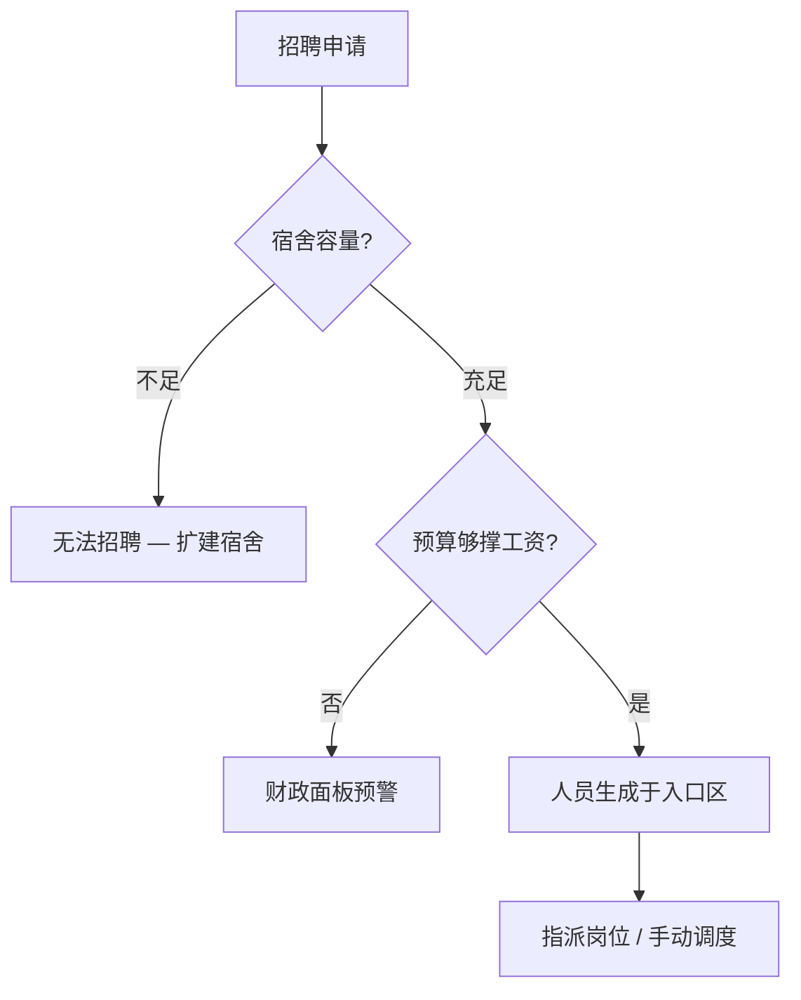

# 👥 人事

> **文档版本**：v1.6.1 · 站点编制与人员调度终端  
> **编制主体**：基金会人事部 — SCP-CN-465 在岗名册

> **[待补图 IMG-008]** 人事编制列表

---

## 面板定位

**人事** Tab 管理全站 **五类人员编制、招聘解雇与人员列表**。顶栏不直接显示编制数，但工资支出在 [财政](finance.md) 月结中体现。地图选中人员时，左下 **详情面板** 提供移动、指派岗位与状态查看。


SCP-173 到位 **前** 必须配置 **观察岗** 研究员。视线中断将导致瞬移攻击。详见 [观察岗](../07-personnel/orders-observation.md)。


---

## 人员类型

| 类型 | 职责 | 关键设施 | 编制建议 |
|------|------|----------|----------|
| 科研人员 | 研究产出、SCP 观测、观察岗轮班 | 科研中心、实验室、观察室 | 早期 ≥ 2 |
| 安保人员 | 巡逻、押送、拦截 loose SCP | 安保站、HCZ 走廊 | 有 Keter 后增编 |
| 工程师 | 施工、电力设施巡检 | 工地、发电站 | 早期 ≥ 2 |
| 医护人员 | 治疗伤员、维持士气 | 医务室 | 中期 1–2 |
| D 级人员 | 高风险实验（伦理敏感） | 实验室、收容单元 | 按需，有伦理代价 |

D 级人员 **不算编内**，不计入宿舍容量但参与实验事件。见 [D 级人员与伦理](../07-personnel/d-class.md)。

---

## 招聘与解雇

| 操作 | 入口 | 限制条件 |
|------|------|----------|
| 招聘 | 人事面板各类型 `+` | 宿舍容量、预算 |
| 批量调整 | 面板滑块 / 按钮 | 月工资增量 |
| 解雇 | 右键人员 / 面板操作 | 即时停止工资 |
| 地图解雇 | 右键人员 → 解雇 | 二次确认 |

招聘前在暂停模式估算月工资增量，参阅 [财政](finance.md) 安全线表。

---

## 人员列表

列表显示全站在编人员：

| 列 | 内容 | 筛选用途 |
|----|------|----------|
| 姓名 | 随机生成标识 | 地图对照 |
| 类型 | 科研 / 安保 / 工程师 / 医护 | 按职能筛选 |
| 状态 | 空闲 / 移动中 / 岗位 / 避险 | 识别闲置人力 |
| 位置 | 当前房间或走廊 | 快速定位 |

点击列表项或地图人员 → 左下 **详情面板** 同步展开。

---

## 详情面板操作

| 操作 | 方式 | v1.6.1 说明 |
|------|------|-------------|
| 移动 | 右键地图目标格 | 沿走廊寻路，跨层走电梯/楼梯 |
| 指派岗位 | 详情 → **指派岗位** → 点击房间 | v1.6.0+ 常驻绑定 |
| 查看状态 | 详情面板属性区 | 生命、伤势、士气、需求 |
| 解雇 | 右键菜单 / 详情按钮 | 编内人员即时移除 |

### 指派岗位 vs 手动移动

| 模式 | 行为 | 适用场景 |
|------|------|----------|
| 指派岗位 | 人员常驻目标房间，自动复归 | 观察岗、科研产出、工程师工地 |
| 手动移动 | 单次指令，完成后空闲 | 紧急押送、临时调遣 |

房间详情显示 **在岗人员** 列表，便于核查观察岗轮班。

---

## 编制建议（按阶段）

| 阶段 | 科研 | 工程师 | 安保 | 医护 | 关键任务 |
|------|------|--------|------|------|----------|
| 开局（日 1–3） | 2 | 2 | 1 | 0 | 走廊、科研中心、首发电 |
| 首 capture 前 | 3 | 2 | 1 | 0 | 材料节点研究链 |
| SCP-173 到位前 | 3+ | 2 | 2 | 1 | **观察室 + 观察岗** |
| 多 Keter 运营 | 4+ | 3 | 4+ | 2 | HCZ 轮班、重收容押送 |
| 危机期 | 维持 | 维持 | 满编 | 1+ | 优先安保拦截 loose SCP |


开启 C.A.S.S.I.E 时，系统自动调度安保 intercept 与引导人员进避难所。关闭后非战斗人员恢复日常勤务。见 [CASSIE](cassie.md)。


---

## 人员需求与士气

| 需求 | 满足方式 | 不足后果 |
|------|----------|----------|
| 休息 | 宿舍 | 士气下降、效率降低 |
| 进食 | 食堂 + 口粮 | 士气下降 |
| 饮水 | 水厂 + 清洁水 | 士气下降 |
| 治疗 | 医务室 + 医护 | 伤势恶化、死亡 |

SCP-999 等异常可提升周围人员士气。生命与寻路机制见 [人员类型与需求](../07-personnel/types-needs.md)。

---

## 与 C.A.S.S.I.E 的协作

| C.A.S.S.I.E 状态 | 人员行为 | 主管操作 |
|------------------|----------|----------|
| 开启 | 自动避险、安保 intercept | 少手动干预 |
| 关闭（v1.6.0+） | 解除封锁、恢复施工与日常 | 手动危机管理 |
| 全站封锁 | 非战斗人员强制避难所 | 勿手动调出人员 |
| 核武 / 毁灭协议 | 封锁不可解除 | 只读等待 |

---

## 相关章节

* [手动调度与观察岗](../07-personnel/orders-observation.md) — 173 观察规程
* [人员类型与需求](../07-personnel/types-needs.md) — 生命、士气、寻路
* [操作与快捷键](../02-getting-started/controls.md) — 右键移动全流程
* [术语表](../01-introduction/glossary.md) — 编内、避难所、指派岗位

---

## 本章导航

- 上一篇：[建造](build.md)
- 下一篇：[科研](research.md)
