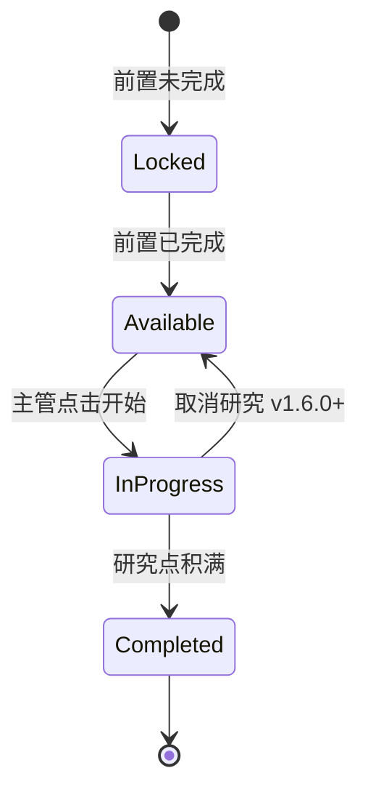
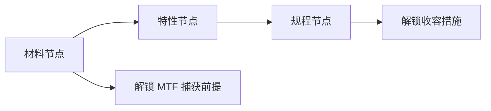

# 🔬 科研

> **文档版本**：v1.6.1 · 站点科技研发与解锁终端  
> **研发权限**：主管批准 — 科研人员执行

> **[待补图 IMG-009]** 横向科技树

---

## 面板定位

**科研** Tab 展示横向 **科技树**，是解锁设施、收容规程、发电类型与核弹弹头的 **唯一途径**。节点按前置依赖排列：锁定 → 可研究 → 进行中 → 已完成。v1.6.1 新手教程 **第 9 步** 要求打开本标签熟悉界面。


须 **科研中心通电** 且有 **科研人员** 派驻才产出研究点。实验室各 +1 槽位（最多 2 座实验室 = +2 槽位）。


---

## 界面元素

| 元素 | 位置 | 功能 |
|------|------|------|
| 横向节点图 | 主区域 | 前置 → 后续依赖可视化 |
| 节点状态色 | 节点本身 | 灰=锁定 / 白=可研究 / 蓝=进行中 / 绿=已完成 |
| 搜索框 | 顶部 | 按名称快速定位节点 |
| 节点详情 | 点击节点 | 消耗点数、解锁内容、前置列表 |
| 取消研究 | 活动项目旁 | v1.6.0+ 可取消进行中项目 |

---

## 研究槽位

| 设施 | 提供槽位 | 全站限制 | 备注 |
|------|----------|----------|------|
| 科研中心 | 1（必需） | 限 1 座 | 无中心则无法研究 |
| 科研实验室 | 各 +1 | 最多 2 座 | 并行加速关键链 |

**最大并行槽位 = 1 + 实验室数量**（上限 3）。

| 条件 | 是否产出研究点 |
|------|----------------|
| 科研中心通电 + 科研人员派驻 | 是 |
| 仅实验室无中心 | 否 |
| 断电 | 否（进度暂停） |
| 科研人员被避险引导 | 暂停产出 |

---

## 科技分类

| 类别 | 代表节点 | 解锁内容 | 详解 |
|------|----------|----------|------|
| 基础设施 | 复合通道、中层扩建协议 | 走廊、地图扩建 | [建造](build.md) |
| 收容 | 重收容技术、临时收容间 | 单元类型、押送规程 | [收容措施](../09-containment/measures-transfer.md) |
| 后勤 | 水力、地热、核电 | 发电设施 | [电力网格](../05-site/power.md) |
| SCP 专项 | 每个 SCP 三条链 | 材料→特性→规程 | [SCP 专项研究](../08-research/scp-research.md) |
| 核弹 | 9 种弹头链 | 发射井 + 弹种 | [核弹科研链](../08-research/warhead-research.md) |

### SCP 专项研究三链结构

每链完成可获 **研究里程碑奖金**（[财政](finance.md) 收入项）。

---

## 研究流程（主管 Checklist）

1. **确认基础设施**：科研中心已建、通电、连通
2. **派驻科研人员**：指派岗位或确保人员在中心内
3. **（可选）建实验室**：需要并行时扩建 +1 槽位
4. **选择节点**：点击可研究节点 → 开始
5. **等待积满**：可 `空格` 暂停查阅，或调高时间倍速
6. **验收解锁**：完成后检查 [建造](build.md) 新设施 / [收容](containment.md) 新措施


捕获 SCP 前通常须完成对应 **材料节点**。未解锁则 MTF 派遣无效或报告滞留。


---

## 取消研究（v1.6.0+）

| 操作 | 效果 | 适用场景 |
|------|------|----------|
| 取消进行中项目 | 槽位释放，进度归零 | 紧急切换更高优先级链 |
| 已完成节点 | 不可取消 | — |

典型切换场景：临时收容间规程 vs 中层扩建协议；173 规程 vs 其他 SCP 材料链。

---

## 优先级建议（新手）

| 优先级 | 研究目标 | 理由 |
|--------|----------|------|
| P0 | 首 SCP 材料链 | 解锁捕获与单元 |
| P0 | 复合通道（如需） | 站点连通性 |
| P1 | 首 SCP 规程链 | 收容措施防 breach |
| P1 | 水力 / 柴油升级 | 电力稳定 = 审计 |
| P2 | 中层扩建协议 | 地图空间 |
| P3 | 核弹链 | 后期 SCP-682 等 |

首小时详细顺序见 [第一天生存指南](../03-tutorial/first-day.md)。

---

## 与财政 / 收容的联动

| 科研完成 | 下游影响 |
|----------|----------|
| 材料节点 | [收容](containment.md) MTF 派遣解锁 |
| 规程节点 | 收容措施启用，breach RNG 下降 |
| 里程碑 | [财政](finance.md) 一次性奖金 |
| 中层扩建 | [建造](build.md) 控制室发起地图扩展 |
| 核弹节点 | [CASSIE](cassie.md) 手动选弹 |

---

## 相关章节

* [科研树与并行槽位](../08-research/tech-tree.md) — 完整节点依赖图
* [SCP 专项研究](../08-research/scp-research.md) — 26 个内置异常三链
* [核弹科研链](../08-research/warhead-research.md) — 9 弹头 / ~77 万研究点
* [教程 Walkthrough](../03-tutorial/walkthrough.md) — 第 9 步科研引导

---

## 本章导航

- 上一篇：[人事](personnel.md)
- 下一篇：[收容](containment.md)
