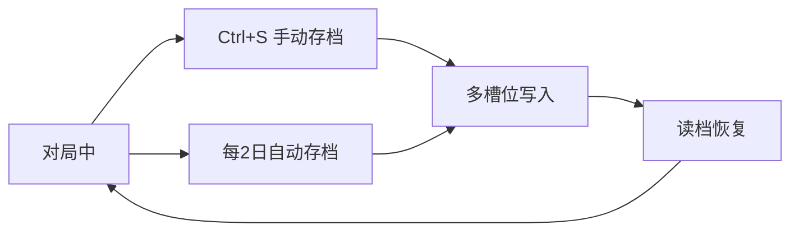
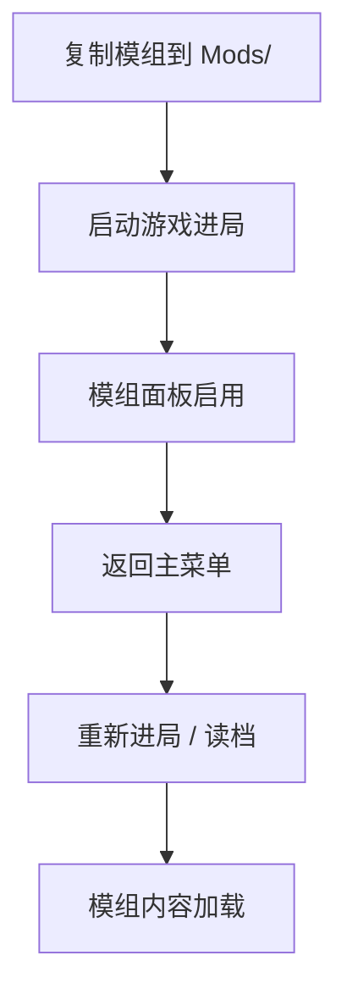

# ⚙️ 设置与模组面板

> **文档版本**：v1.6.1 · 系统配置、存档管理与模组控制  
> **权限级别**：主管本地终端 — 不涉及 O5 远程干预

> **[待补图 IMG-012]** 设置与模组面板

---

## 面板定位

**设置** Tab 提供 **存读档、界面缩放、音量、时间倍速、教程重看与更新日志** 等本地配置。**模组** 入口（同区域或独立 Tab）管理已安装模组的启用状态。Esc 键亦可快速返回主菜单。


重大危机（breach、毁灭协议倒计时）前务必 **手动存档**。自动存档每 2 游戏日触发，不足以覆盖极端局面。


---

## 设置面板功能

| 功能 | 说明 | 快捷键 / 备注 |
|------|------|---------------|
| 存读档 | 多槽位手动保存 / 加载 | `Ctrl+S` 快速存档 |
| 界面缩放 | 调整 UI 比例 | 高 DPI 屏幕建议放大 |
| 音量 | 主音量、音效分轨 | 含 CASSIE 播报音效 |
| 时间倍速 | 1x / 2x / 3x | 暂停（`空格`）独立于倍速 |
| 重看教程 | 重置并启动 12 步教程 | v1.6.1 文案精简版 |
| 更新日志 | 读取 CHANGELOG | 当前 v1.6.1 |
| 返回主菜单 | 需二次确认 | `Esc` 同等 |

### 存档机制

| 类型 | 触发 | 槽位 | 建议 |
|------|------|------|------|
| 手动存档 | 设置面板 / `Ctrl+S` | 多槽位 | 危机前、capture 前、月结前 |
| 自动存档 | 每 2 游戏日 | 固定槽 | 勿依赖覆盖极端局面 |
| 读档 | 主菜单或设置 | — | 教程读档可重入教程（v1.6.1 修复） |

存档位置见 [安装与更新](../02-getting-started/install.md)。

---

## 教程重看（v1.6.1）

v1.6.1 教程更新要点：

| 变更 | 说明 |
|------|------|
| 文案精简 | 12 步目标更清晰 |
| 面板重做 | 目标置顶、阶段标签、紧凑排版 |
| 混合强制 | 暂停、放置走廊、快速存档须完成 |
| 第 9 步 | 改为打开 **科研** 标签 |
| 桌面第 1 步 | 自动切入简报 Tab |
| 读档重入 | 读档后教程可正确恢复 |

详解见 [教程概览](../03-tutorial/overview.md) 与 [12 步 Walkthrough](../03-tutorial/walkthrough.md)。

---

## 模组面板

| 功能 | 说明 |
|------|------|
| 启用 / 禁用 | 切换模组开关 |
| 模组列表 | 显示已安装模组名称与版本 |
| 打开 Mods 文件夹 | 快捷跳转游戏目录 `Mods/` |
| 启用状态记录 | `mods_state.json`（exe 同目录） |


切换模组 **启用状态** 后，须 **返回主菜单并重新开始或读档** 才生效。对局中切换不会热加载。


### 模组安装流程

完整步骤见 [玩家：安装与启用模组](../13-mods/player-guide.md)。

---

## 官方预置模组

发版包 `Mods/` 内预置三个官方模组：

| 模组 | 内容概要 | 推荐场景 |
|------|----------|----------|
| SCP-173 观察规程包 | 强化 173 观察与叙事事件 | 收容 173 前启用 |
| 混沌分裂者事件包 | 入侵与危机事件 | 中期增加挑战 |
| 示例超重型收容模组 | 模组开发参考 / 额外 Keter | 熟悉机制后 |

详情见 [官方模组介绍](../13-mods/official-mods.md)。

---

## 自定义模组

| 途径 | 说明 |
|------|------|
| 社区模组 | 文件夹放入 `Mods/` |
| 自行开发 | `ModSDK/` + `模组开发示例.zip` |
| API 参考 | [API 速查](../13-mods/api-reference.md) |
| 开发教程 | [模组开发教程](../13-mods/modding-tutorial.md) |


模组注册的内容结构会写入存档。禁用模组后读档可能导致存档与模组状态不一致——切换前建议手动存档。


---

## Android 差异

| 项目 | Windows | Android |
|------|---------|---------|
| 模组导入 | 支持 `Mods/` 文件夹 | **不支持** 外部导入 |
| 模组面板 | 完整启用/禁用 | **只读** 展示内置模组 |
| 存档位置 | 安装目录旁 | 应用私有存储 |
| 界面缩放 | 设置面板 | 系统 DPI 自适应 |

触控与底部 Tab 布局见 [Android 移动端](../02-getting-started/mobile.md)。

---

## 显示与时间控制建议

| 设置项 | 新手建议 | 老手建议 |
|--------|----------|----------|
| 时间倍速 | 1x，熟悉后用 2x | 3x 加速研究等待 |
| 界面缩放 | 100%–125% | 按显示器调整 |
| 音量 | 保留 CASSIE 音效 | 危机时音频预警重要 |
| 暂停习惯 | 每次扩建前 `空格` | 肌肉记忆 |

---

## 相关章节

* [主菜单与存档](../02-getting-started/main-menu.md) — 槽位与读档注意
* [快捷键一览](../appendix/shortcuts.md) — `Ctrl+S` / `Esc` / `空格`
* [更新日志](../appendix/changelog.md) — v1.6.1 完整条目
* [GitBook 发布指南](../14-developer/gitbook-publish.md) — 文档版本同步

---

## 本章导航

- 上一篇：[CASSIE](cassie.md)
- 下一篇：[系统百科](../06-systems/README.md)
