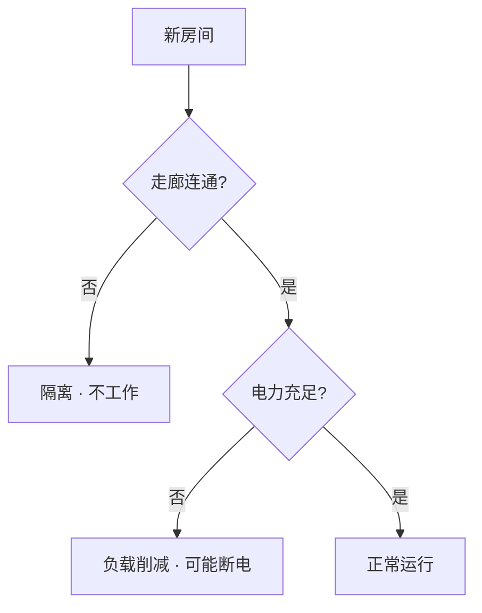

# 🏗️ 建造、升级与扩建

> **v1.6.1** · 站点扩张不是「点一下立刻出现」— 每一间房都需要 **工程师到场、消耗游戏内工时** 才能完工。连通、通电、区域合规三者缺一，房间就是摆设。

---

## 施工四步流程

| 阶段 | 说明 |
|------|------|
| 1. 放置蓝图 | 建造面板选房间 → 地图网格放置 |
| 2. 工程师调度 | 系统自动或手动指派工程师前往 |
| 3. 工时消耗 | 按 `BuildDurationMinutes` 累计（如核电 **9 游戏日**） |
| 4. 完工启用 | 房间纳入电力拓扑，可分配人员与 SCP |


**v1.5.0+**：工程师会 **锁定当前工地** 直至完工，不会反复跑向更远的新工地。手动指派时，请让工程师 **待在同一个工地** 直到进度条满。


---

## 连通与通电双重要求

房间须 **同时满足** 以下条件才会正常工作：

| 条件 | 不满足时的表现 |
|------|----------------|
| 与 **已通电走廊** 寻路可达 | 显示 **隔离斜线**，内部设施停摆 |
| 所在区域电力 **负载未超限** | 触发 C.A.S.S.I.E 负载削减，低优先级房间断电 |

未通电的 **收容单元** 会在数分钟内触发 breach — 这比任何建造省钱都更昂贵。

---

## 走廊类型

| 类型 | 造价 | 解锁 | 说明 |
|------|------|------|------|
| **标准走廊** | ¥500 | 开局 | 1 格宽，基础连通 |
| **复合通道** | ¥1,200 | 基础设施科研 | 更宽，适合主廊 |

走廊是站点的「血管」。主廊建议用复合通道，支线可用标准走廊控制成本。

---

## 单房间升级（v1.6.0+）

以下设施支持 **原地扩建**（UpgradeTiers），无需另建新房：

| 设施 | 升级收益示例 |
|------|--------------|
| 柴油发电站 | 出力 +30（−110 总计）、维护调整 |
| 水力发电站 | 出力 +20、需 +1 编制 |
| 水处理厂 | 扩产能、增维护 |
| 仓储室 | 容量与维护优化 |
| 医务室 / 安保站 | 效率与维护 |

部分扩建需 **中层扩建协议** 科研解锁。升级同样消耗工程师工时与预算。

---

## 站点地图扩建

中层地图扩建流程：

1. 研究 **中层扩建协议 I / II**
2. 在 **控制室** 或 **C.A.S.S.I.E 中枢** 发起扩建
3. 工程师施工若干 **游戏日**
4. 地图边界扩大（60×40 → 72×48 → 84×56）

扩建 **不附带** 预置房间 — 新区域是空白网格，须自行规划走廊与分区。

---

## 拆除与残值回收

| 退款比例 | 条件 |
|----------|------|
| **10%–30%** | 按房间类型、建造状态与区域计算 |

| 规则 | 说明 |
|------|------|
| 施工中拆除 | 终止工程，按规则部分退款 |
| 收容中有 SCP | **不可拆除**（须先转移） |
| 临时间有 SCP | **不可拆除** |


**v1.6.0 读档迁移**：旧存档中的 **太阳能 / 风力** 发电站会自动拆除并按残值回收。新规划请使用柴油 → 水力 → 地热 → 核电链路。


---

## 建造优先级参考

| 阶段 | 建议建造顺序 |
|------|--------------|
| **第 1–3 天** | 主廊延伸 → 科研中心（若未建）→ 第 2 台柴油或水力 |
| **第 4–10 天** | 专属 SCP 单元 → 观察室（173 等）→ 临时间（LCZ/HCZ 边界） |
| **中期** | 中层扩建 → 深层 HCZ 单元 → 输电竖井 |
| **后期** | 核电 4×4 → 核弹研究所 / silo（深层） |

---

## 典型房间造价速查

| 房间 | 尺寸 | 造价 | 工期（约） |
|------|------|------|------------|
| 标准走廊 | 1×1 | ¥500 | 短 |
| 柴油发电站 | 2×2 | ¥20,000 | 2 游戏日 |
| 水力发电站 | 2×2 | ¥22,000 | 2 游戏日 |
| 核电站 | **4×4** | ¥280,000 | **9 游戏日** |
| 水处理厂 | 2×2 | ¥15,000 | 1.5 游戏日 |

---

## 规划要诀

1. **主廊优先** — 先扩连通，再建房间；孤立蓝图是浪费。
2. **电力前置** — HCZ 单元与核电功耗极高，预留 **1200+** 净出力空间。
3. **检查点** — LCZ/HCZ 边界设双扇滑动门，封锁时 C.A.S.S.I.E 控制开关。
4. **临时间** — Keter 转移前在边界预建；每 zone 最多 **3 间**，倒计时 **20 游戏分钟**。
5. **暂停测试** — 复杂布局完成后，暂停模式下检查寻路与电力中继覆盖。

---

## 相关章节

* [三层站点与区域](floors-zones.md)
* [电力网格](power.md)
* [收容措施与转移](../09-containment/measures-transfer.md)

---

## 本章导航

- 上一篇：[楼层](floors-zones.md)
- 下一篇：[电力](power.md)
