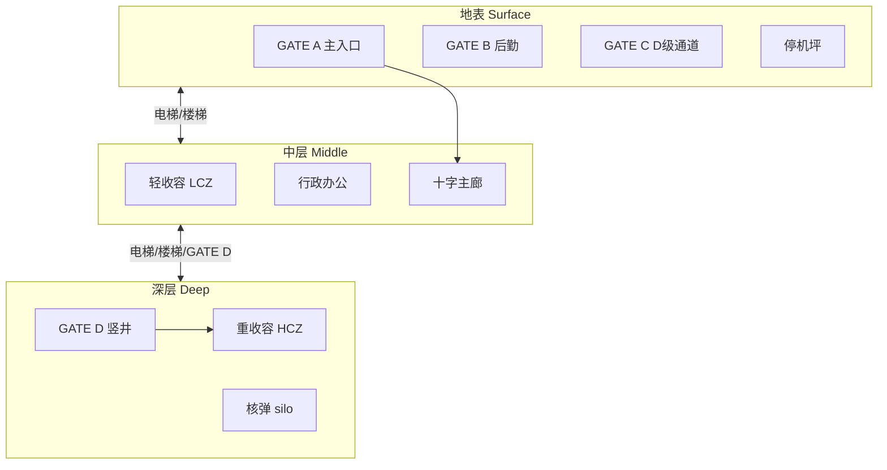
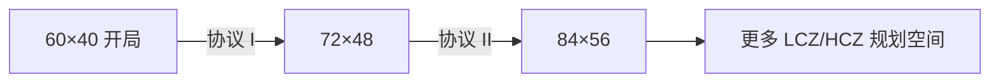

# 🗺️ 三层站点与区域规划

> **v1.6.10** · 站点由 **地表 · 中层 · 深层** 三层垂直堆叠构成。每一层都有独立的寻路网格、区域着色与电力负载，规划时须同时考虑 **竖向连通** 与 **横向分区**。

---

## 楼层结构总览

| 楼层 | 代号 | 典型设施 | 战略意义 |
|------|------|----------|----------|
| **地表** | Surface | GATE A、停机坪、撤离点、部分后勤 | 对外窗口；突破至此后果极重 |
| **中层** | Middle | 十字主廊、LCZ、行政、大部分收容 | 日常运营核心；核电须建于此层 |
| **深层** | Deep | HCZ、Keter 单元、核弹 silo、地热 | 高威胁收容与终极手段 |

新游戏在 **60×40** 地图的 **40×40 核心区**（x 10–49）预置 **正方形四象限分区** 与十字主廊：**西北行政 · 东北后勤 · 西南/东南 LCZ**；十字中心 **(30, 20)** 为入口走廊，深层下半象限为 HCZ。预置四座 GATE、4 处检查点、五台柴油发电站、控制室、C.A.S.S.I.E、SCP-999 收容单元及宿舍/食堂。开局电力约 **400 发电 / 120 用电**。

---

## 竖向连通

| 连通方式 | 作用 |
|----------|------|
| **电梯井 / 楼梯间** | 人员与 SCP 跨层寻路 |
| **GATE D 竖井闸口** | 深层重型物资与 MTF 专用通道；毁灭协议期间可 **密封** 以减轻 GATE A 突破惩罚 |
| **输电竖井** | 跨层电力传输，HCZ 高耗电设施依赖此链路 |


深层 **地热发电站** 只能建在 Deep 层；**核电站**（4×4）须建在中层 Administrative 或 Support 区域。规划电力时先画竖井，再铺房间。


---

## 功能区域与颜色编码

| 区域 | 地图色 | 收容对象 | 风险特征 |
|------|--------|----------|----------|
| **行政办公** | 蓝 | 控制室、C.A.S.S.I.E 中枢、避难所 | 危机时人员汇聚点 |
| **LCZ 轻收容** | 绿 `#48B976` | Safe、低威胁 Euclid | 密度过高仍会增加 breach RNG |
| **HCZ 重收容** | 红 `#CD5555` | Keter、高威胁 Euclid | 错放 Keter 于 LCZ 突破概率陡增 |
| **后勤支援** | 灰 | 发电、仓储、水处理 | 支撑运营评分中的后勤分项 |
| **入口区** | 黄 | GATE A/B/C/D | loose SCP 抵达 GATE A 触发重大审计惩罚 |

**区域密度规则**：同一 zone 内 SCP 过密会提高收容失效随机概率。Keter 错放在 LCZ 同样会大幅增加突破概率 — 这不是建议，而是代码中的风险乘数。

---

## 中层地图扩建

研究 **中层扩建协议 I / II** 后，可在控制室或 C.A.S.S.I.E 中枢发起扩建。工程师施工若干游戏日后，地图边界扩大：

| 扩建等级 | 地图尺寸 | 前置 |
|----------|----------|------|
| 0（默认） | **60×40** | — |
| 1 | **72×48** | 中层扩建协议 I |
| 2 | **84×56** | 中层扩建协议 II |

扩建不会自动通电或连通 — 仍需手动铺设走廊、竖井与中继。

---

## 全站唯一建筑

以下房间 **全站限 1**，重复建造会被系统拒绝：

| 房间 | 说明 |
|------|------|
| 科研中心 | 研究槽位起点（1 槽） |
| C.A.S.S.I.E 中枢 | AI 安全主管核心 |
| 控制室 | 扩建发起、站点管理 |
| 核电站 | 4×4，出力 **1200**，维护 ¥8,000/月 |

---

## 开局布局速查

| 项目 | 状态 |
|------|------|
| 区域网格 | 40×40 核心区四象限（20×20）；十字 **(30, 20)** = 入口区 |
| 已收容 SCP | SCP-999（计入胜利 **3 个配额** 中的 1 个） |
| 初始审计 | **70** |
| 初始余额 | **¥500,000** |
| GATE | A/B/C/D 预置 |
| 竖向连通 | 楼梯/竖井 x=30；输电竖井 **(26, 20)** 三层同坐标 |
| 电力 | 柴油 ×5（−80 各）≈ **400** 净出力 |

---

## 规划建议

1. **主廊优先** — 先保证每层主廊通电连通，再建功能房间。
2. **LCZ/HCZ 分界** — 边界至少设一道 **检查点**（双扇滑动门）。
3. **避难所容量** — 行政区内预置避难所；封锁/核弹时人员自动寻路，须 **通电** 才有效。
4. **暂停规划** — 复杂竖井与中继布局务必在 **暂停模式** 下完成（空格暂停后仍可建造）。


**新手路线**：中层巩固 LCZ → 科研解锁水力 → 捕获第 2、3 个 SCP → 再考虑深层 HCZ 与扩建。不要过早铺开深层而未拉输电竖井。


---

## 相关章节

* [建造与扩建](construction.md) — 施工工时、走廊类型
* [电力网格](power.md) — 发电方式与负载削减
* [GATE 与检查点](gates.md) — 地表突破与 MTF 通道

---

## 本章导航

- 上一篇：[站点导览](../06-systems/hubs/站点与建造.md)
- 下一篇：[建造](construction.md)
