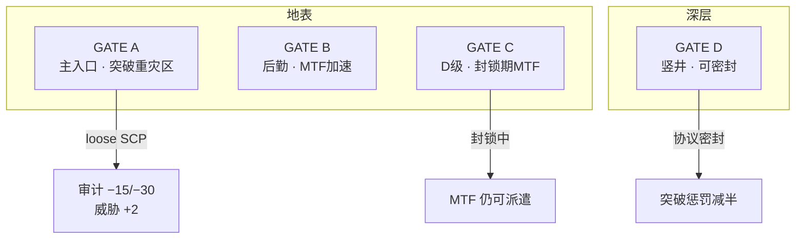
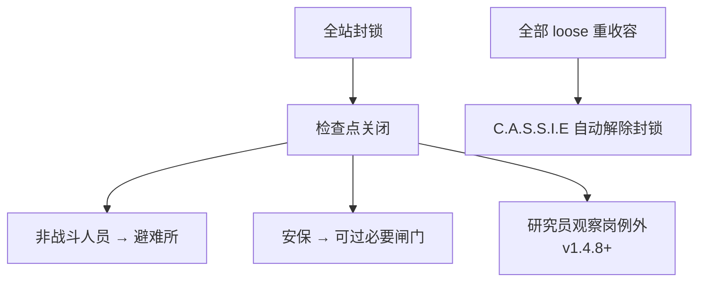

# 🚪 GATE 闸口与检查点

> **v1.6.1** · 四座 GATE 与区域 **检查点** 构成站点的物理防线。loose SCP 抵达 **GATE A** 不会立刻 Game Over，但审计与威胁等级的打击足以让财政链断裂 — 而 **GATE C** 则是封锁期间 MTF 仍能进出的救命通道。

---

## 四座 GATE 概览

| 闸口 | 楼层 | 主要作用 | 特殊机制 |
|------|------|----------|----------|
| **GATE A** | 地表 | 主入口；civilian 可见 | loose SCP 抵达 → 重大审计惩罚 |
| **GATE B** | 地表 | 后勤 / 人员通道 | 存在时 MTF 冷却 **×0.85**；D 级成本 **×0.9** |
| **GATE C** | 地表 | D 级专用通道 | 全站封锁期间 **仍允许 MTF 通行** |
| **GATE D** | 深层竖井 | 重型物资与 MTF 深层入口 | 毁灭协议激活时可 **密封**，减轻 GATE A 突破后果 |

---

## GATE A 突破

GATE A 被突破 **不会立即 Game Over**，但后果严重：

| 后果 | 数值 / 说明 |
|------|-------------|
| 审计下降 | **−30**（GATE D 密封时为 **−15**） |
| 威胁等级 | **+2**（上限 10） |
| 叙事 | O5 审查邮件、民间舆论事件 |
| 记录 | SCP ID 写入 `GateABreachedScps`，不重复扣罚同一 SCP |

代码逻辑：`GateDoorSystem` **禁止 loose SCP 主动开启 GATE A** — 突破指 SCP **游荡抵达** GATE A 房间中心（地表 loose 实体寻路至此）。


务必在地表维持 **武装安保** 与 **检查点**，在 loose SCP 抵达 GATE A **之前** 完成 intercept 或重收容。一次突破 −30 审计可能直接把拨款乘数打入 **<50（−15%）** 区间。


---

## 检查点（Checkpoint）

检查点位于 **区域交界**（典型：LCZ / HCZ 边界）：

| 特性 | 说明 |
|------|------|
| 结构 | **双扇滑动门**，需授权通过 |
| 控制 | 封锁期间由 **C.A.S.S.I.E** 统管开关 |
| 寻路 | 普通人员被引导至避难所；**安保** 执行任务时可通行 |
| **电力** | **不传电** — 两侧走廊电网在此断链；须并行铺设 [**电缆通道**](power.md) 或使用电力中继绕开 |


典型布局：人员主廊经检查点通行，其旁一行 **电缆通道** 连续传电至 LCZ/HCZ。电缆不可过人，SCP 无法借电缆抄近路。


### 封锁期间行为

| 人员类型 | 封锁期间 |
|----------|----------|
| 科研（观察岗） | **可继续值守**（如 SCP-173） |
| 安保 | 可通过检查点 intercept |
| 工程师 | C.A.S.S.I.E 关闭时可非封锁区施工 |
| 其他编内 | 涌向 **通电避难所** |

---

## MTF 与 GATE 联动

| 参数 | GATE B 存在 | GATE B 不存在 |
|------|-------------|---------------|
| MTF 冷却乘数 | **×0.85**（7 日 → 约 5.95 日） | ×1.0 |
| D 级招聘加成 | +1 编制上限 | 标准 |
| D 级成本 | **×0.9** | ×1.0 |

| 参数 | 说明 |
|------|------|
| MTF 基础费用 | **¥150,000** × 审计费用乘数 |
| 停机坪存在 | 费用 **×1.2**，冷却 **−2 日** |
| 封锁 + 无 GATE C | **无法派遣 MTF** |

审计对 MTF 费用的影响：

| 审计 | MTF 费用乘数 | 示例费用 |
|------|--------------|----------|
| ≥ 80 | **×0.95** | ¥142,500 |
| 50–79 | ×1.0 | ¥150,000 |
| 30–49 | ×1.15 | ¥172,500 |
| < 30 | **×1.30** | ¥195,000 |

---

## GATE D 密封机制

当 **设施毁灭协议 / 核弹协议** 激活（`FacilityProtocol.Active`）且 GATE D 通电：

* loose SCP 抵达 GATE A 时，审计惩罚从 **−30 降为 −15**
* 事件日志会注明「GATE D 密封减轻了地表泄露后果」

这是极端危机下的 **减损手段**，不能替代日常安保。

---

## 设计建议

| # | 建议 | 理由 |
|---|------|------|
| 1 | LCZ → HCZ 间至少 **一道检查点** | 单点 breach 不扩散全站 |
| 2 | GATE A 路径上设 **安保站** | 地表 intercept 窗口 |
| 3 | 临时间 **远离 GATE** | 转移超时 breach 不会直冲地表 |
| 4 | 保留 **GATE C** 通电 | 封锁期 MTF 仍能运作 |
| 5 | 暂停测试避难所寻路 | 确认封锁时全员可达避难所 |

---

## 与威胁 / 审计的联动

| 事件 | 威胁 | 审计 |
|------|------|------|
| GATE A 突破 | +2 | −15 / −30 |
| 全站封锁 | — | 间接（breach 相关） |
| MTF 捕获成功 | — | 间接改善收容分项 |

高威胁（8–10）时 C.A.S.S.I.E 响应更激进，可能触发 **毁灭协议** 评估 — 见 [封锁与 MTF](../11-cassie/lockdown-mtf.md)。

---

## 相关章节

* [三层站点与区域](floors-zones.md)
* [收容失效与重收容](../09-containment/breach-recontain.md)
* [异常上报管线](../09-containment/pipeline.md) — MTF 派遣

---

## 本章导航

- 上一篇：[电力](power.md)
- 下一篇：[财政导览](../06-systems/hubs/财政与后勤.md)
