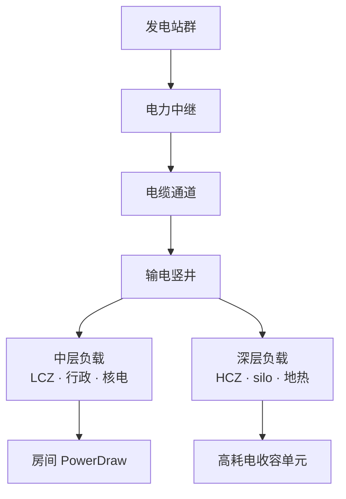
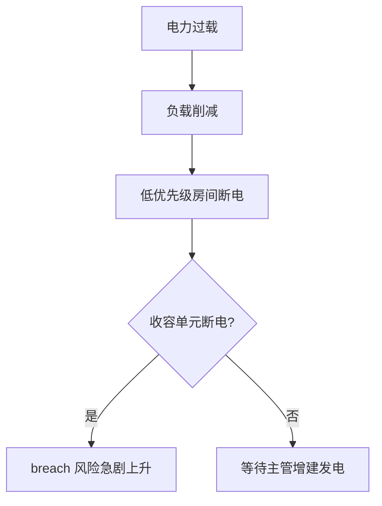

# ⚡ 电力网格

> **v1.6.1** · 电力是站点的生命线。顶栏实时显示 **发电 vs 消耗**；当消耗超过发电，C.A.S.S.I.E 会按优先级 **负载削减** — 而断电的收容单元，是 breach 最快的捷径。

---

## 发电方式一览

| 类型 | 尺寸 | 净出力 | 造价 | 维护/月 | 解锁 | 备注 |
|------|------|--------|------|---------|------|------|
| **柴油发电站** | 2×2 | **−80** | ¥20,000 | ¥800 | 开局 | 可升级 +30 出力 |
| **水力发电站** | 2×2 | **−45** | ¥22,000 | ¥500 | 水力工程 | 须邻接水体；**全站限 2** |
| **地热发电站** | 2×2 | **−55** | ¥25,000 | ¥600 | 地热（需水力+收容前置） | **仅 Deep 层**；限 2 |
| **核电站** | **4×4** | **−1200** | ¥280,000 | ¥8,000 | 核电科研 | **全站限 1**；需 6 编制 |


**v1.6.0 起已移除** 太阳能与风力发电。读档时旧存档中的 `room.power.solar` / `room.power.wind` 会自动拆除并 **回收残值**。请勿再规划这两种设施。


> 注：`PowerDraw` 为负表示 **发电**，为正表示 **用电**。

---

## 推荐发电路线

| 阶段 | 策略 |
|------|------|
| **开局** | 2 台柴油 ≈ 160 出力，对应 ~153 用电，**几乎无余量** |
| **早期扩张** | 解锁水力，利用地图水体邻接放置 |
| **中层饱和** | 深层地热补充；注意竖井传输 |
| **后期 HCZ** | 核电一次解决 1200 出力，但造价 ¥28 万 + 9 日工期 |

---

## 电力拓扑

| 设施 | 作用 |
|------|------|
| **电力中继** | 延长传输范围，大站点必备 |
| **电缆通道** | 不可通行的专用输电走廊；与人员走廊并行，**可绕过检查点**向 LCZ/HCZ 续电 |
| **输电竖井** | 跨楼层传输；深层 HCZ 无竖井 = 深层断电 |

---

## 负载管理与削减

当 **消耗 > 发电** 时，系统按优先级执行：

| 后果 | 说明 |
|------|------|
| 低优先级房间停摆 | 生产、部分后勤中断 |
| **收容单元断电** | 数分钟内触发 breach；审计 **−15** |
| 运营评分下降 | 电力分项拖累月绩效 |

C.A.S.S.I.E **CassiePowerResponse** 模块会在危机时自动削减非必要负载，优先保障 HCZ 与关键设施。核电站 outage 超过 **60 游戏分钟** 会触发专项警告。

---

## 典型用电参考

| 设施类型 | 耗电特征 |
|----------|----------|
| 标准后勤 | 5–30 |
| SCP 收容单元 | 10–50+（096 等更高） |
| 科研中心 / 实验室 | 中等 |
| HCZ Keter 单元 | 高 |
| 核弹 silo | 须长期通电待命 |

SCP-457 等火焰实体对 **通风与电力** 有特殊需求 — 详见 [SCP 图鉴](../10-scp/index.md)。

---

## 核电站专项

| 属性 | 数值 |
|------|------|
| 占地 | **4×4** |
| 出力 | **1200** |
| 造价 | ¥280,000 |
| 工期 | 9 游戏日（`60×24×9` 分钟） |
| 编制 | 6 人 |
| 维护 | ¥8,000/月 |
| 放置 | 中层 Administrative 或 Support |
| 数量 | **全站 1 座** |


核电是 **中后期** 选项。早期强行核电会拖垮现金流；先用柴油+水力撑到 HCZ 规划清晰后再上核电。


---

## 管理要点

1. **顶栏监控** — 发电/消耗比低于 1.0 时立即暂停评估。
2. **扩建 HCZ 前** — 确认深层竖井 + 中继 + 额外发电已就位。
3. **升级柴油** — 中期可升级现有柴油站 +30 出力，比新建有时更划算。
4. **水力选址** — 必须邻接水体或河流，否则无法放置。
5. **暂停规划** — 在暂停模式下铺设中继链，避免施工期间过载。
6. **检查点断链** — 检查点不传电；在分区边界与人员主廊**并行**铺设电缆通道，或于两侧放置电力中继。

---

## 与运营评分的联动

`FacilityOperationScore` 中 **电力分项占 20%**：

| 发电/消耗比 | 电力得分 |
|-------------|----------|
| ≥ 1.0 | **100** |
| < 1.0 | 按比例下压（最低约 20） |

电力不足会直接拉低运营评分 → 月拨款基础池缩水（`¥50,000 + 运营评分 × ¥70,000`）。

---

## 相关章节

* [建造与扩建](construction.md)
* [C.A.S.S.I.E 电力响应](../11-cassie/auto-response.md)
* [收容失效](../09-containment/breach-recontain.md) — 断电 breach

---

## 本章导航

- 上一篇：[建造](construction.md)
- 下一篇：[GATE](gates.md)
