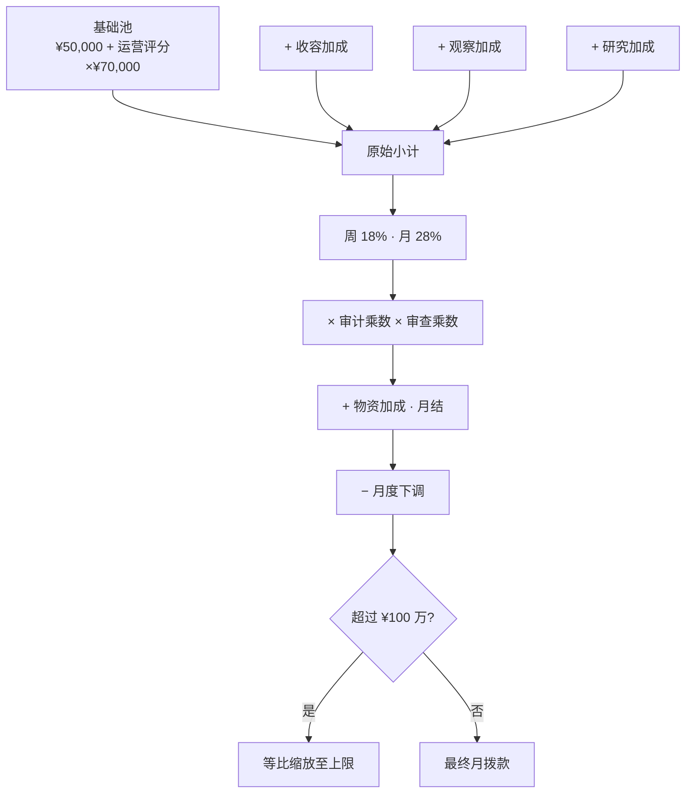
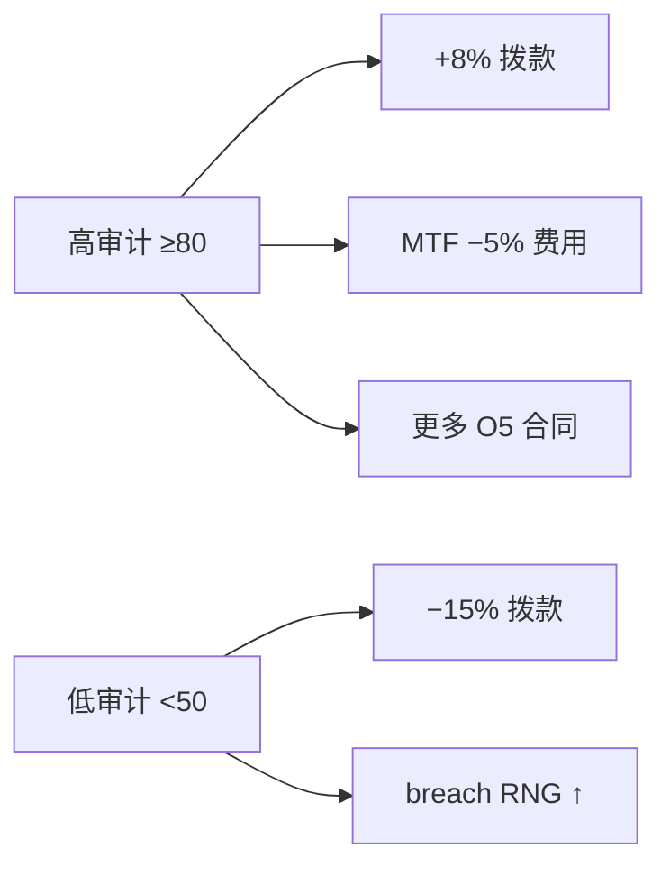

# 💰 财政与审计

> **v1.6.1** · 站点的现金流由 **周补给 + 月绩效** 驱动，而审计评级则是拨款的「乘数开关」。维持审计 ≥80 可获得 **+8% 收入** 与更低 MTF 费用；跌破 50 则 **−15% 拨款** 且 breach 随机概率上升。

---

## 收入结构

| 来源 | 频率 | 说明 |
|------|------|------|
| **周补给** | 每周入账 | 占月拨款池 **18%**（`WeeklyShareRatio = 0.18`） |
| **月绩效** | 每月初结算 | 运营评分 + 各项加成 − 罚金 |
| **研究里程碑** | 一次性 | SCP 观测阶段完成时现金奖励 |
| **O5 合同奖励** | 完成时 | 见 [O5 合同](../12-progression/missions-threat.md) |

---

## 月拨款公式（代码级）

### 各项加成与上限

| 组成部分 | 计算方式 | 上限 |
|----------|----------|------|
| **基础池** | ¥50,000 + 运营评分 × ¥70,000 | — |
| **收容加成** | 每间已收容 SCP × **¥1,500** | **¥25,000** |
| **观察加成** | 每间活跃观察室 × ¥2,000 | ¥20,000 |
| **研究加成** | 预估月产出 ÷ 100 × ¥80 | ¥15,000 |
| **物资加成** | 月结时按补给库存 | ¥5,000 |
| **月拨款总 cap** | 周×4 + 月绩效 | **¥1,000,000** |


顶栏「预计月收入」已含审计乘数。若显示 **「月拨款已达上限」**，说明你的运营已触顶 — 此时进一步堆收容加成不会突破 100 万 cap。


---

## 审计评级（0–100）

审计是全局核心指标，影响拨款、MTF、breach RNG 与合同 offer 概率。

### 收入乘数

| 审计区间 | 拨款乘数 | 显示 |
|----------|----------|------|
| **≥ 80** | **×1.08（+8%）** | 高拨款档 |
| 50–79 | ×1.0 | 标准 |
| **< 50** | **×0.85（−15%）** | 拨款削减档 |

### 基金会审查制裁

超期 SCP **42 日** 阶段会触发 `StartFoundationReview`：

| 效果 | 数值 |
|------|------|
| 拨款额外乘数 | **×0.92（−8%）** |
| 持续时间 | **3–6 游戏日** |
| 叠加 | 与审计乘数 **相乘** |

### MTF 费用乘数（基础 ¥150,000）

| 审计 | 费用乘数 | 实际费用 |
|------|----------|----------|
| ≥ 80 | **×0.95** | ¥142,500 |
| 50–79 | ×1.0 | ¥150,000 |
| 30–49 | ×1.15 | ¥172,500 |
| < 30 | **×1.30** | ¥195,000 |

### Breach 随机乘数

| 审计 | 收容失效 RNG |
|------|--------------|
| ≥ 80 | **×0.90**（略降） |
| 50–79 | ×1.0 |
| < 50 | **×1.12**（上升） |

---

## 运营评分（0–100）

`FacilityOperationScore` 加权构成：

| 分项 | 权重 | 数据来源 |
|------|------|----------|
| 审计 | 25% | `SiteAuditRating` |
| 电力 | 20% | 发电/消耗比 |
| 收容 | 25% | loose 数量、单元通电率 |
| 连通 | 15% | 竖向连通评分 |
| 后勤 | 15% | 水/粮/补给库存 |
| 威胁 | 10% | loose SCP 数量 |

### 典型审计变动

| 事件 | 审计变化 |
|------|----------|
| 收容失效（breach） | **−15** |
| 重新收容 | **+5** |
| O5 合同完成 | **+10** |
| O5 合同失败 | **−20** |
| 超期 28 日 | **−3** |
| GATE A 突破 | **−15 / −30** |

---

## 月度结算流程

每月初系统自动执行：

1. 扣除 **维护费 + 工资 + 电力成本**
2. 发放 **月绩效拨款**（含物资加成）
3. 生成月结事件 — 区分 **「月结净额」** 与 **「本月合计净增」**


**v1.4.8+ 修复**：O5 合同失败罚金仅作用于 **当次结算**，不会永久叠加到后续月份。


合同失败还会追加 `MonthlyIncomePenalty += ¥10,000`（月度拨款下调）。

---

## 财政失败

| 条件 | 结果 |
|------|------|
| 余额 **< −¥100,000** | **Game Over** — 站点破产 |

新游戏开局余额 **¥500,000**，审计 **70**。建议始终保留 **≥¥200,000** 缓冲以应对 breach 罚款（单次可达 **¥25,000**）与 MTF 费用。

---

## 管理策略

| 优先级 | 行动 |
|--------|------|
| **安全线** | 维持审计 **≥70**；理想目标 **≥80** |
| **breach** | 优先重收容 — 每次 −15 审计 + ¥25,000 罚款 |
| **招聘** | 大规模扩编前估算月工资增量 |
| **合同** | 早期接受低难度合同攒奖金（+¥55,000–100,000） |
| **超期** | 42 日审查 −8% 拨款可持续数日 — 见 [超期升级](../09-containment/overdue.md) |

---

## 相关章节

* [物资与后勤](logistics.md) — 物资加成
* [胜利与失败](../12-progression/win-lose.md)
* [O5 合同](../12-progression/missions-threat.md)

---

## 本章导航

- 上一篇：[财政导览](../06-systems/hubs/财政与后勤.md)
- 下一篇：[后勤](logistics.md)
