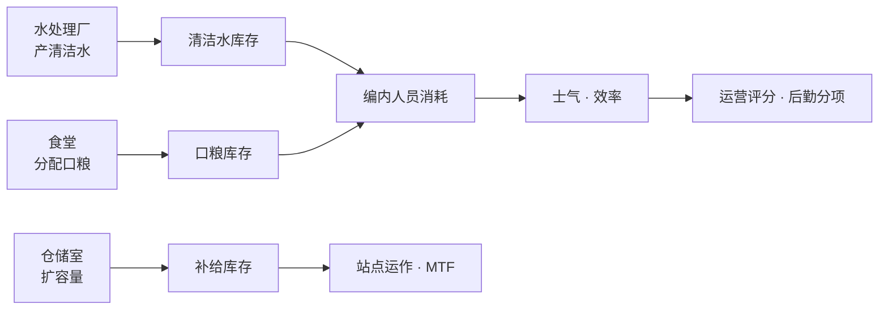
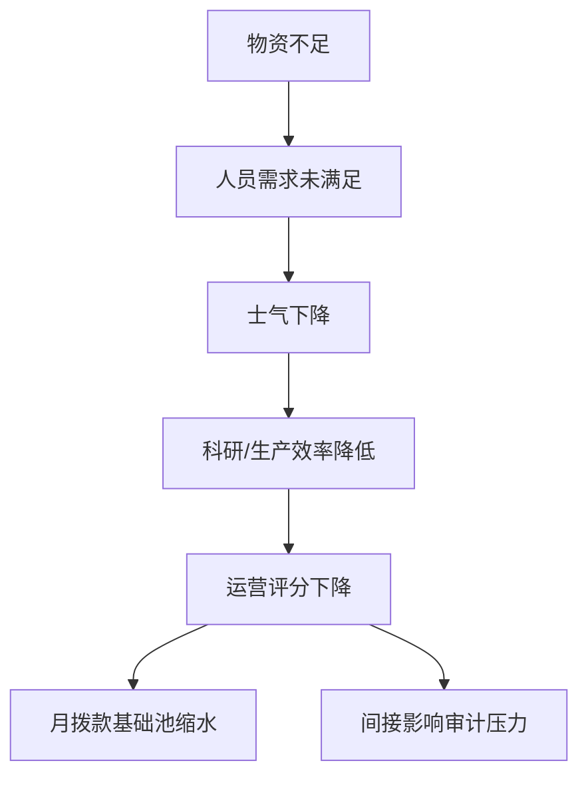

# 📦 物资与后勤

> **v1.6.1** · 三类物资 — **清洁水、口粮、补给** — 支撑编内人员的日常消耗与站点运营评分。库存告急不会立刻 Game Over，但会通过 **士气 → 效率 → 运营评分 → 月拨款** 的链条暗中掏空你的预算。

---

## 三类物资

| 物资 | 游戏变量 | 主要用途 |
|------|----------|----------|
| **清洁水** | `CleanWater` | 人员卫生需求、部分生产 |
| **口粮** | `FoodRations` | 食堂供应、维持饥饿需求 |
| **补给** | `Supplies` | 综合后勤消耗、MTF 返程可补充 |

---

## 生产与消耗链路

---

## 后勤设施

| 设施 | 功能 | 扩建 |
|------|------|------|
| **水处理厂** | 持续产出清洁水；耗电 ~30 | v1.6.0+ 可单房间升级 |
| **仓储室** | 提升补给存储上限 | 可升级 |
| **食堂** | 满足饥饿需求，恢复士气 | — |
| **宿舍** | 限制 **最大编内编制** | — |

### 设施造价参考

| 设施 | 造价 | 工期 |
|------|------|------|
| 水处理厂 | ¥15,000 | ~1.5 游戏日 |
| 仓储室 | ¥7,000 | ~0.5 游戏日 |
| 食堂 | 见房间目录 | — |
| 宿舍 | 见房间目录 | — |

---

## 库存与运营评分

`FacilityOperationScore` 后勤分项（占 **15%**）按三类资源分别评分后取平均：

| 资源水平 | 得分 |
|----------|------|
| ≥ 警告线 | **100** |
| ≥ 临界线 | 60 |
| > 0 | 30 |
| = 0 | **10** |

各资源警告/临界阈值（代码）：

| 资源 | 警告线 | 临界线 |
|------|--------|--------|
| 补给 | ≥ 20 | ≥ 10 |
| 清洁水 | ≥ 20 | ≥ 10 |
| 口粮 | ≥ 30 | ≥ 15 |

---

## 库存不足后果

| 后果 | 说明 |
|------|------|
| 士气下降 | 编内人员效率降低 |
| 运营评分降低 | 基础池 `¥50,000 + 评分×¥70,000` 减少 |
| 间接审计压力 | 长期忽视会拖累整体运营 |


财政紧张时 **优先保 HCZ 电力**，而非删除食堂。断电 breach 的 −15 审计 + ¥25,000 罚款远比省一点维护费更贵。


---

## 收入加成

### 物资加成（月结）

| 计算 | 上限 |
|------|------|
| 补给库存 ÷ 20 × ¥100 | **¥5,000** |

### 收容加成（与后勤独立）

| 计算 | 上限 |
|------|------|
| 每间已收容 × **¥1,500** | **¥25,000** |

充足后勤 + 多 SCP 收容 = 月拨款双通道增益。详见 [财政与审计](budget-audit.md)。

---

## MTF 与物资

MTF 派遣返程时（约 **60% 概率**）可能带回物资：

| 获得 | 数量 |
|------|------|
| 补给 | +50 |
| 口粮 | +30 |

其余概率为捕获 SCP 或部分费用退还。MTF 基础费用 **¥150,000**（× 审计乘数）。

---

## 分阶段建议

| 阶段 | 后勤配置 |
|------|----------|
| **第 1–5 天** | 至少 **1 水处理 + 1 食堂**；监控顶栏三项库存 |
| **扩编期** | 每 +3 编内人员，检查水/粮是否仍 ≥ 警告线 |
| **中期** | 升级水处理 / 仓储；考虑第二食堂（若地图远） |
| **后期** | 库存维持高水位以拿满 ¥5,000 物资加成 |

---

## 与 D 级 / GATE B 的联动

| 条件 | 效果 |
|------|------|
| **GATE B** 存在 | D 级成本 **×0.9**；编制 +1 |
| D 级启用 | 不消耗编内宿舍配额，但有伦理代价 |

见 [D 级人员](../07-personnel/d-class.md)。

---

## 检查清单

- [ ] 顶栏三项物资均 ≥ 警告线？
- [ ] 水处理厂 **通电** 且有工程师/自动运作？
- [ ] 食堂与宿舍在人员寻路范围内？
- [ ] 仓储室是否限制了补给上限？
- [ ] 扩建 HCZ 前是否同步扩建后勤？

---

## 相关章节

* [财政与审计](budget-audit.md)
* [人员类型与需求](../07-personnel/types-needs.md)
* [核心玩法循环](../01-introduction/gameplay-loop.md)

---

## 本章导航

- 上一篇：[财政](budget-audit.md)
- 下一篇：[人员导览](../06-systems/hubs/人员管理.md)
