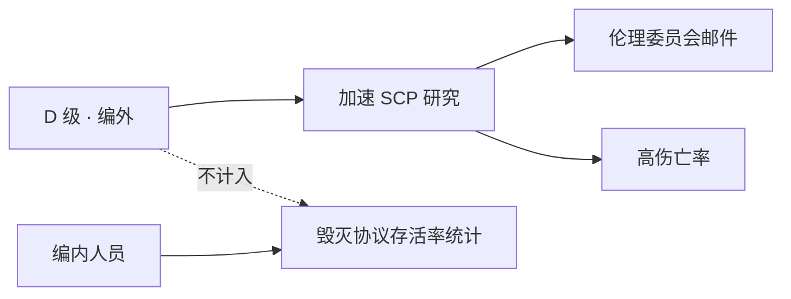
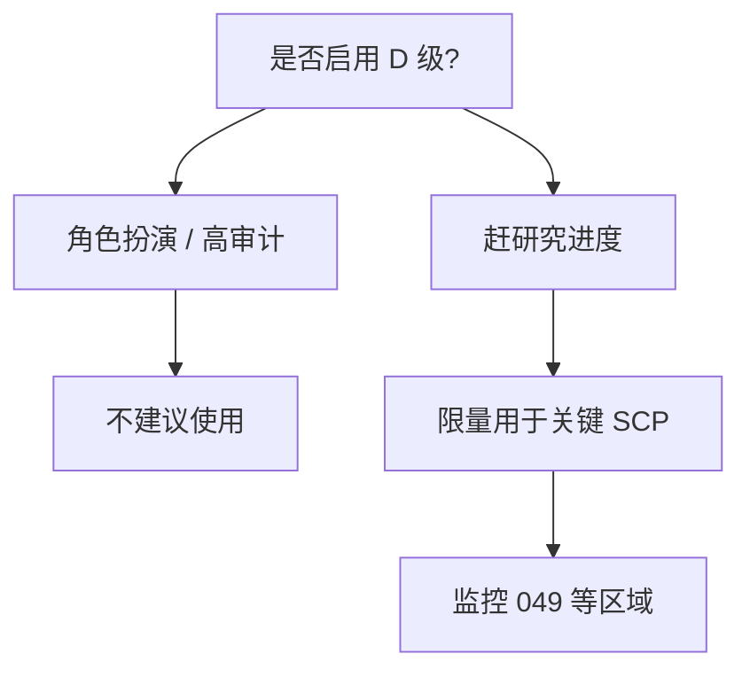

# ⚠️ D 级人员与伦理

> **v1.8.0** · D 级（D-Class）是基金会用于 **高风险人体实验** 的可消耗人员。启用前须 **伦理委员会批准** — 能加速部分 SCP 研究，但会触发 **审查案**，并在特定 SCP 区域造成 **极高伤亡风险**。

---

## D 级是什么

| 维度 | 说明 |
|------|------|
| 定位 | 可消耗实验体；**编外人员** |
| 招聘 | 可选；受 GATE 与伦理事件影响 |
| 编制 | **不计入** 宿舍编内上限 |
| 毁灭协议 | **不计入** 编内存活率统计 |

---

## 游戏机制

| 项目 | 说明 |
|------|------|
| **启用流程** | 伦理面板 → 提交 D 级伦理申请 → 回应审查案 → 批准后开关劳务 |
| **用途** | D 级劳工系统；加速部分 SCP 研究产出 |
| **风险** | 实验 casualties；breach 时死亡率极高 |
| **伦理** | 触发 **伦理委员会** 邮件与事件 |
| **审计** | 过度使用间接拖累审计与叙事压力 |

### GATE B 联动

| GATE B 状态 | 效果 |
|-------------|------|
| **存在且通电** | D 级成本 **×0.9**；编制 **+1** |
| 不存在 | 标准成本与编制 |

---

## D 级劳工系统

启用 D 级劳工可：

| 收益 | 代价 |
|------|------|
| 提升部分研究产出 | 人员伤亡 |
| 承担高危操作 | 审计 / 伦理事件 |
| 加速关键 SCP 链 | 士气间接影响（叙事层） |


**毁灭协议判定** 只看 **编内人员**（非 D 级）存活率 **≥ 30%**。D 级大量死亡 **不会** 直接触发 Game Over — 但编内人员若在连带事故中死亡，仍会拉低存活率。


---

## 伦理邮件典型触发

| 触发条件 | 示例 |
|----------|------|
| D 级在 **SCP-049** 区域伤亡 | 转化/处决事件 |
| 过度使用 D 级实验 | 累计 casualties 阈值 |
| 特定 SCP 交互 | 各 SCP 行为脚本 |

### SCP-049 交互

| 规则 | 说明 |
|------|------|
| 049 行为 | 将人员转化为僵尸化个体 |
| **禁止** | D 级或编外人员 **单独** 进入 049 区域 |
| 陪同 | 所有交互须 **武装安保** 陪同 |

---

## 是否使用 D 级？策略矩阵

| 策略 | 适合玩家 | 优点 | 缺点 |
|------|----------|------|------|
| **不用** | 高审计 playthrough、角色扮演 | 零伦理事件；审计稳定 | 研究较慢 |
| **限量** | 大多数玩家 | 关键 SCP 链加速 | 偶发伦理邮件 |
| **频繁** | 高风险速通 | 研究产出最高 | 伦理/审计/伤亡压力 |

---

## 与编内人员的区别

| 对比项 | 编内人员 | D 级 |
|--------|----------|------|
| 宿舍占用 | ✅ | ❌ |
| 需求系统（ hunger 等） | ✅ | 简化 |
| 毁灭协议存活率 | **计入** | **不计入** |
| 伦理邮件 | 常规 | **高频** |
| 招聘成本 | 标准 | GATE B 时 **×0.9** |

---

## 风险管理

1. **049 区域** — 永远不要让 D 级单独进入。
2. **breach 期间** — D 级通常是第一个 casualties；不要指望他们 intercept。
3. **审计 playthrough** — 完全不用 D 级是最干净的路线。
4. **编内安全** — 即使 D 级不计入存活率，**编内** 在事故中死亡仍可能导致 **< 30%** 失败。

---

## 招聘与成本参考

| 项目 | 标准 | GATE B 存在 |
|------|------|-------------|
| 招聘成本乘数 | ×1.0 | **×0.9** |
| 编制上限加成 | — | **+1** |
| 伦理事件频率 | 随使用强度上升 | 同左 |

D 级 **不占用宿舍**，但会占用你的 **道德底线** 与事件日志空间 — 高审计 playthrough 建议全程零 D 级。

---

## 常见误区

| 误区 | 事实 |
|------|------|
| 「D 级死了没关系」 | 编内人员在连带 breach 中死亡仍影响 **存活率** |
| 「D 级能挡 173」 | 173 瞬移攻击 D 级同样有效；应靠 **观察岗** |
| 「不用 D 级无法胜利」 | 完全可不用；仅研究速度较慢 |
| 「049 区域派 D 级探路」 | **极高转化风险** + 伦理邮件 |

---

## 相关章节

* [人员类型与需求](types-needs.md)
* [SCP 专项研究](../08-research/scp-research.md)
* [胜利与失败](../12-progression/win-lose.md) — 存活率判定

---

## 本章导航

- 上一篇：[观察岗](orders-observation.md)
- 下一篇：[科研导览](../06-systems/hubs/科研体系.md)
