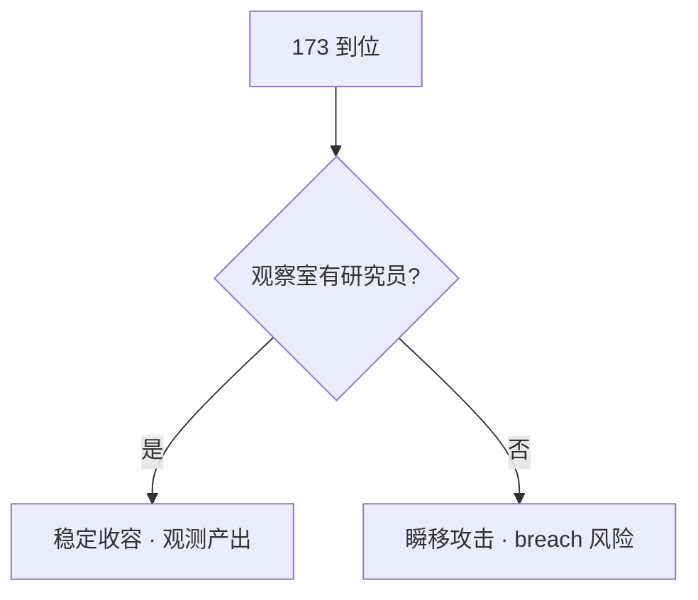

# 👁️ 手动调度与观察岗

> **v1.6.1** · 开启 C.A.S.S.I.E 后大部分危机调度可自动化，但 **观察岗**、**远端工地** 与 **紧急押送** 仍需要主管亲手调度。掌握右键寻路与 **指派岗位**，是在高威胁收容中少死人、少 breach 的基本功。

---

## 手动移动

| 步骤 | 操作 |
|------|------|
| 1 | 左键选中人员 |
| 2 | 右键点击地图目标格 |
| 3 | 人员沿 **走廊寻路** 前往 |

**适用场景**：

* 紧急押送 loose SCP 路径上的安保增援
* 调工程师去 **远端工地**（尤其 v1.5.0+ 锁定机制下）
* 危机中手动规避 C.A.S.S.I.E 未覆盖的死角


跨层移动会自动使用电梯/楼梯/GATE D。确保路径上 **检查点** 在封锁策略下仍可通行（安保 vs 普通人员）。


---

## 指派岗位（v1.6.0+）

| 特性 | 说明 |
|------|------|
| 锁定 | 人员设为 room **常驻岗位** |
| 显示 | 房间详情面板列出 **在岗人员** |
| C.A.S.S.I.E | **不会** 自动调动已指派岗位者 |
| 工程师 | 手动指派到 **同一工地** 直至完工最高效 |

---

## 观察岗（SCP-173 等）

部分 SCP 带 `RequiresObservation` 行为标志：

| 要求 | 说明 |
|------|------|
| 不间断视线 | 至少 **1 名研究员** 在观察室轮班 |
| 观察室 | 邻接收容单元的专用房间 |
| 研究产出 | 无观察岗则 **无观测研究点** |
| 封锁例外 | v1.4.8+ 封锁期间研究员 **仍可值守** |

### SCP-173 特别注意

| 规则 | 后果 |
|------|------|
| 视线中断 | **瞬移攻击** 最近人员 |
| 观察室布局 | 须邻接 173 单元；错位会导致异常移动 |
| 到位顺序 | **173 迁入前** 须建好观察室并派研究员 |

观察室配额计入 **观察加成**：每间活跃观察室 **¥2,000/月**（上限 ¥20,000）。

---

## C.A.S.S.I.E 调度

开启 C.A.S.S.I.E 时，系统自动：

| 行为 | 说明 |
|------|------|
| 避险 | 引导非战斗人员进 **通电避难所** |
| 拦截 | 调度安保 intercept loose SCP |
| 施工 | 分配工程师（**非** 手动岗位锁定者） |
| MTF | 按规则发起紧急召回 |

**关闭 C.A.S.S.I.E（v1.6.0+）** 时：

* 自动解除全站封锁（核武/毁灭协议中 **除外**）
* 解除避难所强制指令与事故区隔离
* 非战斗人员恢复施工与日常

---

## 右键菜单

右键编内人员可选：

| 选项 | 效果 |
|------|------|
| **移动到…** | 单次寻路指令 |
| **解雇** | 永久移除（谨慎使用） |

D 级人员选项可能不同 — 见 [D 级人员](d-class.md)。

---

## 封锁 / 核弹期间的手动规则

| 人员 | 封锁期 | 核弹倒计时 |
|------|--------|------------|
| 编内非战斗 | 自动 → 避难所 | **不要** 手动调出避难所 |
| 安保 | 可通过检查点 intercept | 仅在必要时出击 |
| 观察研究员 | **可继续值守** | 173 单元仍需视线 |
| 工程师 | C.A.S.S.I.E 关时非封锁区可施工 | 优先避险 |

---

## 最佳实践

| # | 实践 | 理由 |
|---|------|------|
| 1 | 173 到位 **前** 建好观察室 + 派研究员 | 避免瞬移伤亡 |
| 2 | 工程师 **手动指派同一工地** | 避免 v1.5.0+ 锁定机制下跑错工地 |
| 3 | 核弹倒计时 **勿手动调出** 避难所人员 | 存活率 < 30% → Game Over |
| 4 | 手动增援路径上确认 **无 096 人脸** | 096 enraged 可破门 |
| 5 | 读档后等待人员 **重新寻路** 完成 | v1.4.8+ 强制走廊寻路 |

---

## 与收入 / 科研的联动

| 机制 | 关联 |
|------|------|
| 观察室 | 观测研究点 + 月 **观察加成** |
| 科研岗位 | 研究点产出 → 月 **研究加成**（上限 ¥15,000） |
| 工程师 | 施工速度 → 更快通电 → 更早捕获 SCP → **收容加成** |

---

## 相关章节

* [人员类型与需求](types-needs.md)
* [C.A.S.S.I.E 自主响应](../11-cassie/auto-response.md)
* [SCP 专项研究](../08-research/scp-research.md)

---

## 本章导航

- 上一篇：[人员类型](types-needs.md)
- 下一篇：[D级](d-class.md)
