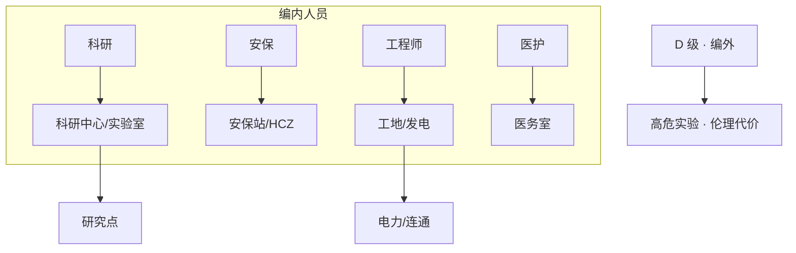
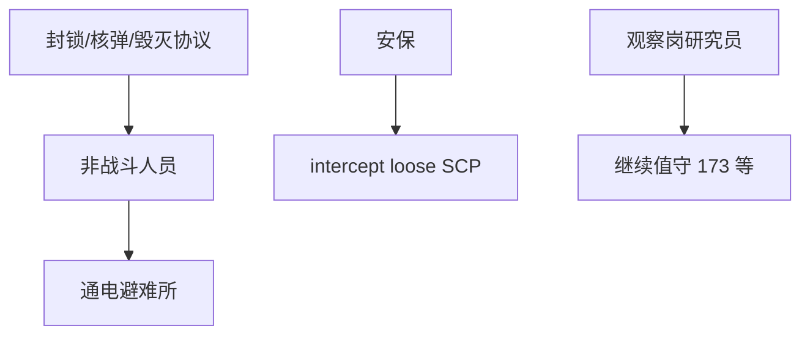

# 👥 人员类型与需求

> **v1.6.1** · 站点运转依赖 **五类人员**：科研、安保、工程师、医护与可选的 D 级。编内人员有 **饥饿 / 疲劳 / 卫生** 三维需求；需求未满足则士气下滑，科研产出与施工效率随之衰减。

---

## 五类人员

| 类型 | 核心职能 | 典型岗位 | 编制 |
|------|----------|----------|------|
| **科研** | 研究点产出、SCP 观测 | 科研中心、实验室、**观察室** | 编内 |
| **安保** | 拦截 loose SCP、押送、巡逻 | 安保站、HCZ 轮班 | 编内 |
| **工程师** | 施工、设施维护 | 工地、发电站 | 编内 |
| **医护** | 治疗伤员、稳定士气 | 医务室 | 编内 |
| **D 级** | 高风险人体实验 | 研究辅助（可选） | **编外** |

---

## 需求系统

编内人员（**非 D 级**）有三项需求指标：

| 需求 | 满足方式 | 不足后果 |
|------|----------|----------|
| **饥饿** | 食堂 | 士气 ↓ |
| **疲劳** | 宿舍休息 | 效率 ↓ |
| **卫生** | 医务室 / 设施 | 士气 ↓ |

需求未满足 → 士气下降 → 科研/施工效率降低 → 运营评分中间接拖累月拨款。

---

## 生命与状态体系

| 属性 | 说明 |
|------|------|
| **生命** | 归零则 **永久死亡**，需重新招聘 |
| **伤势** | 战斗/事故造成；医护可治疗 |
| **精神状态** | 低士气、模因 SCP（如 035）影响 |
| **士气** | SCP-999 等可提升；后勤不足则下降 |


编内人员 **不可复活**。高威胁 HCZ 轮班时务必保证医务室有人值守、宿舍可达。


---

## 编制与效率

| 机制 | 说明 |
|------|------|
| **宿舍** | 限制编内 **最大编制** |
| **科研效率** | 受科研人员数量、设施通电、观察岗影响 |
| **观察岗** | 部分 SCP（173 等）须 **研究员** 在观察室 **不间断视线** |
| **工程师锁定** | v1.5.0+ 锁定工地直至完工 |

### 观察岗要点（SCP-173）

| 要求 | 说明 |
|------|------|
| 观察室 | 邻接收容单元的专用房间 |
| 人员 | 至少 1 名研究员轮班 |
| 封锁例外 | v1.4.8+ 封锁期间研究员 **仍可值守** |
| 视线中断 | 173 瞬移攻击 — **到位前** 须建好观察室 |

---

## 寻路与危机行为

| 场景 | 行为 |
|------|------|
| 日常 | 沿 **走廊** 寻路至岗位/需求设施 |
| 跨层 | 电梯 / 楼梯 / GATE D |
| 封锁 / 核弹 | 自动寻路至 **最近通电避难所** |
| 读档 | v1.4.8+ 强制重新沿走廊寻路 |

---

## 死亡与替换

| 情况 | 后果 |
|------|------|
| 编内人员死亡 | 永久损失；影响 **毁灭协议存活率** 统计 |
| D 级伤亡 | **伦理委员会** 邮件；不计入编内编制 |
| 大量编内死亡 | 毁灭协议后存活率 **< 30%** → Game Over |

D 级详情见 [D 级人员](d-class.md)。

---

## 招聘策略参考

| 阶段 | 建议编制 |
|------|----------|
| **开局** | 2 科研 + 2 工程师 + 1 安保 |
| **首个 Euclid** | +1 安保；+1 观察研究员 |
| **HCZ 期** | 安保 ≥ 4（O5 合同常见要求） |
| **核电期** | 工程师 + 发电站 6 编制需求 |

招聘前在暂停模式下估算 **月工资增量**，避免触发 **−¥100,000** 破产线。

---

## 与 C.A.S.S.I.E 的分工

| 系统 | 人员相关职责 |
|------|--------------|
| C.A.S.S.I.E 开启 | 自动引导避险、调度安保 intercept |
| C.A.S.S.I.E 关闭 | 非战斗人员恢复日常；工程师可非封锁区施工 |
| 手动岗位 | v1.6.0+ 锁定人员至指定房间，C.A.S.S.I.E 不调动 |

见 [手动调度与观察岗](orders-observation.md)。

---

## 相关章节

* [手动调度与观察岗](orders-observation.md)
* [D 级人员](d-class.md)
* [物资与后勤](../06-economy/logistics.md)

---

## 本章导航

- 上一篇：[人员导览](../06-systems/hubs/人员管理.md)
- 下一篇：[观察岗](orders-observation.md)
