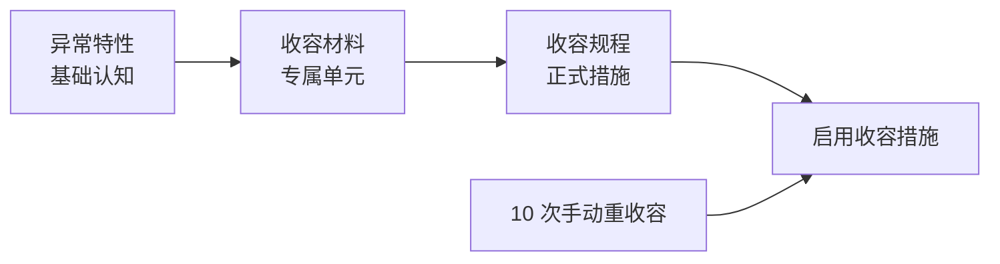
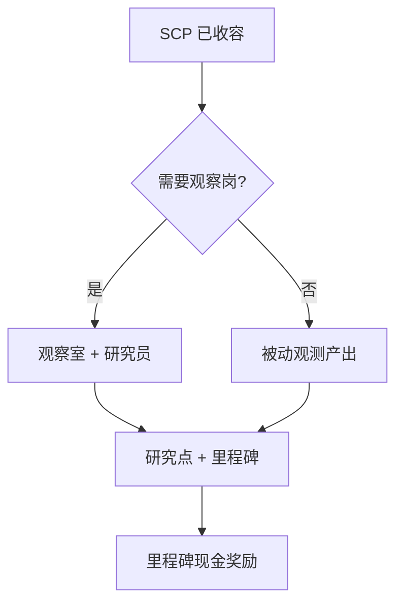

# 🧪 SCP 专项研究

> **v1.6.1** · 每个 SCP 拥有独立的 **三条科研链**：异常特性 → 收容材料 → 收容规程。完成 **材料节点** 才能建造专属单元；完成 **规程节点** 或累计 **10 次手动重收容** 才能解锁正式 **收容措施**。

---

## 三链结构

| 节点 | 解锁内容 |
|------|----------|
| **异常特性** | 基础认知；开启观测研究 |
| **收容材料** | **专属收容单元** 建造权限 |
| **收容规程** | 正式 **收容措施**；稳定收容 |


**捕获前 checklist**：材料节点完成 → 建好专属单元并通电 → MTF 捕获 → 分配 → 启用措施。跳过材料节点无法建单元，MTF 捕获后无处安置。


---

## 研究里程碑（现金奖励）

每个 SCP 有 **3 个观测里程碑**（观察室累积研究点阈值），完成时：

* 发放 **现金奖励**
* 触发 **研究邮件** 报告

| 分级 | 阈值（研究点） |
|------|----------------|
| **Safe** | **150 / 400 / 1000** |
| **Euclid** | **200 / 600 / 1500** |
| **Keter** | **300 / 900 / 2000** |

里程碑奖励是早期重要的 **预算补充**，与 O5 合同并列。

---

## 收容措施解锁

两种方式 **任选其一**：

| 方式 | 条件 |
|------|------|
| 科研 | 完成该 SCP **收容规程** 节点 |
| 经验 | 累计 **10 次** 手动重收容（`ManualUnlockThreshold = 10`） |

在收容面板为已收容 SCP **启用/切换** 措施。措施降低 breach 风险乘数（典型 **×0.35** breachMult）。

### 典型措施示例

| SCP | 措施 |
|-----|------|
| 173 | 观察笼、24h 监控 |
| 096 | 面部屏蔽、单向玻璃 |
| 079 | 物理断网接口 |

---

## 观测研究

| 规则 | 说明 |
|------|------|
| 产出 | 已收容 SCP 持续产出 **观测研究点** |
| 观察岗 | `RequiresObservation` 类（173）**须观察室 + 研究员** 才有产出 |
| 收入 | 每间活跃观察室 **¥2,000/月**（上限 ¥20,000） |
| v1.4.8+ | 修复观察室配额加成计算 |

---

## 捕获前 Checklist

- [ ] **特性** 节点完成
- [ ] **材料** 节点完成 → 可建专属单元
- [ ] 单元 **通电**、**区域正确**（LCZ/HCZ）
- [ ] **收容等级** ≥ SCP `RequiredContainmentLevel`
- [ ] 特殊需求：173 观察室 / 096 无脸 / 079 断网
- [ ] MTF 费用 **¥150,000**（× 审计）+ **7 日冷却**

---

## 与 MTF / 超期的关系

| 阶段 | 科研优先级 |
|------|------------|
| 报告当日 | 立即排 **材料链** |
| 14 日 | 民间传闻 — 威胁 +1 |
| 28 日 | O5 催办 — 审计 **−3** |
| 42 日 | 基金会审查 — 拨款 **−8%** |
| 56 日 | 高威胁 SCP 可能 **loose 游荡** |
| 70 日 | GOC 锁定 — **永久失去** 该 SCP |

详见 [超期升级](../09-containment/overdue.md)。

---

## 与胜利条件

| 项目 | 是否必须 |
|------|----------|
| 单个 SCP 三链全完成 | ❌ 不必须 |
| ≥ **3 个 SCP** 已分配收容室 | ✅ 必须（999 计 1） |
| 非 SCP 全科技 | ✅ 必须 |
| 30 天无 breach | ✅ 必须 |

SCP 专项节点（`research.scp-*`）**不计入** 胜利科技条件，但材料/规程节点是安全收容的前提。

---

## 研究点来源汇总

| 来源 | 说明 |
|------|------|
| 科研中心 / 实验室 | 基础产出；须通电 + 科研人员 |
| 观测研究 | 已收容 SCP 被动产出 |
| 观察岗加成 | 173 等须观察室才有观测产出 |
| D 级劳工 | 可选加速；伦理代价 |
| 里程碑 | 达阈值一次性现金 — 非研究点但补预算 |

预估月研究产出进入 **研究加成**：`/100 × ¥80`，上限 **¥15,000/月**。

---

## 分级科研节奏建议

| 分级 | 建议顺序 | 典型工期 |
|------|----------|----------|
| Safe | 特性 → 材料 → 捕获 → 规程 | 1–2 周 |
| Euclid | 材料 rush → 观察室 → 捕获 | 2–3 周 |
| Keter | 材料 + HCZ 单元 + 安保 ≥4 → 捕获 | 3 周+ |

---

## 相关章节

* [异常上报管线](../09-containment/pipeline.md)
* [收容措施与转移](../09-containment/measures-transfer.md)
* [SCP 图鉴](../10-scp/index.md)

---

## 本章导航

- 上一篇：[科研树](tech-tree.md)
- 下一篇：[核弹链](warhead-research.md)
