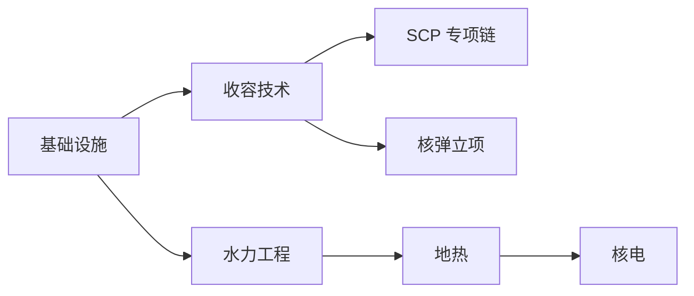
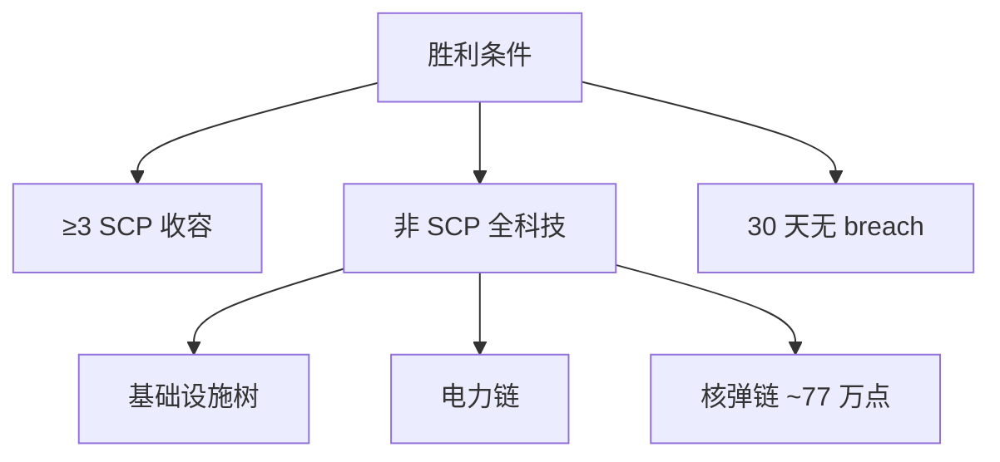

# 🔬 科研树与并行槽位

> **v1.6.1** · 科研树是 **横向节点图**：左 → 右为前置依赖。完成节点永久解锁房间、收容能力与核弹体系。**胜利条件** 要求解锁全部 **非 SCP 科技**（`research.scp-*` 前缀除外）— 规划时别忘了基础设施树与核弹链。

---

## 树结构

| 特性 | 说明 |
|------|------|
| 布局 | 横向节点图，箭头指向前置 |
| 节点类型 | 基础设施 / 收容 / 后勤 / 电力 / SCP 专项 / 核弹 |
| 完成效果 | **永久解锁** 对应能力，不可撤销 |
| 取消 | v1.6.0+ 活动项目可 **一键取消** — 进度 **不保留** |

---

## 并行研究槽位

| 设施 | 槽位贡献 |
|------|----------|
| **科研中心** | **+1**（必须首先建造） |
| **科研实验室** ×2 | 各 **+1** |

**最多 3 个并行项目**（1 中心 + 2 实验室）。

| 要求 | 说明 |
|------|------|
| 通电 | 未通电则不产出 |
| 科研人员 | 须派驻在编科研 |
| SCP 观测 | 部分 SCP 提供观测研究加成 |


科研中心、C.A.S.S.I.E 中枢、控制室各 **全站限 1**。实验室可建 2 间以凑满 3 槽 — 中后期并行加速非 SCP 全科技是胜利关键。


---

## 研究点产出

产出依赖：

* 设施 **通电**
* **科研人员** 数量与分配
* 已收容 SCP 的 **观测研究**（173 等须观察岗）
* 预估月产出计入 **研究加成**（`/100 × ¥80`，上限 **¥15,000**）

---

## 推荐科研顺序（早期）

| 优先级 | 节点 | 理由 |
|--------|------|------|
| 1 | **基础设施** | 复合通道、扩建前置 |
| 2 | **收容技术** | 临时间、检查点、HCZ 前置 |
| 3 | **首个上报 SCP 链** | 特性 → 材料 → 规程 |
| 4 | **水力工程** | 邻水放置 −45 出力 |
| 5 | **地热**（中后期） | 深层 −55 出力 |
| 6 | **核电**（后期） | 4×4，−1200 出力 |

---

## 非 SCP 科技与胜利

**胜利条件 #2**：解锁 **全部非 SCP 科技**。

| 前缀 | 是否计入胜利 |
|------|--------------|
| `research.scp-*` | ❌ **除外** |
| `tech.*` 基础设施/收容/电力 | ✅ 必须 |
| `tech.warhead.*` 核弹链 | ✅ **必须**（属于非 SCP 科技） |

核弹全树约 **77.3 万** 研究点（9 弹头 × 8.5 万/型 + 立项 0.8 万）+ O5 齐射授权 **5 万** ≈ **82.3 万** 总计。

---

## 电力科研链

| 节点 | 解锁 |
|------|------|
| 水力工程 | 水力发电站（−45，限 2，须邻水） |
| 地热 | 地热发电站（−55，Deep 层，限 2） |
| 核电 | 核电站（4×4，−1200，限 1） |


**v1.6.0 起** 太阳能/风力已从科研树移除。读档旧存档会自动拆除对应房间。


---

## 取消研究（v1.6.0+）

| 操作 | 效果 |
|------|------|
| 活动项目旁 **取消** | 立即停止 |
| 已消耗研究点 | **不返还** |
| 槽位 | 立即释放 |

适用场景：误点高成本节点、紧急切换 SCP 专项优先级。

---

## 中层扩建协议

| 协议 | 地图尺寸 |
|------|----------|
| 默认 | 60×40 |
| 扩建 I | 72×48 |
| 扩建 II | 84×56 |

须在 **控制室** 或 **C.A.S.S.I.E 中枢** 发起，工程师施工数游戏日。

---

## 规划检查清单

- [ ] 科研中心已建且通电？
- [ ] 是否计划第 2 间实验室凑 3 槽？
- [ ] 非 SCP 树中哪些节点仍锁定？（胜利进度）
- [ ] 首个外勤 SCP 材料节点是否优先于核电？
- [ ] 核弹链是否纳入中期规划？（~77 万点）

---

## 相关章节

* [SCP 专项研究](scp-research.md)
* [核弹科研链](warhead-research.md)
* [胜利与失败](../12-progression/win-lose.md)

---

## 本章导航

- 上一篇：[科研导览](../06-systems/hubs/科研体系.md)
- 下一篇：[SCP研究](scp-research.md)
