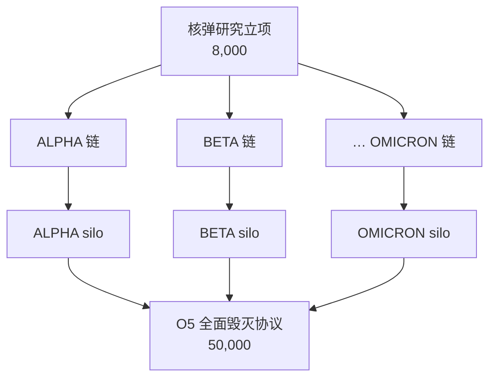
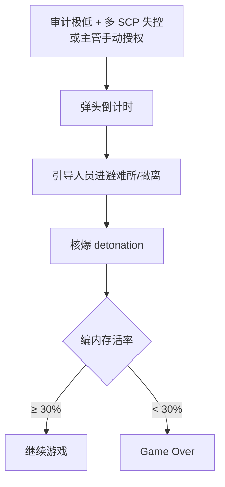

# ☢️ 核弹科研链

> **v1.6.1** · 核弹科研链解锁 **9 种弹头**、对应 **发射井** 与 **O5 全面毁灭协议**。全树约 **77.3 万** 研究点（含立项）；加 O5 齐射授权共约 **82.3 万**。核弹链属于 **非 SCP 科技** — **计入胜利条件**。

---

## 概述

| 项目 | 数值 |
|------|------|
| 弹头数量 | **9**（Alpha ~ Omicron） |
| 每型研究元素 | 3（E1/E2/E3）+ 1 silo 节点 |
| 每型研究点 | 18,000 + 20,000 + 22,000 + 25,000 = **85,000** |
| 9 型合计 | **765,000** |
| 立项 | **8,000** |
| O5 齐射授权 | **50,000** |
| **总计** | **≈ 823,000** |

---

## 九种弹头

| 代号 | 典型用途 | 倒计时（秒） | 毁伤范围 |
|------|----------|--------------|----------|
| **ALPHA** | 基础战术；全地下净化 | 90 | FullUnderground |
| **BETA** | 单层分区净化 | 75 | Floor |
| **GAMMA** | 扇区辐射净化 | 60 | Sector |
| **OMEGA** | 全 loose SCP 清除 | 120 | AllLooseScp |
| **DELTA** | 收容室定向 | — | CellAdjacent |
| **ZETA** | 模因/信息危害 | — | InfoHazard |
| **LAMBDA** | Safe 级局部 | — | — |
| **SIGMA** | 生物/瘟疫 | — | BioHazard |
| **OMICRON** | 终极净化 Archon | 100 | Apollyon |

> 倒计时以 `CountdownSeconds` 为准，游戏内横幅显示剩余时间。

---

## 发射井

| 要求 | 说明 |
|------|------|
| 科研 | 每型完成 E1/E2/E3 + **silo 节点** |
| 建造 | **弹头发射井**（深层 HCZ） |
| 运行 | 须 **通电、连通** |
| 安保 | 建议附近设安保站 |

C.A.S.S.I.E 选弹时会查找 **已建且通电** 的对应 silo。

---

## 使用场景

| 场景 | 方式 |
|------|------|
| **手动** | C.A.S.S.I.E 面板 → 选 ALPHA…OMICRON |
| **自动** | C.A.S.S.I.E 按威胁自动选弹 |
| **O5 齐射** | 多 silo 同时发射 — **SCP-682 等必须** |


**SCP-682** 标记 `CanSurviveWarhead` — **单发无法清除**。须研究多个 silo 并执行 **O5 全面毁灭协议** 齐射。单弹失败会累积 `FailedSingleAttempts`，C.A.S.S.I.E 可能自动升级齐射。


---

## 毁灭协议流程

| 阶段 | 说明 |
|------|------|
| 触发 | C.A.S.S.I.E 判定不可恢复；或主管手动 ACT-O5 |
| 倒计时 | 各弹头 **60–120 秒** 不等（非 30 分钟） |
| 避险 | 人员自动涌向 **通电避难所** |
| 结算 | 统计 **编内人员**（非 D 级）存活比例 |
| 失败 | 存活率 **< 30%** 且有编内人员记录 → **Lost** |

核弹执行还会附加 **审计惩罚**（各弹头 5–25 不等）。

---

## 是否研究核弹链？

| 建议 | 理由 |
|------|------|
| **中期开始立项** | 8,000 点门槛低，先占坑 |
| **备而不用** | silo 通电待命即可；极端危机最后手段 |
| **胜利必须** | 非 SCP 全科技 **包含** 核弹节点 |
| **682 前置** | 若计划收容 682，须 O5 齐射能力 |

---

## 研究成本规划

| 阶段 | 目标 | 累计研究点 |
|------|------|------------|
| 早期 | 立项 + ALPHA E1 | ~26,000 |
| 中期 | 完成 2–3 型 silo | ~200,000+ |
| 后期 | 全 9 型 + O5 授权 | ~823,000 |

3 并行槽 + 观测里程碑 + O5 合同可显著加速。预估月研究产出也计入 **研究加成**（上限 ¥15,000/月）。

---

## 与 C.A.S.S.I.E 的集成

| 模块 | 职责 |
|------|------|
| `CassieWarheadResponse` | 自动选弹 / 触发 O5 齐射 |
| `WarheadProtocolSystem` | 倒计时、detonation、存活率 |
| 手动指令 | `warhead_alpha`、`o5_protocol`（ACT-O5） |

协议执行期间 **无法关闭 C.A.S.S.I.E 或解除封锁**。

---

## 相关章节

* [毁灭协议与弹头](../11-cassie/warhead-protocol.md)
* [科研树](tech-tree.md)
* [胜利与失败](../12-progression/win-lose.md)

---

## 本章导航

- 上一篇：[SCP研究](scp-research.md)
- 下一篇：[收容导览](../06-systems/hubs/收容行动.md)
