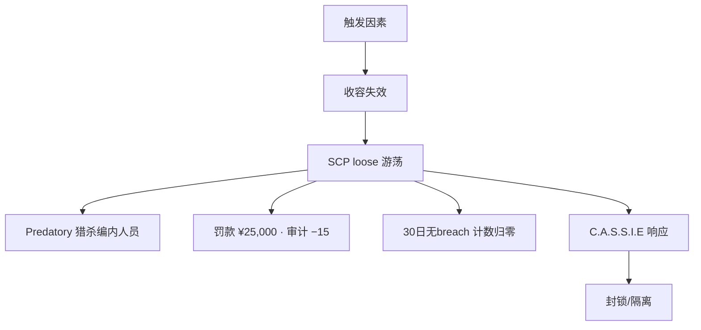
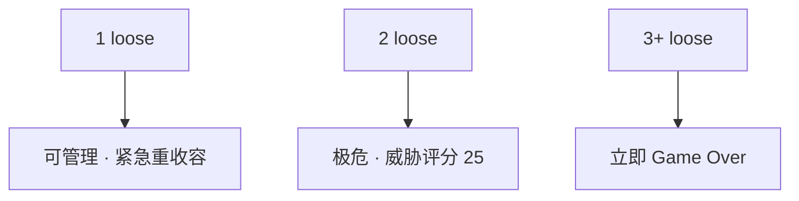

# 🚨 收容失效与重收容

> **v1.6.1** · 收容失效（breach）意味着 SCP 进入 **loose** 状态沿走廊游荡。每次 breach 审计 **−15**、罚款 **¥25,000**，并 **归零** 胜利所需的 **30 天无 breach** 计数。同时 **≥3 个 loose** → 立即 Game Over。

---

## Breach 触发因素

| 因素 | 说明 |
|------|------|
| **电力中断** | 收容单元 / 临时间断电 |
| **收容等级不足** | 房间 level < SCP 需求 |
| **区域不合规** | Keter 在 LCZ、密度过高等 |
| **临时收容超时** | **20 游戏分钟** 到期未迁入专用单元 |
| **特殊行为** | 173 视线中断、096 见脸、106 穿门等 |
| **随机事件** | 受审计 modulate（<50 时 ×1.12） |

---

## Breach 后果

| 后果 | 数值 |
|------|------|
| 审计 | **−15** |
| 罚款 | **¥25,000** |
| 威胁等级 | 上升 |
| 连续无 breach 天数 | **归零**（影响胜利） |
| loose ≥ 3 | **立即 Lost** |

### 特殊 loose 行为

| SCP 类型 | 行为 |
|----------|------|
| **Predatory** | 主动猎杀编内人员 |
| **096** | enraged 状态可 **破门** |
| **106** | 可 **穿门** phase |
| **173** | 视线外 **瞬移攻击** |

loose SCP 基础移速 **58**（高于 contained 的 ~40）。

---

## 重收容方式

### 1. 手动收容规程

| 步骤 | 操作 |
|------|------|
| 1 | 收容面板 → 选 loose SCP |
| 2 | **执行收容规程** |
| 3 | 调度安保押送 |
| 4 | 路径须通畅、检查点策略正确 |

成功：**审计 +5**；手动计数 +1（满 **10 次** 解锁措施）。

### 2. MTF 紧急召回

| 项目 | 说明 |
|------|------|
| 发起 | C.A.S.S.I.E 或收容面板 |
| 目标 | 优先 **最高威胁** loose SCP |
| 费用 | **¥150,000** × 审计乘数 |
| 冷却 | **7 游戏日**（GATE B ×0.85） |

### 3. C.A.S.S.I.E 自动

`CassieIsolationResponse` + `CassieDispatchResponse`：

* 区域 **隔离** 事故扇区
* 调度安保 **intercept**
* 多 breach → **全站封锁** + 避难所

---

## 手动重收容计数

| 规则 | 数值 |
|------|------|
| 每次成功手动重收容 | **+1** |
| 解锁正式收容措施 | **≥ 10 次**（`ManualUnlockThreshold`） |
| 替代路径 | 完成 **收容规程** 科研节点 |

---

## 全 SCP 重收容后

**v1.4.8+ / v1.6.0+** 自动行为：

| 效果 | 说明 |
|------|------|
| 解除封锁 | C.A.S.S.I.E 自动 **解除全站封锁** |
| 人员恢复 | 非战斗人员恢复施工与日常 |
| 威胁回落 | 威胁等级逐步下降 |

---

## 失败阈值

| loose 数量 | 威胁评分 | 结果 |
|------------|----------|------|
| 0 | 100 | 安全 |
| 1 | 55 | 警戒 |
| 2 | 25 | 极危 |
| **≥3** | 0 | **站点失控 · Lost** |

---

## 预防策略

| # | 策略 |
|---|------|
| 1 | 顶栏电力 **发电 ≥ 消耗** |
| 2 | 173 **观察室 + 研究员** 到位前不迁入 |
| 3 | 临时间 **20 分钟** 内完成转移 |
| 4 | 维持审计 **≥50**（breach RNG ×1.0） |
| 5 | HCZ Keter **勿放 LCZ** |


单次 breach −15 审计 + ¥25,000 罚款。连续两次 breach 可能把审计打入 **<50（−15% 拨款）** 区间 — 比 MTF 费用更伤。


---

## 与 GATE A 的联动

loose SCP 游荡至 **地表 GATE A**：

| 后果 | 数值 |
|------|------|
| 审计 | **−30**（GATE D 密封时 **−15**） |
| 威胁 | **+2** |

不立即 Game Over，但可能是「软死亡」起点。

---

## 相关章节

* [收容措施与转移](measures-transfer.md)
* [GATE 与检查点](../05-site/gates.md)
* [胜利与失败](../12-progression/win-lose.md)

---

## 本章导航

- 上一篇：[转移](measures-transfer.md)
- 下一篇：[危机导览](../06-systems/hubs/危机与治理.md)
