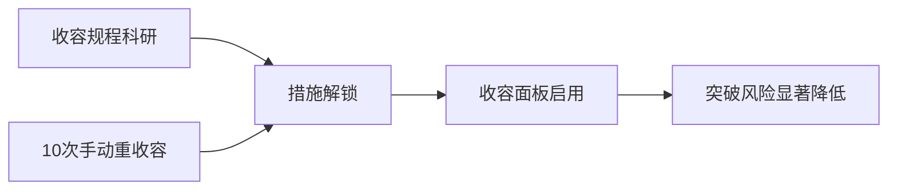
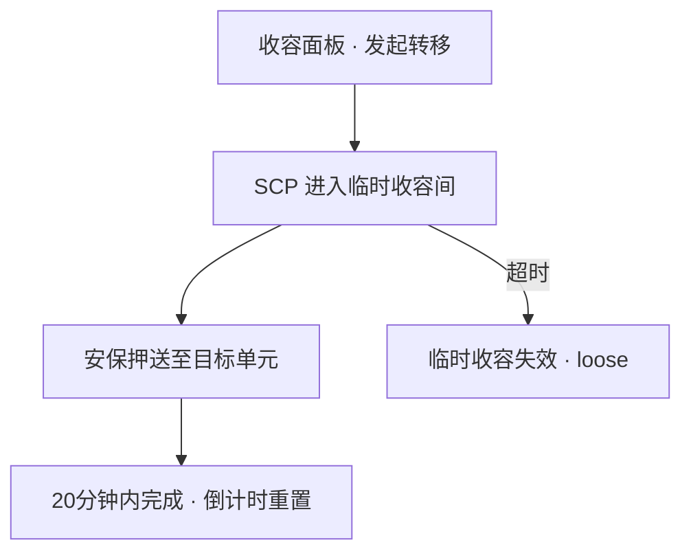

# 🔄 收容措施与转移

> **v1.6.1** · **收容措施** 是针对特定 SCP 的额外规程，显著降低 breach 风险。**转移** 则通过 **临时收容间**（20 游戏分钟倒计时）在同层 LCZ ↔ HCZ 或单元间安全移动 SCP。

---

## 收容措施

### 解锁方式（二选一）

| 方式 | 条件 |
|------|------|
| 科研 | 完成该 SCP **收容规程** 节点 |
| 经验 | 累计 **10 次** 手动重收容 |

在收容面板为已收容 SCP **启用/切换** 措施。

### 典型措施

| SCP | 措施 | 要点 |
|-----|------|------|
| **173** | 观察笼、24h 监控 | 须观察室 + 研究员视线 |
| **096** | 面部屏蔽、单向玻璃 | 路径 **零人脸** |
| **079** | 物理断网接口 | 阻止网络渗透 |
| **682** | 强化规程 | 仍无法单弹清除 |

措施应用后 breach 风险乘数典型降至 **×0.35**（`BreachRiskMultiplier`）。

---

## 临时收容间

| 类型 | 每 zone 上限 | 用途 |
|------|--------------|------|
| **轻收容临时** | **3** | LCZ 押送中转 |
| **重收容临时** | **3** | HCZ 押送中转 |

| 规则 | 数值 |
|------|------|
| 倒计时 | **20 游戏分钟**（`TempContainmentDurationMinutes`） |
| 超时 | **breach 风险激增** → 常触发失效 |
| 断电 | 同样触发临时收容失效 |
| 有 SCP 时 | **不可拆除** 临时间 |


倒计时 **20 游戏分钟** 极短。转移前须确认 **目标专用单元已通电、空位、等级合规** — 否则 SCP 会在临时间超时 loose。


---

## 转移流程

同层 LCZ ↔ HCZ 或单元间移动：

| 步骤 | 说明 |
|------|------|
| 1 | 收容面板发起 **转移** |
| 2 | SCP 进入同 zone **临时收容间** |
| 3 | 安保押送至 **目标专用单元** |
| 4 | 须在 **20 游戏分钟** 内完成 |

专用收容间拆除前，须先将 SCP 押送至同区域临时间 — 否则系统拒绝拆除。

---

## 手动岗位与押送

| 方式 | 说明 |
|------|------|
| 右键调度安保 | 手动 reinforce 押送路线 |
| C.A.S.S.I.E | 自动调度押送 / intercept |
| 封锁期间 | **安保** 可通过必要检查点 |
| 096 转移 | 路径上清除 **一切人脸图像** |

---

## 收容等级与区域

| 检查 | 不满足后果 |
|------|------------|
| `ContainmentLevel` ≥ 需求 | breach RNG 极高 |
| **PreferredZone** 合规 | 错区风险上升 |
| 单元 **通电** | 快速 breach |
| zone 内 SCP **密度** | 过密 → RNG 上升 |

---

## 规划建议

| # | 建议 |
|---|------|
| 1 | LCZ/HCZ **边界预建** 临时间（各 up to 3） |
| 2 | Keter 转移前目标 HCZ 单元 **已通电** |
| 3 | 096 路径 **零人脸** — 包括装饰/人员 |
| 4 | 173 转移时观察岗 **不间断** |
| 5 | 暂停模式下预演寻路长度 — 20 分钟很短 |

---

## 与收入 / 科研

| 机制 | 关联 |
|------|------|
| 成功收容 | +¥1,500/月（上限 ¥25,000） |
| 措施启用 | 降低 breach → 保护 30 日 streak |
| 观测研究 | 稳定收容后持续产出里程碑 |

---

## 转移失败案例

| 失败原因 | 后果 |
|----------|------|
| 目标单元未通电 | 迁入后快速 breach |
| 20 分钟超时 | 临时间失效 → loose |
| 096 路径人脸 | enraged → 破门 / 伤亡 |
| 173 观察中断 | 转移途中瞬移攻击 |
| zone 临时间已满（3/3） | 无法发起转移 |

**暂停模式下** 预演：选中 SCP → 查看目标单元距离 → 估算安保押送时间是否 < 20 分钟。

---

## 拆除与转移联动

| 操作 | 前置 |
|------|------|
| 拆除专用收容间 | SCP 须先迁入 **同 zone 临时间** |
| 拆除临时间 | 内 **不可有 SCP** |
| 扩建专用单元 | 可先转临时间再施工 |

---

## 相关章节

* [SCP 专项研究](../08-research/scp-research.md)
* [收容失效与重收容](breach-recontain.md)
* [手动调度](../07-personnel/orders-observation.md)

---

## 本章导航

- 上一篇：[超期](overdue.md)
- 下一篇：[重收容](breach-recontain.md)
