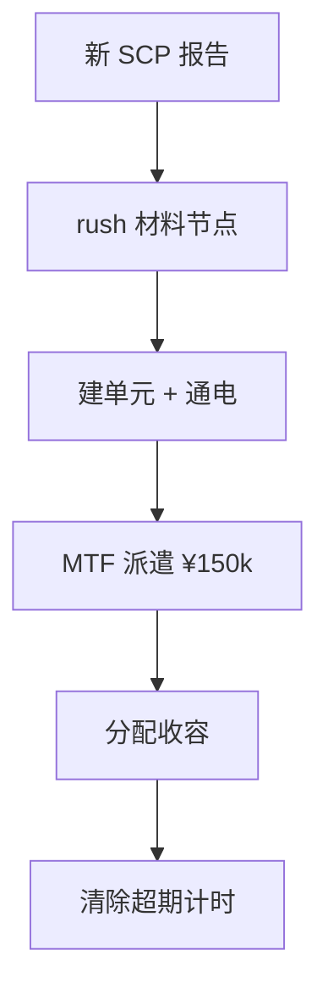
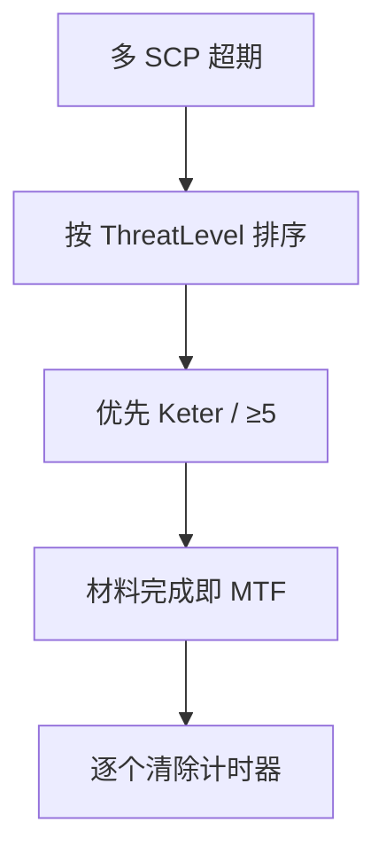

# ⏰ 超期升级与 GOC 介入

> **v1.6.1** · 外勤上报后若迟迟未能捕获收容，系统按 **14 → 28 → 42 → 56 → 70 游戏日** 逐级升级外部压力。第 **70 日** 高威胁 SCP 可能被 **GOC 冻结** — 永久失去收容机会，并重创审计。

---

## 升级时间线

阈值数组（代码 `ScpReportBalance.OverdueThresholdDays`）：**[14, 28, 42, 56, 70]**

---

## 各阶段效果

| 天数 | 事件 | 代码效果 |
|------|------|----------|
| **14** | 民间目击传闻 | 威胁 **+1**；安全部门邮件 |
| **28** | O5 催办 | 审计 **−3**；O5 邮件 |
| **42** | 基金会审查 | 威胁 **+1**；`StartFoundationReview(3–6 日)` → 拨款 **−8%** |
| **56** | 游荡 / 骚动 | 高威胁（≥5）且未 loose → **SpawnLooseScpFromOverdue**；否则媒体骚动事件 |
| **70** | GOC 介入 | 高威胁 → **GocLockedScpIds** + 审计 **−5** + MTF 捕获 **永久暂停**；低威胁 → 审计 **−3** |


**70 日 GOC 锁** 意味着该 SCP **永远无法再被 MTF 捕获或收容**，且不计入胜利 **≥3 SCP** 配额。关键 SCP 被锁可能迫使主管改换胜利路线。


---

## 阶段详解

### 第 14 日 — 民间传闻

* 威胁等级 +1（上限 10）
* 内部安全邮件：民间目击
* 尚 **无** 直接审计扣减 — 这是最后「低成本」窗口

### 第 28 日 — O5 催办

* 审计 **−3**
* O5 议会邮件施压
* 若同时多个 SCP 超期，审计下滑会叠加

### 第 42 日 — 基金会审查

* 触发 **基金会审查** 3–6 游戏日
* 期间拨款额外 **×0.92（−8%）**
* 与审计 <50 的 −15% **相乘** — 双重挤压

### 第 56 日 — 游荡失控

* **高威胁 SCP**（ThreatLevel ≥ 5）：若尚未 loose，在站点外围 **SpawnLooseScpFromOverdue**
* 低威胁：区域骚动与媒体关注（无 spawn，但叙事压力）
* 一旦 loose，进入 [收容失效](breach-recontain.md) 危机循环

### 第 70 日 — GOC 冻结

* **高威胁**：加入 `GocLockedScpIds`；审计 **−5**；MTF 捕获 **暂停**
* **低威胁**：审计 **−3**；声誉受损事件
* GOC 锁定 SCP **无法** 通过任何方式捕获

---

## 应对策略

| 优先级 | 行动 |
|--------|------|
| 1 | **报告出现当天** 将材料链置顶 |
| 2 | 材料完成 → **当天** 建单元 + 派遣 MTF |
| 3 | 多报告并行 → 优先 **Keter / 高 ThreatLevel** |
| 4 | 42 日前务必捕获 — 避免 −8% 审查制裁 |
| 5 | 财政允许时不要 **空转 MTF 冷却**（7 日） |

---

## 与胜利条件

| 情况 | 影响 |
|------|------|
| GOC 锁定 SCP | **不计入** ≥3 收容计数 |
| 999 已计 1 | 仍须再收容 **2 个** 未被锁 SCP |
| 非 SCP 全科技 | 不受超期直接影响 |
| 30 天无 breach | 56 日 spawn loose 会 **归零** streak |

---

## 与审计 / 收入的叠加惩罚

假设审计本已 <50（−15% 拨款），42 日审查再 −8%：

| 乘数 | 值 |
|------|-----|
| 审计 | ×0.85 |
| 审查 | ×0.92 |
| **合计** | ×0.782（约 **−22%**） |

---

## 叙事邮件

每个阶段触发对应 **邮件 + 事件日志**，简报区会显示提醒。建议超期 SCP **≥ 10 日** 时在暂停模式下重新排科研优先级。

---

## 多 SCP 同时超期

| 情况 | 建议 |
|------|------|
| 2 个 Safe + 1 个 Keter | 先做 Keter 材料链 |
| 均超 28 日 | 审计已 −6+；暂停排优先级 |
| 均超 42 日 | 审查 −8% 可能叠加；捕获任一可缓压 |
| 1 个已 GOC 锁 | 改换其他 SCP 凑 ≥3 胜利 |

---

## 超期 vs Breach 对比

| | 超期（未捕获） | Breach（已 loose） |
|---|----------------|---------------------|
| 56 日 | 可能 spawn loose | 已是 loose |
| 70 日 | GOC 锁 | 仍可能 GOC 语境外 |
| 审计 | 阶段式 −3/−5 | 单次 **−15** |
| 罚款 | 无直接罚款 | **¥25,000** |
| 30 日 streak | 未捕获不妨 streak | breach **归零** streak |

---

## 相关章节

* [异常上报管线](pipeline.md)
* [收容失效与重收容](breach-recontain.md)
* [财政与审计](../06-economy/budget-audit.md)

---

## 本章导航

- 上一篇：[管线](pipeline.md)
- 下一篇：[转移](measures-transfer.md)
