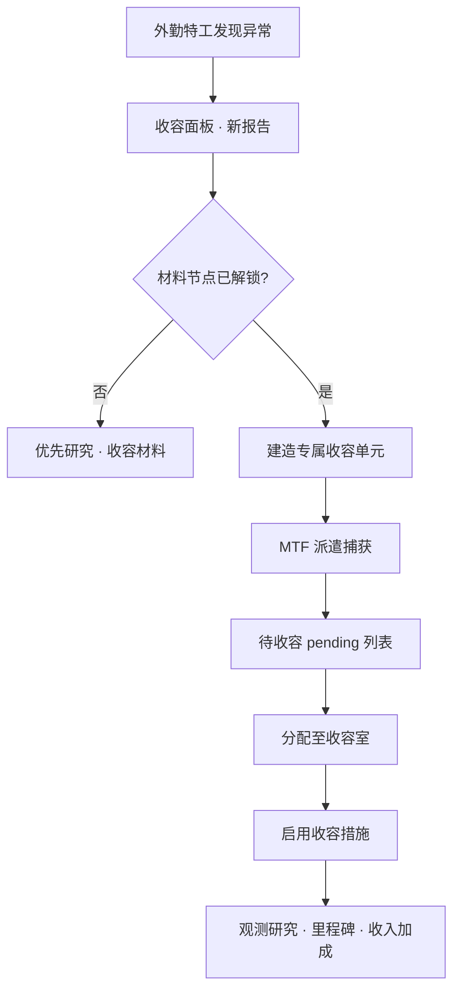

# 🔒 异常上报 → MTF 捕获

> **v1.6.1** · 外勤特工发现的异常会进入 **收容面板报告列表**。完整管线是：科研解锁材料 → 建造专属单元 → MTF 派遣捕获 → 分配收容 → 启用措施。任何一环断裂都会在 **超期计时器** 下迅速恶化。

---

## 完整管线

---

## 外勤上报

| 特性 | 说明 |
|------|------|
| 触发 | 游戏推进中 **周期性** 产生新 SCP 报告 |
| 开局 | 已有 **SCP-999** 收容，无需捕获 |
| 内容 | SCP 编号、分级、威胁预估 |
| 计时 | 自报告日起算 **超期天数**（14/28/42/56/70） |

---

## MTF 派遣（v1.9.0）

| 项目 | 说明 |
|------|------|
| **编队** | 玩家自养；人事 → 特遣队培养 |
| **费用** | 任务补给费（非 ¥150,000 总部派遣） |
| **冷却** | 按编队恢复（约 3–5 游戏日），非全站冷却 |
| **前提** | 就绪编队 + 材料节点 + C.A.S.S.I.E 在线 |

### 派遣结果概率

| 结果 | 概率 | 说明 |
|------|------|------|
| **物资返程** | ~60% | 补给 +50、口粮 +30 |
| **捕获 SCP** | ~40% 中子集 | → pending 列表 |
| **费用退还** | 无可用 SCP 时 | 退 **50%** 费用 |
| **O5 驳回** | 审计 < 40 时 50% | 费用已扣，任务取消 |

### 审计对 MTF 费用的影响

| 审计 | 实际费用（无停机坪） |
|------|----------------------|
| ≥ 80 | **¥142,500** |
| 50–79 | ¥150,000 |
| < 30 | **¥195,000** |


MTF 不一定每次带 SCP 回来 — 但 **7 日冷却** 是硬约束。材料节点一完成就 **立即** 建单元并派遣，不要浪费冷却窗口。


---

## 分配收容

| 步骤 | 说明 |
|------|------|
| 1 | pending SCP 出现在 **待收容** 列表 |
| 2 | 选择已建、**空位** 的 **专属单元** |
| 3 | 确认 SCP 进入收容状态 |
| 4 | 启用 **收容措施**（若已解锁） |

---

## 收容等级与区域

| 检查项 | 不满足后果 |
|--------|------------|
| `ContainmentLevel` ≥ SCP `RequiredContainmentLevel` | breach RNG **极高** |
| SCP 位于 **PreferredZone** | 错区 + 区域过密 → 突破上升 |
| 单元 **通电** | 数分钟内 breach |

---

## 紧急召回（loose 状态）

当 SCP 已 **loose**：

| 方式 | 说明 |
|------|------|
| 收容面板 | 发起 **MTF 紧急召回** |
| C.A.S.S.I.E | 自动 targeting **最高威胁** loose SCP |
| 费用/冷却 | 同常规派遣规则 |

同时 **≥3 个 loose** → **立即 Game Over**，召回来不及。

---

## 超期压力对照

| 天数 | 事件 | 关键影响 |
|------|------|----------|
| **14** | 民间传闻 | 威胁 +1 |
| **28** | O5 催办 | 审计 **−3** |
| **42** | 基金会审查 | 拨款 **−8%**，3–6 日 |
| **56** | 游荡 | 高威胁 SCP 可能 **loose** |
| **70** | GOC | **永久冻结** 捕获 |

详见 [超期升级](overdue.md)。

---

## 收入联动

每成功收容 1 个 SCP：

| 加成 | 数值 |
|------|------|
| 收容加成 | **+¥1,500/月**（总上限 **¥25,000**） |
| 观测/里程碑 | 潜在里程碑现金 + 研究点 |

---

## 捕获 Checklist

- [ ] 报告出现 → 材料链优先
- [ ] 专属单元建造 + **通电**
- [ ] 区域 / 等级 / 观察室（173）合规
- [ ] 余额 ≥ MTF 费用
- [ ] 冷却已结束 + C.A.S.S.I.E 在线
- [ ] 非 GOC 锁定 SCP

---

## 相关章节

* [SCP 专项研究](../08-research/scp-research.md)
* [超期升级](overdue.md)
* [封锁与 MTF](../11-cassie/lockdown-mtf.md)

---

## 本章导航

- 上一篇：[收容导览](../06-systems/hubs/收容行动.md)
- 下一篇：[超期](overdue.md)
