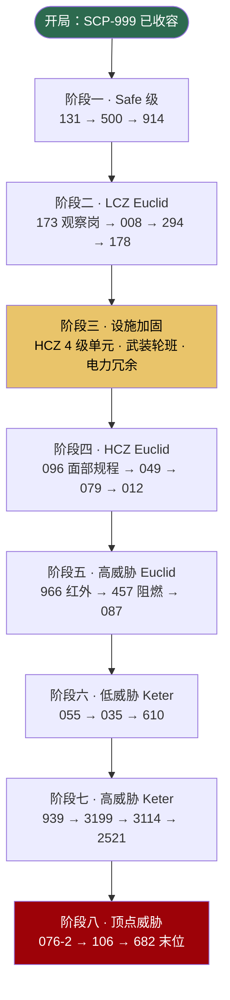

# 📕 SCP 异常实体图鉴总览

> **机密等级：4 级人员及以上** · 站点代号 SCP-CN-465 · 内置异常实体 **26** 项  
> 本文档依据 `BuiltinScpDefinitions` 登记数据编制，供站点主管在 MTF 调度、单元分配与科研规划时参考。

---

## 分级统计

| 对象分级 | 数量 | 首选区域 | 科研里程碑（研究点） | 详细条目 |
|----------|------|----------|----------------------|----------|
| **Safe** | 4 | LCZ | 150 / 400 / 1000 | [Safe 级图鉴](safe.md) |
| **Euclid** | 12 | LCZ 或 HCZ（威胁 ≥5 倾向 HCZ） | 200 / 600 / 1500 | [Euclid 级图鉴](euclid.md) |
| **Keter** | 10 | HCZ | 300 / 900 / 2000 | [Keter 级图鉴](keter.md) |


**首选区域** 由对象分级与威胁等级自动推算：Safe → LCZ；Keter → HCZ；Euclid 在威胁等级 **≥5** 时倾向 HCZ，否则为 LCZ。将 SCP 安置于错误区域会触发 O5 警告邮件，并提高区域密度相关的 breach 风险。


---

## 全实体对照表（26 项）

| SCP | 对象分级 | 威胁 | 收容等级 | 首选区域 | 占用权重 | 移动模式 | 行为标记 | 速度倍率（收容/失控） |
|-----|----------|------|----------|----------|----------|----------|----------|----------------------|
| SCP-999 | Safe | 1 | 1 | LCZ | 1 | 滚动 | 士气提升 | 1.0 / **1.2** |
| SCP-131 | Safe | 1 | 1 | LCZ | 1 | 滚动 | 士气提升 | 1.0 / **1.4** |
| SCP-500 | Safe | 1 | 1 | LCZ | 1 | 静止 | — | — |
| SCP-914 | Safe | 2 | 2 | LCZ | 1 | 静止 | — | — |
| SCP-294 | Euclid | 2 | 1 | LCZ | 2 | 静止 | — | — |
| SCP-066 | Euclid | 3 | 2 | LCZ | 2 | 不规律跳跃 | — | 0.8 / 0.8 |
| SCP-173 | Euclid | 4 | 2 | LCZ | 2 | **观察传送** | 需观察岗 | — |
| SCP-008 | Euclid | 4 | 2 | LCZ | 2 | 静止 | 感染风险 | — |
| SCP-049 | Euclid | 4 | 3 | LCZ | 2 | 标准步行 | 瘟疫医生 | 0.9 / 0.9 |
| SCP-079 | Euclid | 4 | 3 | LCZ | 2 | 网络束缚 | 网络隔离 | 0.6 / 0.6 |
| SCP-178 | Euclid | 4 | 2 | LCZ | 2 | 静止 | — | — |
| SCP-096 | Euclid | 5 | 3 | **HCZ** | 2 | 平静→狂暴 | **面部敏感** | 平静 0.15× / 狂暴 **3.5×** |
| SCP-012 | Euclid | 5 | 2 | **HCZ** | 2 | 静止 | 模因危害 | — |
| SCP-966 | Euclid | 5 | 3 | **HCZ** | 2 | 掠食冲刺 | 攻击性 | 1.5 / 1.5 |
| SCP-087 | Euclid | 6 | 3 | **HCZ** | 3 | 掠食冲刺 | 攻击性 | 1.3 / 1.3 |
| SCP-457 | Euclid | 6 | 3 | **HCZ** | 3 | 标准步行 | 火焰危害 | 1.1 / 1.1 |
| SCP-035 | Keter | 7 | 3 | HCZ | 3 | 标准步行 | 模因危害 | 0.85 / 0.85 |
| SCP-939 | Keter | 7 | 4 | HCZ | 3 | 声诱猎杀 | 攻击性 | 潜伏 0.5× / 狩猎 **2.2×** |
| SCP-610 | Keter | 7 | 3 | HCZ | 3 | 标准步行 | 感染风险 | 0.6 / 0.6 |
| SCP-055 | Keter | 6 | 3 | HCZ | 3 | 标准步行 | 模因危害 | 0.85 / 0.85 |
| SCP-2521 | Keter | 8 | 3 | HCZ | 4 | 标准步行 | 模因危害 | 0.85 / 0.85 |
| SCP-3114 | Keter | 8 | 4 | HCZ | 4 | 标准步行 | 身份替换 | 1.0 / 1.0 |
| SCP-3199 | Keter | 8 | 4 | HCZ | 4 | 掠食冲刺 | 攻击性 | 1.4 / 1.4 |
| SCP-076-2 | Keter | 9 | 4 | HCZ | 4 | 掠食冲刺 | 攻击性 | **1.6 / 1.6** |
| SCP-106 | Keter | 9 | 4 | HCZ | 4 | **相位掠食** | 腐蚀危害 · **穿门** | 0.7 / 0.7 |
| SCP-682 | Keter | 10 | 4 | HCZ | 5 | 掠食冲刺 | 攻击性 · **抗核弹** | 0.8 / 0.8 |

> **占用权重**：同区域内 SCP 密度越高，收容失效风险越大。Safe = 1；多数 Euclid = 2；高威胁 Euclid（威胁 ≥6）与 Keter 为 3–5。

---

## 移动模式速查（玩家向）

| 移动模式 | 游戏内表现 |
|----------|------------|
| **静止** | 不会自主移动；失控时仍停留在地图实体位置，但可能通过其他机制造成伤害 |
| **标准步行** | 常规寻路；威胁 ≥4 或带掠食/攻击性标记时主动猎杀附近人员 |
| **滚动** | 以滚动方式移动，速度略快；999/131 失控时比编内人员更快 |
| **观察传送** | 有人持续观察时**冻结**；视线中断后瞬移至目标附近（约 40–80 单位）并高速攻击 |
| **平静→狂暴** | 常态极慢（0.15×）；触发后面部追踪目标，速度飙升至 3.5× 并可**破门** |
| **网络束缚** | 移动范围限制在收容单元附近（约 120 单位半径），模拟其操控门禁/监控的能力边界 |
| **相位掠食** | 可**穿过关闭的门**；腐蚀有机/无机物，偏好拖走受害者 |
| **掠食冲刺** | 锁定猎物后额外加速（约 1.35×）；087/966/076/682/3199 等 |
| **声诱猎杀** | 先**潜伏**（0.5×），发现人员后切换**狩猎**（2.2×）；勿回应其模仿的人声 |
| **不规律跳跃** | 间歇性随机跳跃位移，路径难以预测 |

---

## 行为标记速查

| 标记 | 含义 | 代表实体 |
|------|------|----------|
| 需观察岗 | 须观察室 + 研究员轮班，否则无法稳定收容且无法产出观测研究 | SCP-173 |
| 面部敏感 | 目睹面部（含图像）后不可逆追踪；须面部屏蔽措施 | SCP-096 |
| 士气提升 | 提升附近编内人员士气 | SCP-999、SCP-131 |
| 感染风险 | 突破后可能触发感染/检疫协议 | SCP-008、SCP-610 |
| 网络隔离 | 须物理断网；可影响门禁与监控 | SCP-079 |
| 腐蚀危害 | 腐蚀结构；106 穿门 | SCP-106 |
| 身份替换 | 可伪装为工作人员；怀疑事件须全站封锁 | SCP-3114 |
| 模因危害 | 信息本身构成威胁；须认知过滤 | SCP-012、035、055、2521 |
| 攻击性 | 主动猎杀编内人员 | 多数 Keter 与 087/966 |
| 瘟疫医生 | 「治愈」产生僵尸化个体 | SCP-049 |
| 火焰危害 | 消耗氧气、点燃可燃物；优先保障电力 | SCP-457 |

---

## MTF 捕获建议顺序

新手应按 **威胁递增、设施就绪** 原则逐步扩充收容编目，避免同时 loose 多个高威胁个体。

### 分阶段要点

| 阶段 | 推荐捕获 | 前置条件 |
|------|----------|----------|
| 一 | SCP-131、SCP-500 | 完成材料节点 → 建好 LCZ 1–2 级单元 |
| 二 | **SCP-173**、SCP-008 | 173 **必须先建观察室并指派 ≥2 观察岗** |
| 三 | — | 扩建 HCZ；科研「收容材料」至 3–4 级单元 |
| 四 | SCP-096、SCP-049、SCP-079 | 096 启用面部屏蔽；079 物理断网 |
| 五 | SCP-966、SCP-457、SCP-087 | 457 独立通风；087 禁止单人探索 |
| 六 | SCP-055、SCP-035、SCP-610 | 模因类缩短研究轮班；610 生化隔离 |
| 七 | SCP-939、SCP-3199、SCP-3114 | 939 声学隔离；3199 温控 ≤10°C |
| 八 | SCP-076-2、SCP-106、**SCP-682** | 682 **抗单发核弹**，须 O5 齐射；106 **穿门** |


**SCP-173** 与 **SCP-096** 是新手最易触发 breach 的两项。捕获 173 前务必阅读 [观察岗调度](../07-personnel/orders-observation.md)；捕获 096 前确认面部屏蔽措施已研发或手动解锁。



同时 **loose ≥3** 个 SCP 将触发 **Game Over**。Keter 失控优先 MTF 紧急召回；**SCP-682** 失控时常规 Alpha 弹头无效，须完成 [核弹科研链](../08-research/warhead-research.md) 并执行 **O5 齐射**。


---

## 图鉴条目阅读指南

各分级页面中，每条目均包含：

1. **档案参数** — 对象分级、威胁等级（1–10）、所需收容等级（1–4）、首选区域
2. **描述与收容规程** — 与游戏内登记文本一致
3. **行为机制** — 行为标记与移动模式的游戏化解读
4. **科研里程碑** — 观测研究点阈值与现金奖励意义
5. **实战建议** — 捕获前 checklist、岗位配置、常见失误
6. **特殊警告** — 173 观察、096 面部、106 穿门、682 核弹等

---

## 相关章节

* [异常上报 → MTF 捕获](../09-containment/pipeline.md) — 从外勤发现到分配单元
* [SCP 专项研究](../08-research/scp-research.md) — 三链科研与里程碑奖励
* [收容失效与重收容](../09-containment/breach-recontain.md) — breach 处置流程
* [毁灭协议与弹头](../11-cassie/warhead-protocol.md) — 682 与 O5 齐射


模组可通过 API 注册额外 SCP，见 [模组开发教程](../13-mods/modding-tutorial.md)。内置 26 项登记于 `BuiltinScpDefinitions.RegisterAll`。


---

## 本章导航

- 上一篇：[图鉴说明](README.md)
- 下一篇：[Safe](safe.md)
