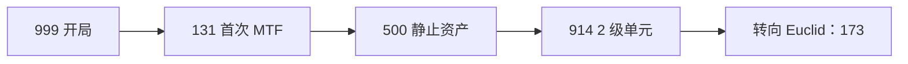

# 🟢 Safe 级异常实体图鉴

> **对象分级：Safe** · 首选部署区域：**轻收容区（LCZ）**  
> Safe 级并不意味着「无害」，而是指在**正确执行收容规程**的前提下可被可靠收容。本页收录内置登记 **4** 项 Safe 实体。

---

## 分级共性

| 项目 | 说明 |
|------|------|
| 科研里程碑 | **150 / 400 / 1000** 研究点（完成时发放现金奖励 + 研究邮件） |
| 首选区域 | LCZ（`ScpZoneHelper` 自动分配） |
| 区域占用权重 | **1**（对区域密度影响最小） |
| 新手定位 | 练习 **MTF 捕获 → 分配单元 → 观测研究 → 收容措施** 全流程的最佳对象 |


Safe 级是站点扩张早期的**经济支柱**：里程碑现金奖励可观，且 breach 后果相对可控。建议在第一项 Euclid（通常是 SCP-173）之前完成 131 与 500 的收容。


---

## SCP-999 — 「痒痒怪」

### 档案参数

| 项目 | 数值 |
|------|------|
| 对象分级 | Safe |
| 威胁等级 | **1** / 10 |
| 所需收容等级 | **1** |
| 首选区域 | LCZ |
| 行为标记 | 士气提升 |
| 移动模式 | 滚动（失控速度 **1.2×**） |

### 描述

橘色凝胶状生物，表现出孩童般的友善行为。接触后可显著缓解人员心理压力与创伤反应。

### 收容规程

经伦理委员会批准，可在监督下与编内人员有限互动。须记录每次互动时长与参与人员。禁止单独留驻收容单元。

### 行为机制

* **士气提升**：附近编内人员士气获得正向修正，是早期稳定站点情绪的有效手段。
* **滚动移动**：失控时以滚动方式移动，速度略快于标准步行，但威胁等级极低，几乎不会造成致命伤害。

### 科研里程碑

| 阈值 | 建议用途 |
|------|----------|
| 150 | 早期预算补充 |
| 400 | 衔接 173 观察室建设 |
| 1000 | 中期科研资金缓冲 |

### 实战建议

* **开局已收容** — 无需 MTF 捕获，优先为其分配正式 LCZ 1 级单元并开启观测。
* 可与 SCP-131 形成「士气双核」，减轻首月财政与人员压力。
* 互动须留档，但不必过度投入安保资源。

### 特殊警告

无高危机制。唯一注意的是：**禁止单独留驻** — 分配单元后仍需偶尔检查状态，避免被其他系统事件连带影响。

---

## SCP-131 — 「眼魔」

### 档案参数

| 项目 | 数值 |
|------|------|
| 对象分级 | Safe |
| 威胁等级 | **1** / 10 |
| 所需收容等级 | **1** |
| 首选区域 | LCZ |
| 行为标记 | 士气提升 |
| 移动模式 | 滚动（失控速度 **1.4×**） |

### 描述

一对眼球状生物（A 型与 B 型），以滚动方式移动，对人员表现出好奇与依恋。

### 收容规程

可在监督下于走廊自由活动，但不得离开重收容区外围。须防止其进入未授权区域。

### 行为机制

* **士气提升**：与 999 类似，提供士气加成。
* **滚动移动**：失控时速度 **1.4×**，在 Safe 级中偏快 — 若 breach 需及时指派安保引导或等待 MTF。

### 科研里程碑

**150 / 400 / 1000** — 建议作为**首个主动 MTF 捕获目标**，熟悉捕获管线。

### 实战建议

* 完成 **收容材料** 科研节点后再发起 MTF 捕获。
* 捕获后分配至 LCZ 走廊附近单元，便于士气辐射覆盖编内人员活动区。
* 规程允许走廊活动，但**不得进入 HCZ** — 检查点与区域划分须提前规划。

### 特殊警告

虽为 Safe，失控后可能滚入未授权房间。确保 LCZ 门禁与检查点逻辑正确，避免 131 成为 breach 链的「敲门砖」。

---

## SCP-500 — 「万能药」

### 档案参数

| 项目 | 数值 |
|------|------|
| 对象分级 | Safe |
| 威胁等级 | **1** / 10 |
| 所需收容等级 | **1** |
| 首选区域 | LCZ |
| 行为标记 | 无 |
| 移动模式 | **静止** |

### 描述

一个小型塑料罐，内含 47 片红色药片。单片即可治愈几乎所有已知疾病与感染。

### 收容规程

药片取用须双人在场登记，每次使用须 O5 级批准。剩余数量每月盘点归档。

### 行为机制

* **静止**：不会移动，失控时仍停留在地图位置。
* **无行为标记**：不猎杀、不感染、不提升士气 — 纯资产型异常。

### 科研里程碑

**150 / 400 / 1000** — 研究产出稳定，适合作为第二个 MTF 目标。

### 实战建议

* 优先级高：材料节点完成后尽快捕获，占据占用权重仅 **1** 的 LCZ 单元。
* 双锁登记在游戏中体现为**高规格收容措施** — 完成规程科研可降低 breach 乘数。
* 药片数量为叙事设定；观测研究本身即可产生里程碑收入。

### 特殊警告

无战斗威胁。注意**双人取用**规程 — 避免在人员短缺时将其与需重兵把守的实体混合同区。

---

## SCP-914 — 「精炼机」

### 档案参数

| 项目 | 数值 |
|------|------|
| 对象分级 | Safe |
| 威胁等级 | **2** / 10 |
| 所需收容等级 | **2** |
| 首选区域 | LCZ |
| 行为标记 | 无 |
| 移动模式 | **静止** |
| 科研里程碑 | **200 / 600 / 1500**（Euclid 阈值） |

### 描述

一台大型发条驱动装置，具有五档精细度设置，可对放入物品进行「精炼」或「粗化」转化。

### 收容规程

操作须双人复核，Fine/Very Fine 档测试须 O5 批准。严禁人员进入传送室。

### 行为机制

* **静止**：固定于收容单元内。
* **科研链成本较高** — 材料与规程节点研究点需求高于其他 Safe 实体，但回报期长。

### 科研里程碑

| 阈值 | 说明 |
|------|------|
| 200 | 第一档奖励（Euclid 标准） |
| 600 | 中期 |
| 1500 | 后期大额现金 |

> 登记数据中里程碑数组为 Euclid 档（200/600/1500），与其 Safe 分级并存 — 观测时以游戏内实际显示为准。

### 实战建议

* 需要 **2 级收容单元** — 建造前确认 LCZ 电力与空间。
* 建议在 131、500 稳定收容后再启动 914 科研链。
* Fine/Very Fine 档为叙事高风险操作；游戏中体现为**高等级收容措施**与 O5 审批事件。

### 特殊警告

**严禁人员进入传送室** — 分配单元时勿将编内人员岗位设在 914 单元内。操作须双人复核，单人驻岗不符合规程。

---

## Safe 级捕获 checklist

- [ ] 完成目标 SCP **收容材料** 科研节点
- [ ] 建造对应等级 LCZ 专属单元并**通电**
- [ ] 确认区域密度未超载（每项占用权重 = 1）
- [ ] MTF 捕获 → 分配单元 → 启用收容措施
- [ ] 开启观测研究，冲刺 **150** 首档里程碑

---

## 相关链接

* [Euclid 级图鉴](euclid.md) — 下一阶段的 173、008 等
* [SCP 专项研究](../08-research/scp-research.md) — 三链结构与里程碑
* [图鉴总览](index.md) — 全 26 项对照表

---

## 本章导航

- 上一篇：[总览](index.md)
- 下一篇：[Euclid](euclid.md)
