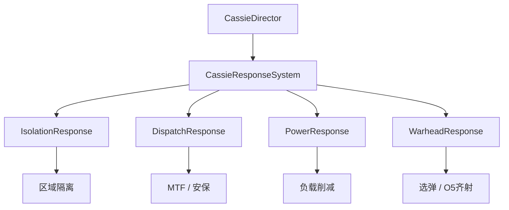
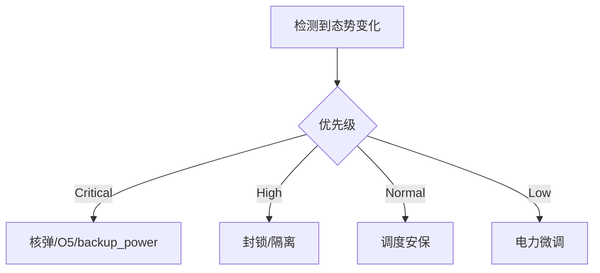

# 🤖 C.A.S.S.I.E 自主响应

> **v1.6.1** · **C.A.S.S.I.E**（Central Autonomous Site Security Intelligence Engine）是站点的 AI 安全主管。它通过多个子系统在 **秒级** 响应 breach、电力过载与极端威胁 — 主管负责长期规划，C.A.S.S.I.E 负责危机秒表。

---

## 子系统架构

| 模块 | 职责 |
|------|------|
| **CassieDirector** | 播报队列、优先级、态势快照 |
| **CassieResponseSystem** | breach 自动响应总线 |
| **CassieIsolationResponse** | 区域隔离 |
| **CassieDispatchResponse** | 人员 / MTF 调度 |
| **CassiePowerResponse** | 电力削减、核电 outage 警告 |
| **CassieWarheadResponse** | 核弹选弹 / O5 齐射升级 |

---

## 自动触发示例

| 态势 | C.A.S.S.I.E 响应 |
|------|------------------|
| 单个 breach | 隔离事故区 + 调安保 intercept |
| 多 breach | **全站封锁** + 引导避难所 |
| **096** 脸泄露 | 紧急封锁 + MTF |
| **079** 渗透 | 切断网络链路响应 |
| 电力过载 | **负载削减**（优先保 HCZ） |
| 核电 outage > 60 分 | 专项警告 |
| 审计崩溃 + 多 loose | 评估 **O5 全面毁灭协议** |

---

## 播报系统

| 元素 | 说明 |
|------|------|
| 地图顶栏 | **CASSIE 条** 滚动播报 |
| 视觉 | 左侧严重度色条 + 扫描线 |
| 音频 | 音效提示（音量默认 0.85） |
| 优先级 | Critical > Warning > Info |

手动指令如 `warhead_alpha`、`o5_protocol` 同为 **Critical** 优先级。

---

## 开关 C.A.S.S.I.E（v1.6.0+）

### 关闭时

| 效果 | 说明 |
|------|------|
| 解除封锁 | 自动解除 **全站封锁**（核武/毁灭协议中 **除外**） |
| 避难所 | 解除强制避险指令 |
| 隔离 | 解除事故区隔离 |
| 日常 | 非战斗人员恢复施工与日常 |
| MTF | **无法派遣**（须 C.A.S.S.I.E 在线） |

### 开启时

恢复全自动危机管理 — breach 响应、封锁、MTF、选弹评估。


**早期建议开启** C.A.S.S.I.E 熟悉机制；熟练后可尝试 **关闭** 进行手动危机管理（高难度）。协议执行期间 **无法关闭**。


---

## 与玩家主管的分工

| C.A.S.S.I.E | 玩家主管 |
|-------------|----------|
| 秒级 breach 响应 | 长期建造 / 科研规划 |
| 自动隔离 / 封锁 | 手动 MTF / 选弹 override |
| 人员避险调度 | 财政、招聘、审计维护 |
| 核弹选弹建议 | O5 齐射 **最终授权** |
| 电力负载削减 | 增建发电 / 竖井 |

---

## 响应优先级逻辑

---

## 限制与例外

| 场景 | 行为 |
|------|------|
| 手动岗位锁定 | C.A.S.S.I.E **不调动** 已指派人员 |
| 观察岗（173） | 封锁期间研究员 **仍可值守** |
| 设施毁灭协议 Active | 无法关 C.A.S.S.I.E / 无法解除封锁 |
| GATE C | 封锁期间 MTF **仍可通行** |

---

## 态势快照（CassieDirector）

C.A.S.S.I.E 每 tick 维护态势快照，核心字段包括：

| 字段 | 用途 |
|------|------|
| `LooseScpCount` | loose 数量变化 → 触发升级响应 |
| 威胁等级 | 1–10；驱动选弹与封锁 |
| 审计 | 极低时评估毁灭协议 |
| 电力比 | 触发负载削减 |

loose 数量 **增加** 且 > 0 时，Director 优先排队 **Critical** 级播报。

---

## 新手 / 老手配置建议

| 玩家类型 | C.A.S.S.I.E | 理由 |
|----------|-------------|------|
| 新手 | **常开** | 避免 173/096 秒级失误 |
| 中期 | 开；手动 override MTF | 学会有取舍 |
| 高手 | 可关；纯手动封锁 | 挑战成就向 |

---

## 相关章节

* [封锁与 MTF](lockdown-mtf.md)
* [毁灭协议](warhead-protocol.md)
* [电力响应](../05-site/power.md)

---

## 本章导航

- 上一篇：[危机导览](../06-systems/hubs/危机与治理.md)
- 下一篇：[封锁](lockdown-mtf.md)
