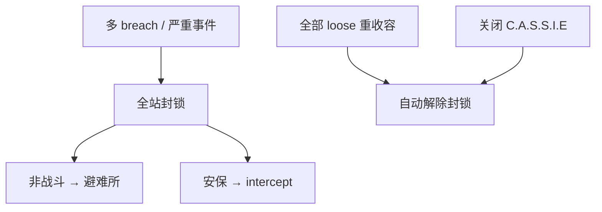

# 🔐 封锁与 MTF 调度

> **v1.6.1** · **全站封锁** 将检查点紧闭、非战斗人员赶入避难所，仅 **安保** 与特殊例外可通行。**MTF** 则是捕获外勤 SCP 与紧急重收容 loose 异常的核心手段 — 基础费用 **¥150,000**，7 日冷却。

---

## 全站封锁

### 触发条件

| 来源 | 示例 |
|------|------|
| 自动 | 多个 SCP loose、096/3114 等严重事件 |
| 手动 | C.A.S.S.I.E 面板发起 |
| C.A.S.S.I.E | `CassieIsolationResponse` 升级 |

### 效果

| 效果 | 说明 |
|------|------|
| 检查点 | **关闭**（安保任务除外） |
| 非战斗人员 | 引导至 **通电避难所** |
| 视觉 | 地图外圈红色渐晕（v1.4.5+ 柔光） |
| MTF | 无 GATE C → **无法派遣** |

### 解除条件

| 方式 | 说明 |
|------|------|
| 自动 | 全部 loose SCP **重收容** 后自动解除（v1.4.8+） |
| 手动 | **关闭 C.A.S.S.I.E**（v1.6.0+，毁灭协议中除外） |

---

## 区域隔离

比全站封锁更 **精准** — 仅隔离 **事故区** 相邻扇区：

| 对比 | 全站封锁 | 区域隔离 |
|------|----------|----------|
| 范围 | 整个站点 | 事故相邻扇区 |
| 人员 | 全员避难 | 非事故区可有限活动 |
| 适用 | 多 breach | **单个** breach 控制蔓延 |

---

## MTF 调度

| 类型 | 用途 |
|------|------|
| **常规派遣** | 捕获 reported SCP → pending |
| **物资返程** | ~60% 概率带回补给 +50、口粮 +30 |
| **紧急召回** | 重收容 loose SCP（高威胁优先） |

### 核心参数

| 参数 | 数值 |
|------|------|
| **基础费用** | **¥150,000** |
| **冷却** | **7 游戏日** |
| GATE B | 冷却 **×0.85**；D 级成本 **×0.9** |
| 停机坪 | 费用 **×1.2**；冷却 **−2 日** |
| 审计 ≥ 80 | 费用 **×0.95** → ¥142,500 |
| 审计 < 30 | 费用 **×1.30** → ¥195,000 |
| 审计 < 40 | **50%** 概率 O5 驳回 |

### 派遣前提

| 条件 | 说明 |
|------|------|
| C.A.S.S.I.E **在线** | 离线无法派遣 |
| 余额充足 | ≥ 实际费用 |
| 冷却结束 | 顶栏/面板可查剩余天数 |
| 封锁期 | 须 **GATE C** 通电 |
| 科研 | SCP **材料节点** 已解锁 |

---

## GATE 与 MTF 联动

| GATE | MTF 相关效果 |
|------|--------------|
| **B** | 冷却 ×0.85 |
| **C** | 封锁期间 **仍允许 MTF** |
| **D** | 毁灭协议密封 → 减轻 GATE A 突破 |
| **A** | loose SCP 抵达 → 审计 −15/−30 |

---

## 避难所

| 规则 | 说明 |
|------|------|
| 位置 | 行政区预置 **避难所** 房间 |
| 触发 | 封锁 / 核弹 / 毁灭协议 |
| 要求 | 须 **通电** 才有效 |
| 寻路 | 人员自动寻路至 **最近通电** 避难所 |


扩建编制前检查避难所 **容量与通电**。毁灭协议统计 **编内存活率 ≥ 30%** — 避难所不足 = Game Over。


---

## 封锁期间特殊规则

| 人员 | 行为 |
|------|------|
| **研究员**（观察岗） | **可继续值守** 173 等 |
| **工程师** | C.A.S.S.I.E 关闭时可非封锁区施工 |
| **安保** | 可通过检查点 intercept |
| **D 级** | 编外；通常最先 casualties |

---

## 手动 Override

C.A.S.S.I.E 面板可：

| 指令 | 效果 |
|------|------|
| 发起 / 解除封锁 | 手动控制（协议中除外） |
| 指定 MTF 目标 | 紧急召回 prioritization |
| 关闭 AI | 全自动 → 手动危机管理 |

---

## 相关章节

* [C.A.S.S.I.E 自主响应](auto-response.md)
* [异常上报管线](../09-containment/pipeline.md)
* [GATE 与检查点](../05-site/gates.md)

---

## 本章导航

- 上一篇：[自主响应](auto-response.md)
- 下一篇：[核弹](warhead-protocol.md)
