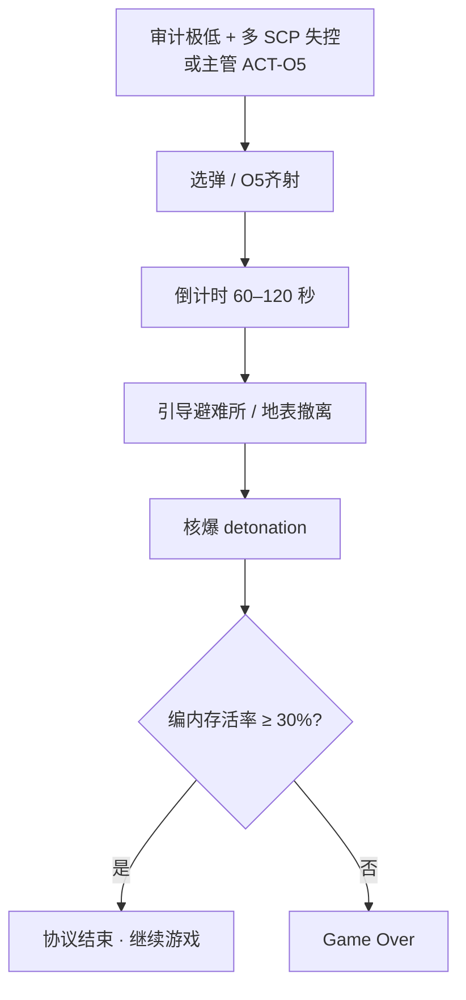

# ☢️ 毁灭协议与弹头

> **[待补图 IMG-014]** 核弹倒计时横幅（可选）

> **v1.6.1** · 当站点陷入 **不可恢复** 态势，C.A.S.S.I.E 启动 **设施毁灭协议**（核弹体系）。弹头倒计时 **60–120 秒** 不等；detonation 后若 **编内人员存活率 < 30%** → Game Over。单发无法清除 **SCP-682** — 须 **O5 全面毁灭协议** 齐射。

---

## 毁灭协议流程

| 阶段 | 说明 |
|------|------|
| 触发 | `CassieWarheadResponse` 自动；或手动 `warhead_alpha` / `o5_protocol` |
| 倒计时 | 各弹头 **CountdownSeconds**（ALPHA 90s、OMEGA 120s 等） |
| 避险 | `WarheadEvacuationSystem` 引导人员进避难所 |
| 结算 | `LastSurvivalRate` = 编内幸存 / 编内总数（**不含 D 级**） |
| 失败 | 存活率 **< 0.3** 且有编内人员 → `GameOutcome.Lost` |


毁灭协议 **≠ 胜利**。胜利仍须 [≥3 SCP + 非 SCP 全科技 + 30 天无 breach](../12-progression/win-lose.md)。核弹是 **止损手段**，不是通关快捷键。


---

## 九种弹头速查

| 代号 | 倒计时 | 毁伤 scope | 审计惩罚 |
|------|--------|------------|----------|
| ALPHA | 90s | 全地下 | 20 |
| BETA | 75s | 单层 | 18 |
| GAMMA | 60s | 扇区 | 15 (+5 extra) |
| OMEGA | 120s | 全部 loose SCP | 22 |
| OMICRON | 100s | Apollyon 终极 | 25 |

C.A.S.S.I.E 按 **威胁等级、SCP 行为标志、CanSurviveWarhead** 自动选弹。

---

## 手动 vs 自动

| 方式 | 指令 / 触发 |
|------|-------------|
| 单弹手动 | C.A.S.S.I.E 面板 → `warhead_alpha` 等（ACT-05A） |
| O5 齐射 | `o5_protocol`（ACT-O5）— 须科研 **O5 全面毁灭协议** |
| 自动 | 态势不可恢复 → C.A.S.S.I.E 自动启动 |
| 升级 | 单弹未能清除 682 → 自动评估 O5 齐射 |

---

## O5 全面毁灭协议

| 要求 | 说明 |
|------|------|
| 科研 | **全部 9 型 silo 节点** 完成 + O5 授权（50,000 点） |
| 设施 | 多个 **通电 silo** 已建成 |
| 目标 | **CanSurviveWarhead** 实体（SCP-682） |
| 效果 | 多弹头 **同时** detonation |

---

## 失败条件详解

| 条件 | 代码逻辑 |
|------|----------|
| 存活率 < 30% | `survivalRate < 0.3 && 存在编内人员` |
| D 级 | **不计入** 分子分母 |
| 无编内人员 | 存活率视为 1.0（不因此失败） |
| 附带 | 核爆清除 loose SCP、伤亡编内、审计大幅下降 |

---

## GATE D 密封减损

毁灭协议激活且 **GATE D 通电** 时：

* loose SCP 抵达 GATE A 审计惩罚 **−30 → −15**
* 不能替代日常安保，但极端情况下减损

---

## 预防策略

| # | 策略 |
|---|------|
| 1 | 审计不要跌到 C.A.S.S.I.E 自动评估阈值 |
| 2 | 同时 loose 的 Keter **≤ 2**（3 = Game Over） |
| 3 | 提前建够 **通电避难所** 容量 |
| 4 | 核弹链 **中期立项**，silo **备而不用** |
| 5 | 682 路线必须规划 **O5 齐射** |

---

## 协议期间限制

| 操作 | 是否允许 |
|------|----------|
| 关闭 C.A.S.S.I.E | ❌ |
| 解除封锁 | ❌ |
| 手动把人员调出避难所 | ⚠️ 极易导致 < 30% 失败 |
| 继续建造 | 理论上可以但不建议 |

---

## 弹头 vs 场景对照

| 场景 | 推荐弹头 |
|------|----------|
| 多 loose Keter | OMEGA（AllLooseScp） |
| 单层事故 | BETA（Floor） |
| 682 存活 | O5 齐射（非单弹） |
| 079 / 模因 | ZETA（InfoHazard） |
| 610 / 生物 | SIGMA（BioHazard） |
| 全面不可恢复 | OMICRON（Apollyon）或 O5 齐射 |

---

## 倒计时期间的 UI

| 元素 | 位置 |
|------|------|
| 地图横幅 | `WarheadBannerWidget` 显示剩余秒数 |
| 简报面板 | 设施协议块 |
| 顶栏状态 | 「O5 全面毁灭协议」或单弹名称 |
| 音效 | C.A.S.S.I.E 播报 + 警报 |

---

## 相关章节

* [核弹科研链](../08-research/warhead-research.md)
* [C.A.S.S.I.E 自主响应](auto-response.md)
* [胜利与失败](../12-progression/win-lose.md)

---

## 本章导航

- 上一篇：[封锁](lockdown-mtf.md)
- 下一篇：[O5合同](../12-progression/missions-threat.md)
