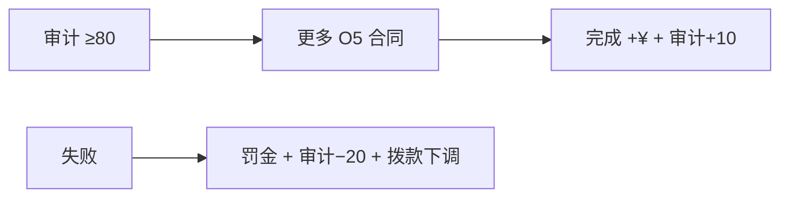

# 📜 O5 合同与威胁等级

> **v1.6.1** · 游戏日 **≥ 3** 后，系统按审计评级概率 offer **O5 合同**。完成合同获 **奖金 + 审计 +10**；失败则 **罚金、审计 −20、月拨款下调 ¥10,000**。**威胁等级（1–10）** 则反映当前 loose SCP 与 breach 态势，驱动 C.A.S.S.I.E 激进程度。

---

## O5 合同（Missions）

### 解锁时机

| 条件 | 说明 |
|------|------|
| 游戏日 | **≥ 3** |
| 空闲 | 每时刻通常 **仅 1 个** 活跃合同 |
| 概率 | 见下方 offer 表 |

### 合同类型

| 类型 | 示例目标 | 模板奖励 / 罚金 |
|------|----------|-----------------|
| **ContainScp** | 至少收容 2 个 SCP | ¥100,000 / ¥50,000 |
| **NoBreachDays** | 连续 14 天无失效 | ¥80,000 / ¥40,000 |
| **MaintainBalance** | 余额 ≥ ¥200,000（30 天） | ¥60,000 / ¥30,000 |
| **ObservationCompliance** | 观察类 SCP 7 天无 breach | ¥70,000 / ¥35,000 |
| **SecurityStaff** | 安保编制 ≥ 4 人 | ¥55,000 / ¥25,000 |
| **ResearchTech** | 解锁指定锁定科技 | ¥90,000 / ¥45,000 |

期限通常为 **14–30 游戏日**（模板定义）。

---

## Offer 概率

每日 tick 抽样（`deltaMinutes` 加权）：

| 审计 | 基础 chance / tick |
|------|---------------------|
| **≥ 80** | **0.020** |
| **≥ 50** | 0.015 |
| **< 50** | **0.008** |

高审计 → 更多合同机会 + 已有 **+8% 拨款** 优势。

---

## 接受与追踪

| 步骤 | 说明 |
|------|------|
| 1 | 邮件收到「O5 指令合同」 |
| 2 | 简报区查看：标题、期限、奖励、失败罚金 |
| 3 | 自动接受（offer 即 active） |
| 4 | 进度在 **简报** 面板追踪 |

### 完成 / 失败

| 结果 | 效果 |
|------|------|
| **完成** | 余额 +奖励；审计 **+10**；O5 完成邮件 |
| **失败**（超期） | 余额 −罚金；审计 **−20**；`MonthlyIncomePenalty += ¥10,000`；违约邮件 |


**v1.4.8+**：合同失败罚金仅 **当次结算**，不会永久叠加到后续月份。但 **`MonthlyIncomePenalty`** 当月的 ¥10,000 下调仍生效。


---

## 威胁等级（1–10）

| 因素 | 影响 |
|------|------|
| **妥善收容** SCP | 潜在风险（威胁 ×0.3，最低 1） |
| **失控** SCP | 收容失效倍率（威胁 ×3 + 升级阶段） |
| 临期间 / 押送 / 等级不足 | 全额威胁计入 |
| **GATE A** 突破 | 持久 +2（`SiteThreatBonus`） |
| 超期 14 / 42 日 | 各 +1 |
| 核爆 detonation | +1 |
| 重收容 / MTF 现场压制 | 威胁回落（bonus 下调） |

### 威胁 vs 运营评分

| loose 数 | 威胁分项得分 |
|----------|--------------|
| 0 | 100 |
| 1 | 55 |
| 2 | 25 |
| ≥3 | 0（且 **Game Over**） |

威胁高 → C.A.S.S.I.E **更激进**（封锁、MTF、核弹评估）。

---

## 与审计联动

| 事件 | 审计变化 |
|------|----------|
| 合同完成 | **+10** |
| 合同失败 | **−20** |
| breach | **−15** |
| 重收容 | **+5** |
| 超期 28 日 | **−3** |

| 审计区间 | 拨款 | MTF 费用 |
|----------|------|----------|
| ≥ 80 | **+8%** | ×0.95 |
| < 50 | **−15%** | 最高 ×1.30 |

---

## 策略建议

| 场景 | 建议 |
|------|------|
| **早期** | 接受 **低难度** 合同（安保编制、财政稳健）攒奖金 |
| **多 SCP loose** | **拒绝 mentally** — 勿接 NoBreachDays 类（已 active 则优先重收容） |
| **期限临近** | 暂停加速赶工（ResearchTech / ContainScp） |
| **失败风险** | 罚金 + ¥10,000 下调可能触发 **−¥100,000** 破产线 |
| **高审计** | 多接合同巩固 +8% 拨款与 +10 审计正循环 |

---

## 合同 vs 胜利条件

| 项目 | 关系 |
|------|------|
| 合同 | **不必须** 完成任何合同即可胜利 |
| ContainScp 合同 | 辅助推进 ≥3 SCP |
| ResearchTech 合同 | 辅助 **非 SCP 全科技** |
| NoBreachDays | 辅助 30 日 streak 练习 |
| 失败 | 不会直接 Game Over，但可能间接导致破产 |

---

## 相关章节

* [胜利与失败](win-lose.md)
* [财政与审计](../06-economy/budget-audit.md)
* [C.A.S.S.I.E 响应](../11-cassie/auto-response.md)

---

## 本章导航

- 上一篇：[核弹](../11-cassie/warhead-protocol.md)
- 下一篇：[胜负](win-lose.md)
