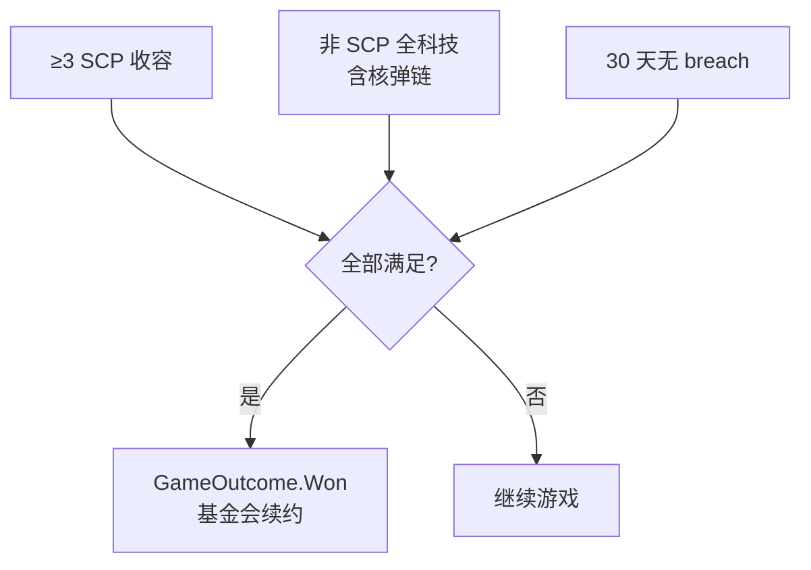
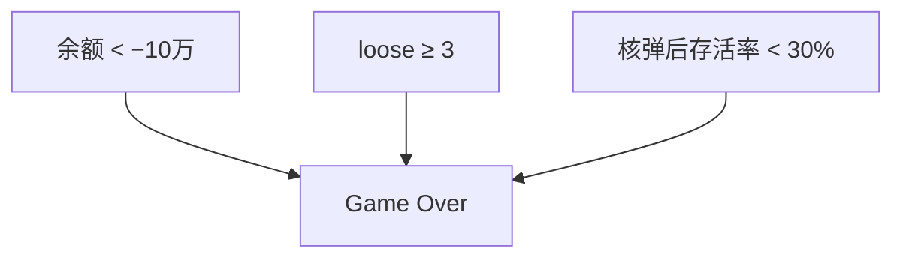

# 🏆 胜利与失败条件

> **v1.6.1** · 以 `MissionSystem.CheckOutcome` 与 `WarheadProtocolSystem.FinalizeProtocol` **代码为准**。胜利需要 **三条硬条件同时满足**；失败则 **任一触发** 即 Game Over。

---

## 胜利（GameOutcome.Won）

**同时满足** 全部条件：

| # | 条件 | 代码判定 |
|---|------|----------|
| 1 | **≥ 3 个 SCP** 已分配至收容室 | `GetAllRooms().Count(AssignedScpId)` |
| 2 | **全部非 SCP 科技** 已解锁 | 除 `research.scp-*` 外 `TechRegistry.All` 均在 `UnlockedTechs` |
| 3 | **连续 30 游戏日** 无收容失效 | `_daysSinceLastBreach >= 30`（无 loose SCP 的日数递增） |

### 达成后

| 效果 | 说明 |
|------|------|
| 事件 | 「任务完成 — 基金会续约」 |
| UI | 胜利 overlay |
| 叙事 | 依据 **最终审计评级** 生成不同叙事邮件 |


**SCP-999 计入 3 个配额**。新游戏已收容 999 — 你只需再成功收容 **2 个** 外勤 SCP。


---

## 失败（GameOutcome.Lost）

**任一** 触发即失败：

| 条件 | 阈值 | 代码 |
|------|------|------|
| **财政破产** | 余额 **< −¥100,000** | `world.Balance < -100_000m` |
| **站点失控** | 同时 **≥ 3 个 SCP loose** | `looseCount >= 3` |
| **毁灭协议** | 编内存活率 **< 30%** | `LastSurvivalRate < 0.3` 且有编内人员 |

---

## 软失败（不立即 Game Over）

以下造成严重惩罚但 **不立刻结束** 存档：

| 事件 | 后果 |
|------|------|
| **GATE A 突破** | 审计 −15/−30；威胁 +2 |
| **GOC 锁定 SCP** | 永久失去该异常；不计入胜利计数 |
| **审计崩溃** (<50) | 拨款 −15%；breach RNG ×1.12 |
| **O5 合同失败** | 罚金 + 审计 −20 + 月拨款下调 ¥10,000 |
| **1–2 SCP loose** | 须紧急重收容；威胁评分 55/25 |
| **超期 42 日** | 审查 −8% 拨款 3–6 日 |

---

## 30 天无 Breach 计数规则

| 规则 | 说明 |
|------|------|
| 递增条件 | 每日 tick 且 **无任何 loose SCP** |
| 归零 | 任意 breach 发生（`OnBreach` → `_daysSinceLastBreach = 0`） |
| 重收容 | 审计 +5，但 **不恢复** 已有 streak 天数 |
| 胜利 | 须 **连续** 30 日 — 第 29 天 breach 则从头计 |

---

## 新游戏默认状态

| 项目 | 值 |
|------|-----|
| 余额 | **¥500,000** |
| 审计 | **70** |
| 已收容 | **SCP-999**（计 1/3） |
| 连续无 breach | **0** |
| 电力 | ~160 发 / ~153 用 |

---

## 胜利规划路线

```mermaid
gantt
  title 典型胜利时间线（示意）
  dateFormat X
  axisFormat %s

  section 早期
  稳电力+科研           :a1, 0, 10
  捕获第2、3 SCP        :a2, 5, 20

  section 中期
  非SCP全科技（含核弹）  :b1, 15, 60
  维持零 loose          :b2, 10, 50

  section 冲刺
  30日无breach streak   :c1, 30, 60
```

| 阶段 | 目标 |
|------|------|
| **前 10 天** | 稳电力 + 科研 + 捕获第 2、3 个 SCP |
| **中期** | 补全 **非 SCP 全科技**（含核弹 ~82 万点）+ 零 loose 运营 |
| **冲刺** | breach 归零后 **连续 30 日** — 暂停加速赶工 |
| **全程** | 财政留缓冲；避免同时 loose |

---

## 非 SCP 全科技说明

| 包含 | 不包含 |
|------|--------|
| 基础设施、收容、电力 | `research.scp-*` 专项节点 |
| **核弹全链**（9 型 + O5） | — |
| 中层扩建协议 | — |

核弹链 **计入** 胜利条件 — 见 [核弹科研链](../08-research/warhead-research.md)。

---

## 相关章节

* [O5 合同与威胁](missions-threat.md)
* [收容失效](../09-containment/breach-recontain.md)
* [财政与审计](../06-economy/budget-audit.md)

---

## 本章导航

- 上一篇：[O5合同](missions-threat.md)
- 下一篇：[SCP图鉴](../10-scp/README.md)
