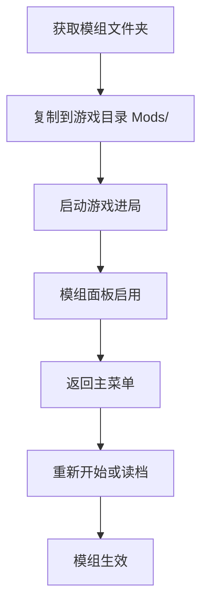

# 🧩 玩家：安装与启用模组

> 扩展游戏内容，无需修改本体 — DLL + mod.json 格式

---

## 模组是什么？

模组（Mod）是 **独立 DLL 插件**，在游戏进入对局时加载，可向站点注入：

* 自定义房间与走廊
* 新 SCP 与科研节点
* 随机事件与 C.A.S.S.I.E 播报
* 自定义 SCP 行为逻辑

```
Mods/MyMod/
├── mod.json          ← 清单（必需）
├── MyMod.dll         ← 编译产物（必需）
└── assets/           ← 贴图等资源（可选）
    └── room_icon.png
```

---

## 安装步骤



| 步骤 | 操作 | 注意 |
|------|------|------|
| 1 | 将模组文件夹放入 `Mods/子文件夹名/` | 不是 `Mods/` 根目录 |
| 2 | 启动游戏 → 新游戏或读档 | 主菜单不加载模组 |
| 3 | 打开 **模组** 面板 → 开关启用 | |
| 4 | **返回主菜单** | 必须 |
| 5 | **重新进局** | 切换才生效 |


**最常见错误**：启用模组后没有返回主菜单重进 — 表现为「模组开了但没效果」。


---

## 游戏内管理

| 功能 | 位置 |
|------|------|
| 启用/禁用 | 模组面板开关 |
| 打开 Mods 文件夹 | 设置或模组页快捷按钮 |
| 状态记录 | `mods_state.json`（exe 同目录） |
| 加载顺序 | `mods_state.json` 的 `loadOrder` |

---

## 官方模组

发版包预置三个官方模组 — 详见 [官方模组介绍](official-mods.md)：

| 模组 | 适合 |
|------|------|
| 示例：超重型收容 | 模组开发学习 |
| SCP-173 观察规程包 | 已收容 173 后增强玩法 |
| 混沌分裂者事件包 | 追求额外危机挑战 |

---

## 自定义模组

| 来源 | 说明 |
|------|------|
| 社区下载 | 放入 `Mods/` 即可 |
| 自行开发 | [模组开发教程](modding-tutorial.md) |
| 发版包附带 | `ModSDK/` + `模组开发示例.zip` |

---

## 存档兼容性

| 情况 | 建议 |
|------|------|
| 存档用了某模组的房间/SCP | 读档时 **必须保持该模组启用** |
| 禁用模组后读旧档 | 可能缺房间定义、数据异常 |
| 切换模组组合 | 建议新开局测试 |

---

## Android 限制

APK **内置** 官方模组，**不支持** 导入外部 `Mods/` 文件夹。

---

## 故障排除

| 症状 | 排查 |
|------|------|
| 列表中看不到 | 检查 `mod.json` + DLL 是否在同文件夹 |
| 启用无效 | 返回主菜单重进 |
| 加载失败 | 查看简报/事件日志的异常摘要 |
| 依赖缺失 | `mod.json` 的 `dependencies` 须先启用 |
| ID 冲突 | 模组 ID 须全局唯一，用 `作者名.` 前缀 |

完整开发者 FAQ → [模组开发教程 · 常见问题](modding-tutorial.md#常见问题)

---

## 本章导航

- 上一篇：[章节说明](README.md)
- 下一篇：[官方模组](official-mods.md)
