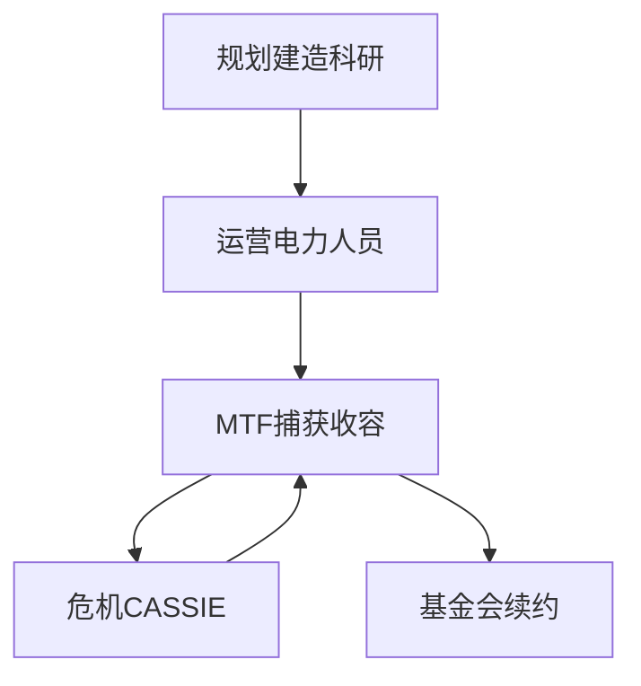

# 🏛️ 站点主管：收容协议

> **Secure. Contain. Protect.** · 控制 · 收容 · 保护

> **[待补图 IMG-001]** 封面/站点剖面横幅（建议 1920×400）


🎮 **当前版本 v1.6.1** · 站点 **SCP-CN-465** · Windows 10/11 + Android 横屏


## 📖 简介

你受 **O5 理事会** 任命，执掌基金会地下设施 **SCP-CN-465**。本手册按 **十大章节** 组织，侧栏可展开 **3～4 层**；薄章节用 **hub 导览页** 聚合，避免「点开只有一层」。


💡 新主管从 [🚀 快速加入](join.md) 开始，约 15 分钟上手。


---

## 🔍 按需求找文档

| 我想… | 去看 |
|--------|------|
| 🎮 **安装并进游戏** | [快速加入](join.md) → [安装与更新](02-getting-started/install.md) |
| 📘 **学操作** | [12 步 Walkthrough](03-tutorial/walkthrough.md) · [快捷键](appendix/shortcuts.md) |
| 🌅 **第一天不翻车** | [第一天生存指南](03-tutorial/first-day.md) |
| 💰 **搞懂拨款** | [财政与审计](06-economy/budget-audit.md) |
| 🔒 **收容新 SCP** | [异常上报管线](09-containment/pipeline.md) → [SCP 图鉴](10-scp/index.md) |
| 🧟 **防 173 breach** | [观察岗](07-personnel/orders-observation.md) |
| 🤖 **CASSIE / 核弹** | [危机与治理](06-systems/hubs/危机与治理.md) |
| 🏆 **怎么赢** | [胜利与失败条件](12-progression/win-lose.md) |
| 🔧 **装模组** | [玩家模组指南](13-mods/player-guide.md) |
| ❓ **遇到问题** | [常见问题](appendix/faq.md) |

---

## 🖥️ 站点档案

| 项目 | 内容 |
|------|------|
| 🏷️ **代号** | SCP-CN-465 |
| 📦 **版本** | v1.6.1 |
| 🎮 **类型** | 2D SCP 站点模拟经营 / 策略 |
| 💻 **平台** | Windows 10/11 · Android 横屏 |
| 💵 **开局资金** | ¥500,000 |
| ⭐ **开局审计** | 70 / 100 |
| 🧡 **预置收容** | SCP-999 |
| 📊 **内置 SCP** | 26 |
| 🏆 **胜利** | ≥3 收容 · 全科技 · 30 天无 breach |

---

## 🧭 文档导航

### 🌱 入门

| 文档 | 说明 |
|------|------|
| [🚀 快速加入](join.md) | 5 分钟进游戏 |
| [📖 认识站点](01-introduction/README.md) | 世界观、玩法、术语 |
| [📘 快速上手](02-getting-started/README.md) | 安装、键位、存档 |
| [🎓 新手教程](03-tutorial/README.md) | 12 步 + 首日指南 |

### ⚙️ 进阶

| 文档 | 说明 |
|------|------|
| [🖥️ 指挥界面](04-interface/README.md) | 9 个部门面板 |
| [⚙️ 系统百科](06-systems/README.md) | 18 篇机制深度 |
| [📕 SCP 图鉴](10-scp/README.md) | 26 异常档案 |

### 🔧 扩展

| 文档 | 说明 |
|------|------|
| [🔧 模组与开发](13-mods/README.md) | 玩家 + ModSDK |
| [📚 附录](appendix/shortcuts.md) | 快捷键 · FAQ · 更新日志 |

---

## 🎯 新主管 5 步

| 步骤 | 行动 |
|------|------|
| 1️⃣ | [🚀 快速加入](join.md) 安装并启动 |
| 2️⃣ | 完成游戏内 **12 步教程** |
| 3️⃣ | 阅读 [🌅 第一天生存指南](03-tutorial/first-day.md) |
| 4️⃣ | 搞懂 [💰 财政与审计](06-economy/budget-audit.md) |
| 5️⃣ | 按 [🔒 收容管线](09-containment/pipeline.md) 捕获第 2 个 SCP |


⚠️ 财政红线 **−¥100,000** · 同时 **≥3** SCP 失控即失败 · 173 须 **观察岗**


---

## 核心玩法循环

---

## 视觉主题

手册配色对齐游戏 HUD（深蓝黑 + 青色荧光）。GitBook Space → Customization → 粘贴 [`styles/website.css`](styles/website.css)。

---

## 📂 侧栏结构（Sync 后）

| 章节 | 结构 |
|------|------|
| 五、指挥界面 | 界面总览 → 部门导览 → **9 个子页** |
| 六、系统百科 | 系统总览 → **6 个 hub** → 18 篇 |
| 七、SCP 图鉴 | 图鉴说明 → Safe/Euclid/Keter |
| 十、维护 | 发布指南、配图清单（建议 **Hidden**） |

---

*手册版本 v1.6.1 · 以游戏代码与界面为准*
